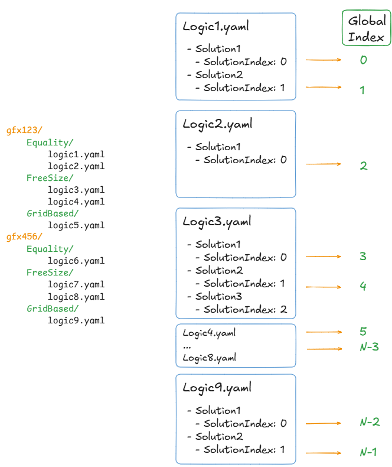
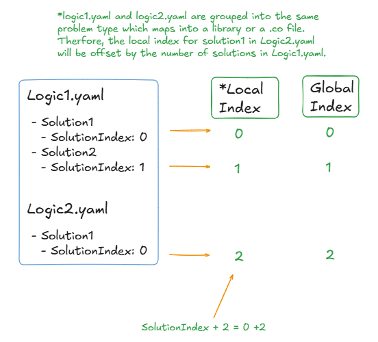

.. meta::
   :description: A library that provides GEMM operations with flexible APIs and extends functionalities beyond the traditional BLAS library
   :keywords: hipBLASLt, ROCm, library, API, tool

.. _SolutionIndexing:

=======================
Solution Indexing
=======================

This document contains information about solution indices and related topics. Each solution in hipBLASLt has two solution indices, a global index and a local index.

Local Solution Index
------------------------------------------

The local solution index is used to label different solutions within a single library logic file. The local solution index for a solution corresponds to the :code:`SolutionIndex` value in its respective library logic file.

Global Solution Index
------------------------------------------

The global solution index is used to label different solutions across all library logic files and is also used to reference solutions in all solution selection algorithms. During Tensilelite library creation all solutions from each library logic file is compiled into a single list - the global solution index is computed by enumerating each solutions position within that list.

The diagram below shows the organization of local and global indices

Solutions from different logic files are further grouped based on their problem type.

MatchTable
------------------------------------------

The local and global solution index information can be found in :code:`MatchTable.yaml` which stores each solutions. Each line has the format:

.. code-block::

   GlobalIndex: [Logic File Path, LocalIndex]
