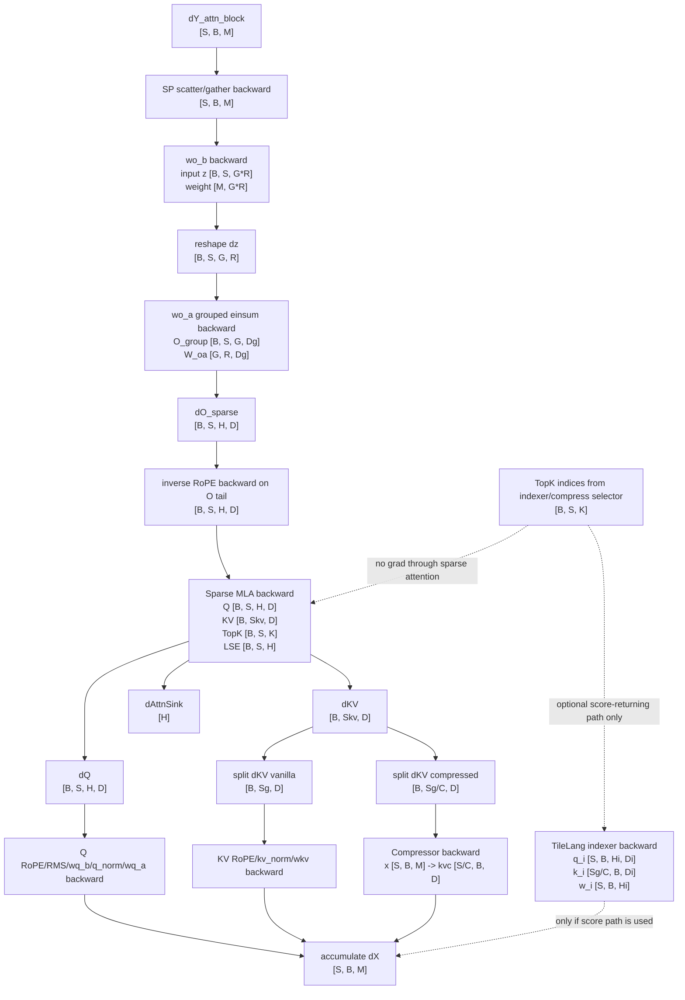

# DSv4 NVIDIA Reference Backward Ops Path

Status: first shape-level pass from the NVIDIA Day-0 Miles/Megatron-LM reference.

Scope: one `DeepSeekV4Attention` block, including sparse MLA, output LoRA, Q/KV projections, optional compressed KV path, and the indexer caveat. This does not yet cover full model residual routing, MoE, optimizer, PP, or complete Megatron schedule semantics.

Primary local anchors:

- `sources/references/miles-deepseek-v4-pr1045/miles_plugins/models/deepseek_v4/deepseek_v4.py`
- `sources/references/miles-deepseek-v4-pr1045/miles_plugins/models/deepseek_v4/ops/kernel/tilelang_sparse_mla.py`
- `sources/references/miles-deepseek-v4-pr1045/miles_plugins/models/deepseek_v4/ops/kernel/tilelang_sparse_mla_fwd.py`
- `sources/references/miles-deepseek-v4-pr1045/miles_plugins/models/deepseek_v4/ops/kernel/tilelang_sparse_mla_bwd.py`
- `sources/references/miles-deepseek-v4-pr1045/miles_plugins/models/deepseek_v4/ops/compressor.py`
- `sources/references/miles-deepseek-v4-pr1045/miles_plugins/models/deepseek_v4/ops/v4_indexer.py`
- `sources/references/miles-deepseek-v4-pr1045/miles_plugins/models/deepseek_v4/ops/kernel/tilelang_indexer.py`
- `sources/references/miles-deepseek-v4-pr1045/miles_plugins/models/deepseek_v4/ops/kernel/tilelang_indexer_bwd.py`
- `sources/references/miles-deepseek-v4-pr1045/miles_plugins/models/deepseek_v4/ops/kernel/precision_aligned_ops.py`

## Shape Symbols

| Symbol | Meaning |
| --- | --- |
| `B` | micro batch size |
| `S` | local sequence length on this rank after sequence-parallel gather |
| `Sg` | global context-parallel sequence length visible to attention, typically `S * CP` |
| `M` | model hidden size |
| `TP` | tensor model parallel size |
| `H` | local query heads, `num_attention_heads / TP` |
| `D` | sparse MLA head/KV dim, `kv_lora_rank = 512` in the reference asserts |
| `Rd` | RoPE dim, `qk_pos_emb_head_dim = 64` |
| `Dn` | non-RoPE dim, `D - Rd = 448` |
| `Qrank` | query LoRA rank |
| `G` | local output groups, `dsv4_o_groups / TP` |
| `R` | output LoRA rank per group, `dsv4_o_lora_rank = 1024` |
| `Dg` | group output dim, `H * D / G` |
| `C` | compressed KV ratio for compressed layers, commonly `4` or `128` |
| `Skv` | sparse MLA KV length, `Sg` without compression or `Sg + Sg / C` with compression |
| `Kwin` | local sliding window topk, `128` |
| `Kidx` | indexer topk for ratio-4 compressed layers, default `512` |
| `K` | total sparse topk per token, for example `Kwin + Kidx` in ratio-4 layers |
| `Hi` | indexer heads, default `64` |
| `Di` | indexer head dim, default `128` |

## Backward Graph

## Detailed Backward Path

| Step | Backward op | Main inputs and saved tensors | Outputs |
| --- | --- | --- | --- |
| 1 | Attention block output gradient enters | `dY [S, B, M]` from the next layer or residual consumer. Forward output was rearranged from `[B, S, M]` back to `[S, B, M]`. | `dY_local [S, B, M]`; if sequence parallelism is active, backward follows the inverse of the forward scatter/gather region. |
| 2 | Rearrange for local attention math | `dY_local [S, B, M]` | `dY_bsm [B, S, M]` |
| 3 | `wo_b` row-parallel linear backward | Forward input `z [B, S, G*R]`; `wo_b.weight [M, G*R]` as the logical row-parallel projection; incoming `dY_bsm [B, S, M]`. | `dz [B, S, G*R]`; `dW_wo_b [M, G*R]` logical shape; possible communication according to Megatron row-parallel semantics. |
| 4 | Unflatten output LoRA groups | `dz [B, S, G*R]` | `dz_group [B, S, G, R]` |
| 5 | `wo_a` grouped einsum backward | Forward `O_group [B, S, G, Dg]`; `W_oa [G, R, Dg]`; forward equation `z[b,s,g,r] = sum_d O_group[b,s,g,d] * W_oa[g,r,d]`; incoming `dz_group [B, S, G, R]`. | `dO_group [B, S, G, Dg]`; `dW_oa [G, R, Dg]` |
| 6 | Fold groups back to heads | `dO_group [B, S, G, Dg]`; `Dg = H * D / G`. | `dO_attn [B, S, H, D]` |
| 7 | Inverse RoPE backward on attention output tail | Forward applied inverse RoPE to `O[..., -Rd:]`; incoming `dO_attn [B, S, H, D]`. | `dO_sparse [B, S, H, D]`; the last `Rd` channels are rotated back through the inverse-RoPE transform, first `Dn` channels pass through. |
| 8 | Sparse MLA backward preprocess kernel | Saved `O [B, S, H, D]`; incoming `dO_sparse [B, S, H, D]`. | `Delta [B, S, H] fp32`, where each element is the head-wise dot product over `D`. |
| 9 | Sparse MLA backward main kernel | Saved `Q [B, S, H, D]`, `KV [B, Skv, D]`, `AttnSink [H]`, `TopK [B, S, K]`, `LSE [B, S, H]`, plus `dO_sparse [B, S, H, D]` and `Delta [B, S, H]`. | `dQ [B, S, H, D]`; `dKV_accum [B, Skv, D] fp32`; `dAttnSink [H] fp32`. |
| 10 | Sparse MLA `dKV` postprocess | `dKV_accum [B, Skv, D] fp32`. | `dKV [B, Skv, D] bf16` in the reference interface. |
| 11 | Split sparse MLA KV gradient | `dKV [B, Skv, D]`; forward `KV = cat([kv_vanilla, kv_compress], dim=1)` when compression is active. | `dKV_vanilla [B, Sg, D]`; if compressed, `dKV_compress [B, Sg/C, D]`. Without compression, all `dKV` is the vanilla branch. |
| 12 | Context-parallel all-gather backward for KV | Forward all-gathered `kv_vanilla [B, S, D]` and optional `kv_compress [B, S/C, D]` across CP. | Per-rank `dKV_vanilla_local [B, S, D]`; optional `dKV_compress_local [B, S/C, D]`. |
| 13 | Vanilla KV RoPE backward | Forward applied RoPE to the last `Rd` dims of `kv_norm [B, S, D]`; incoming `dKV_vanilla_local [B, S, D]`. | `dKV_normed [B, S, D]`; tail `Rd` rotated through RoPE backward, first `Dn` dims pass through. |
| 14 | Optional KV fp8 QAT backward | Forward may fake-quantize `kv[..., :Dn]` for fp8 QAT. | `dKV_normed [B, S, D]`; exact behavior follows the QAT op, normally straight-through style for the simulated quantized region. |
| 15 | `kv_norm` backward | Forward `kv_pre_norm [B, S, D] -> kv_normed [B, S, D]`; incoming `dKV_normed [B, S, D]`. | `dKV_pre_norm [B, S, D]`; `dW_kv_norm [D]` |
| 16 | `wkv` linear backward | Forward input `x [B, S, M]`; `wkv.weight [D, M]`; incoming `dKV_pre_norm [B, S, D]`. | `dX_from_kv [B, S, M]`; `dW_wkv [D, M]` |
| 17 | Q RoPE backward | Forward applied RoPE to `Q[..., -Rd:]`; incoming `dQ [B, S, H, D]`. | `dQ_rot_in [B, S, H, D]` |
| 18 | Q RMS normalization over head dim | Forward normalized query heads over `D`; incoming `dQ_rot_in [B, S, H, D]`. | `dQ_before_head_norm [B, S, H, D]` |
| 19 | Flatten Q heads | `dQ_before_head_norm [B, S, H, D]`. | `dQ_flat [B, S, H*D]` |
| 20 | `wq_b` column-parallel linear backward | Forward input `q_normed [B, S, Qrank]`; `wq_b.weight [H*D, Qrank]` logical local output; incoming `dQ_flat [B, S, H*D]`. | `dQrank_normed [B, S, Qrank]`; `dW_wq_b [H*D, Qrank]` logical local shard. |
| 21 | `q_norm` backward | Forward `q_a [B, S, Qrank] -> q_normed [B, S, Qrank]`; incoming `dQrank_normed [B, S, Qrank]`. | `dQrank_pre_norm [B, S, Qrank]`; `dW_q_norm [Qrank]` |
| 22 | `wq_a` linear backward | Forward input `x [B, S, M]`; `wq_a.weight [Qrank, M]`; incoming `dQrank_pre_norm [B, S, Qrank]`. | `dX_from_q [B, S, M]`; `dW_wq_a [Qrank, M]` |
| 23 | Compressed KV branch, if `C > 0` | Incoming `dKV_compress_local [B, S/C, D]`; forward compressor input `x [S, B, M]`; forward output `kv_compress [S/C, B, D]`. | `dX_from_compressor [S, B, M]` plus compressor parameter grads. Details below. |
| 24 | Accumulate attention-block input gradient | `dX_from_q [B, S, M]`, `dX_from_kv [B, S, M]`, optional compressor/indexer `dX`, plus any parallel-region reductions. | `dX [S, B, M]` for this attention block input. |

## Sparse MLA Kernel Math

The custom autograd wrapper saves `Q`, `KV`, `AttnSink`, `TopK`, `O`, and `LSE` in forward. Backward returns gradients for `Q`, `KV`, and `AttnSink`; `TopK` and `sm_scale` return `None`.

| Kernel phase | Inputs | Outputs | Notes |
| --- | --- | --- | --- |
| Preprocess | `O [B, S, H, D] bf16`, `dO [B, S, H, D] bf16` | `Delta [B, S, H] fp32` | Computes `sum_d O * dO`. |
| Main backward | `Q [B, S, H, D] bf16`, `KV [B, Skv, D] bf16`, `dO [B, S, H, D] bf16`, `AttnSink [H] fp32`, `TopK [B, S, K] int32`, `LSE [B, S, H] fp32`, `Delta [B, S, H] fp32` | `dQ [B, S, H, D] bf16`, `dKV_accum [B, Skv, D] fp32`, `dAttnSink [H] fp32` | Recomputes sparse probabilities from `Q @ KV[topk]^T`, `LSE`, and `AttnSink`; atomically accumulates `dKV`. |
| Postprocess | `dKV_accum [B, Skv, D] fp32` | `dKV [B, Skv, D] bf16` | Casts accumulated KV gradient to bf16 for the Python interface. |

For each query token/head, the main kernel gathers `KV[b, TopK[b,s,:], :]`, recomputes the probability block, then forms:

- `dP = P * (dO @ KV^T - Delta) * sm_scale`
- `dQ += dP @ KV`
- `dKV += dP^T @ Q + P^T @ dO`
- `dAttnSink[h] += -Delta[b,s,h] * softmax_sink_prob[b,s,h]`

## Compressor Backward Shape Path

Forward compressor input is `x [S, B, M]`; internally it is arranged as `[B, S, M]`. For ratio `C`, the output is `kv_compress [S/C, B, D]`.

| Compressor op | Forward input/output | Backward output |
| --- | --- | --- |
| `linear_bf16_fp32(x, wkv.weight)` | `x [B, S, M]`, `wkv.weight [coff*D, M]` -> `kv_raw [B, S, coff*D] fp32` | `dX_kvc [B, S, M]`; `dW_kvc [coff*D, M]` |
| `linear_bf16_fp32(x, wgate.weight)` | `x [B, S, M]`, `wgate.weight [coff*D, M]` -> `score_raw [B, S, coff*D] fp32` | `dX_gate [B, S, M]`; `dW_gate [coff*D, M]` |
| group by compression ratio | `[B, S, coff*D]` -> `[B, S/C, C, coff*D]` | inverse reshape to `[B, S, coff*D]` |
| add absolute position embedding | `ape [C, coff*D]` broadcast over `[B, S/C, C, coff*D]` | `dAPE [C, coff*D]` |
| ratio-4 overlap transform | logical transform from `[B, S/C, C, 2*D]` to `[B, S/C, 2*C, D]` | inverse overlap accumulation |
| softmax gate over ratio axis | `score [B, S/C, C_or_2C, D]` | same shape |
| weighted sum | `kv_raw [B, S/C, C_or_2C, D]`, `score [B, S/C, C_or_2C, D]` -> `[B, S/C, D]` | grads to `kv_raw` and `score` |
| RMSNorm and RoPE | `[B, S/C, D]` -> `[B, S/C, D]` | `dNorm [D]`; tail `Rd` RoPE backward |

`linear_bf16_fp32` has an explicit custom backward: for input `x [..., in]`, weight `[out, in]`, and incoming `grad_output [..., out]`, it returns `grad_x [..., in]` and `grad_weight [out, in]`.

## Indexer Backward Caveat

In the attention forward path, sparse attention receives integer `topk_idxs [B, S, K]`. The `DeepSeekV4SparseAttention.backward` wrapper returns `None` for the indices, so no loss gradient flows from sparse attention into the topk selector itself.

There is still a TileLang indexer autograd path in the reference for a score-returning/replay use case:

| Optional indexer backward op | Inputs | Outputs |
| --- | --- | --- |
| `V4IndexerFunction.backward` | `grad_scores [B, S, Kidx]`, saved `index_q [S, B, Hi, Di]`, `index_k [Sg/C, B, Di]`, `weights [S, B, Hi]`, `topk_indices [B, S, Kidx]` | `grad_q [S, B, Hi, Di]`, `grad_k [Sg/C, B, Di]`, `grad_w [S, B, Hi]` |

If that optional path is used, gradients continue as:

- `grad_q [S, B, Hi, Di]` -> RoPE/rotate backward -> indexer `linear_wq_b` backward -> `qr [S, B, Qrank]` -> shared query-rank branch.
- `grad_w [S, B, Hi]` -> `linear_weights_proj(x)` backward -> `dX_from_index_weights [S, B, M]`.
- `grad_k [Sg/C, B, Di]` -> indexer compressor backward -> `dX_from_index_compressor [S, B, M]`.

For the normal topk-only path used by `DeepSeekV4Attention.forward`, treat the indexer and compression topk selection as non-differentiable routing metadata for the sparse MLA backward.

## AMD Porting Notes From This Pass

- The core kernel to mirror first is sparse MLA backward: saved `Q/KV/O/LSE/TopK/AttnSink` in, `dQ/dKV/dAttnSink` out, with `Delta [B, S, H]` preprocess and fp32 atomic accumulation into `dKV`.
- `TopK` can be treated as an integer input to attention backward, not a differentiable output, for the normal training path.
- The compressed KV branch is a real gradient path into `x` and compressor weights whenever compressed KV tokens are appended to `KV`.
- Output LoRA grouping shapes are fixed enough to make good early assertions: `R = 1024`, `D = 512`, `Rd = 64`, `Dg = H * 512 / G`.
- The first AMD validation harness should check shape, dtype, and accumulation equivalence for `dQ`, `dKV`, and `dAttnSink` before wiring projection/compressor gradients.
