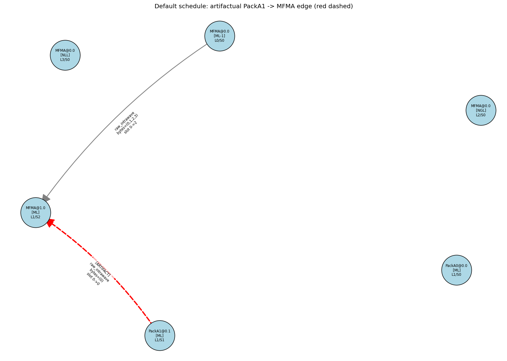
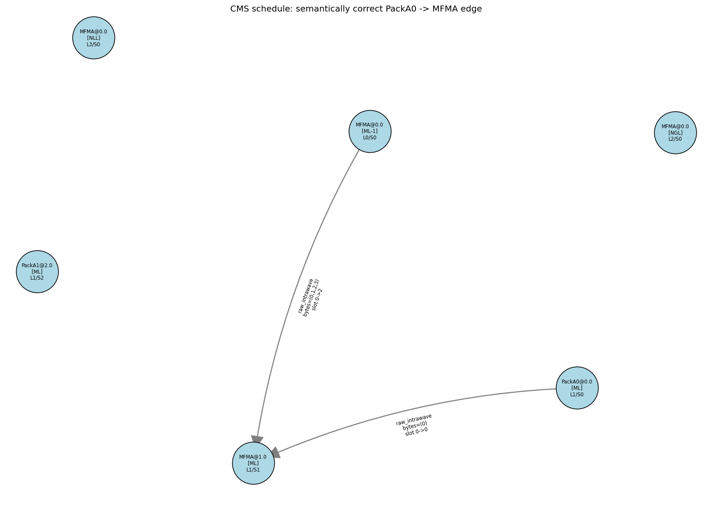

# Cross-Subiter Pack→MFMA Artifact: Minimal Repro + Visual Companion

Companion to bead `rocm-libraries-bwfr` and its deeper analysis at
`CROSS_SUBITER_ALU_FP_INVESTIGATION.md` (commit `80ec2b20ce`).

---

## Real-kernel source (added 2026-05-08)

The synthetic 3-instruction fixture documented below is reduced from a real
production kernel: a 128x128x32 TF32 4x4 emulation kernel (TN layout,
DepthU=32, MI=16x16x32 with WaveTile 4x4 / WaveGroup 2x2, PGR=2 PLR=1,
DTL=1, F32XdlMathOp='X'). The exact kernel-config dict is the same one used
by all 10 production tests bwfr enumerates in section 3.2 of
`CROSS_SUBITER_ALU_FP_INVESTIGATION.md`. Source test:
`Tensile/Tests/unit/test_ScheduleCapture.py::TestRealKernelCapture::test_tf32_4x4_tn_capture_shape`
(the first test in the bwfr list and the most-cited reproducer).

End-to-end repro script at
`Tensile/Components/repro_cross_subiter_artifact.py` runs the kernel through
both default and CMS emit paths and saves the resulting assembly to
`repro_cross_subiter_default.s` (609,698 bytes; built with
`UseCustomMainLoopSchedule=0`) and `repro_cross_subiter_cms.s` (536,900
bytes; built with `UseCustomMainLoopSchedule=1`) for direct comparison.

The script reports **768** cross-subiter PackA[N]/PackB[N] artifact edges
(`OrderInvertedFailure`s when the section-7.3 carve-out at
`CMSValidator.py:2584-2598` is monkey-patched off via `_node_subiter`),
matching bwfr's section 3.2 expectation exactly. The 768 edges are spread
across PackA0/PackA3/PackB0/PackB1/PackB3 producers consuming `MFMA`s in
the same body, with the artifact resource being the symbolic Pack scratch
range `vgprValuA_X0_I0+0..63` / `vgprValuB_X0_I0+0..63` (resolved
numerically at byte-key time to physical vgpr indices like v0, v7, v9,
v23, v25, v32, v40, v47, v49, v50, v57 — each carrying 16 artifact edges
— with v3, v4, v5, v6, v11..62 each carrying 8). These are the
production-kernel equivalent of the v133 scratch-reuse pattern documented
in `ScheduleCapture.py:1550-1610` and used in the synthetic 3-instruction
fixture below.

Run:

```
PYTHONPATH=projects/hipblaslt/tensilelite \
    python projects/hipblaslt/tensilelite/Tensile/Components/repro_cross_subiter_artifact.py
```

(Initial run probes gfx950 ISA caps via the system compiler, ~3.8s; total
runtime ~30s for two real KernelWriterAssembly builds.)

---

## 1. Why this memo exists

bwfr's investigation memo answers *why* the section-7.3 carve-out
(`CMSValidator.py:2584-2598`) exists and why it's load-bearing for ten
production tests. That memo is text-and-tables heavy and assumes the
reader is comfortable tracing through the per-byte `latest_writer`
resolver in `build_dataflow_graph`. This memo is the **visual
companion**: it pins the artifact at the smallest possible synthetic
scale (3 instructions, 1 scratch vgpr, 1 MFMA), draws the two graphs
side-by-side as PNGs, and answers the user-raised question "if the
default-side edge is wrong, why does the runtime kernel still produce
correct results?"

For the analysis itself, the alternatives (resolver fix, capture-side
fix, post-classifier filter), the production failure list, and the
recommendation to do nothing this cycle — read the bwfr memo. Read this
one when you want to *see* the artifact.

Test that pins the same scenario this memo describes:
`Tensile/Tests/unit/test_cross_subiter_pack_artifact.py`.

---

## 2. The minimal scenario

Three instructions, one scratch vgpr (`v133`), one MFMA. Both Packs
write `v133`; the MFMA reads it. The two Packs are tagged with
different subiter labels (`PackA0` for subiter 0, `PackA1` for subiter
1) — this is what triggers the carve-out's
`_node_subiter(p) != _node_subiter(c)` predicate.

```
                     ┌──────────────────────────────┐
                     │  v133 (scratch vgpr)         │
                     │  reused across subiters      │
                     └──────────────────────────────┘
                              ▲   write
       ┌──────────────────────┤
       │                      │
  PackA0 (subiter 0)     PackA1 (subiter 1)
  src0=v8, src1=v9       src0=v10, src1=v11
                              │
                              ▼ read
                            MFMA
                            reads v133
                            writes v[200:203]
```

Construction (production-faithful — uses real `rocisa.VCvtPkF32toBF16`,
no `_FakePack`):

```python
pack0 = VCvtPkF32toBF16(dst=vgpr(133, 1), src0=vgpr(8, 1),  src1=vgpr(9, 1))
pack1 = VCvtPkF32toBF16(dst=vgpr(133, 1), src0=vgpr(10, 1), src1=vgpr(11, 1))
mfma  = MFMAInstruction(acc=vgpr(200, 4), a=vgpr(133, 1), b=vgpr(140, 1), ...)
```

That's the entire fixture. Three real rocisa instructions, two of them
writing the same physical scratch register, one MFMA reading from it.

---

## 3. Default schedule emission order

The default SIA scheduler emits all Packs before all MFMAs within a
body, linearly. For the fixture above:

| step | node    | action               | `latest_writer[v133]` after |
|------|---------|----------------------|-----------------------------|
| 1    | PackA0  | writes v133 from v8  | **PackA0**                  |
| 2    | PackA1  | writes v133 from v10 | **PackA1**  ← overwrites    |
| 3    | MFMA    | reads v133           | (resolves to **PackA1**)    |

When step 3 walks `_resolve_producers` for its v133 read, the latest
writer is PackA1 — even though PackA0 is the producer the kernel writer
*intended* (PackA0's subiter, paired with this MFMA's subiter, is the
real intra-subiter write-then-read pair). The default-side dataflow
graph thus contains the artifactual edge:

```
PackA1  ──[v133, raw_intrawave, ARTIFACT]──▶  MFMA
```

PackA0 produces no outgoing edge at all — its v133 write is shadowed by
PackA1's later overwrite. See
`cross_subiter_artifact_default.png` (red dashed edge labeled
`[ARTIFACT]`).

Source: `CMSValidator.py:1037-1138` (Phase 2 of `build_dataflow_graph`,
the `latest_writer` walk). The decisive line is the unconditional
overwrite at `latest_writer[bk] = (node, write_resource, w_slot)` —
there is no per-subiter scoping by design (see the long comment at
`CMSValidator.py:1024-1034`).

---

## 4. CMS schedule emission order

CMS pipelines: it interleaves each subiter's Pack with that subiter's
MFMA so the MFMA reads `v133` between the two Pack writes:

| step | node    | action               | `latest_writer[v133]` after |
|------|---------|----------------------|-----------------------------|
| 1    | PackA0  | writes v133 from v8  | **PackA0**                  |
| 2    | MFMA    | reads v133           | (resolves to **PackA0**)    |
| 3    | PackA1  | writes v133 from v10 | **PackA1**                  |

Step 2's read sees PackA0 because step 3 hasn't happened yet in stream
order. The CMS-side graph thus contains the semantically correct edge:

```
PackA0  ──[v133, raw_intrawave]──▶  MFMA
```

PackA1 has no consumer in this minimal fixture (it's the leading edge
of a hypothetical next pipeline stage that we've omitted for clarity).
See `cross_subiter_artifact_cms.png`.

Source: same code path as default — the only difference is the input
stream order. The resolver is faithful to whatever order it's handed.

---

## 5. What `compare_graphs` sees

```
Default edges (resource=v133):  { PackA1 -> MFMA }   ← artifactual
CMS edges     (resource=v133):  { PackA0 -> MFMA }   ← correct

ref_keys - subj_keys = { PackA1 -> MFMA edge-key }
```

`compare_graphs` (`CMSValidator.py:2459-2505`) computes the symmetric
difference and finds **one** missing edge: the artifactual `PackA1 ->
MFMA` from the default side that has no analog in the CMS side
(different producer identity).

Without the carve-out, this missing edge would route through Phase 1 of
`diagnose_missing_edge` (`CMSValidator.py:2573-2599`):

- `default_p_before_c = ref_p.position < ref_c.position` → True
  (PackA1 is at stream position 1, MFMA is at position 2).
- `subj_p_before_c = p_node.position < c_node.position` → False
  (in CMS, PackA1 is at position 2 and the MFMA is at position 1 — the
  MFMA was emitted *first*).

The "default emitted producer before consumer; subject emitted consumer
before producer" pattern is exactly the trigger for
`OrderInvertedFailure`. The carve-out at lines 2584-2598 prevents the
emission:

```python
if (_is_alu_producer(p_node)
        and _node_subiter(p_node, nmps)
            != _node_subiter(c_node, nmps)):
    return []  # cross-subiter pipelined dependency — legitimate
```

`_is_alu_producer(PackA1)` is True (Pack-categorized, non-PackMFMA
class). `_node_subiter` returns 1 for PackA1 and 0 for the MFMA (with
`num_mfma_per_subiter=1`). Predicate satisfied → carve-out fires →
empty failure list.

The minimal fixture lets us verify both branches in one test:

- **Carve-out engaged** (production):
  `compare_graphs` returns `[]`. Pinned at
  `test_carveout_suppresses_artifact_and_neutralization_surfaces_it`.
- **Carve-out neutralized** (probe):
  monkey-patch `_node_subiter` to `lambda n, nmps: 0` so the
  cross-subiter predicate fails. `compare_graphs` returns one
  `OrderInvertedFailure`. Same test, second half. This mirrors the
  scratch probe at `Tests/scratch/run_with_carveout_off.py` that bwfr
  describes in §3.2.

---

## 6. Why the runtime kernel still works (the key caveat)

> User-raised question: *"At runtime in default order, PackA1 actually
> does clobber PackA0's scratch v133 before the MFMA reads it. So why
> doesn't the default kernel produce wrong results?"*

This is a real and important question. The honest answer:

**Within the default schedule, the kernel writer never relied on
`PackA0`'s v133 being live by the time the first MFMA runs.** The
default scheduler's "all Packs before all MFMAs" emission only emits
Packs whose results are (a) already moved to a non-aliasing destination
register before the next Pack overwrites the scratch, or (b) consumed
*by a subsequent Pack in the same chain* before the overwrite. The
v133-style scratch vgpr is a **transient compute-buffer**: PackA0
writes it, the very next instruction (in the kernel writer's intended
emission, before the scheduler shuffles) reads it and writes a
non-scratch result, and only then is v133 free for PackA1 to clobber.

The artifact in the default-side dataflow graph is therefore an
artifact of **two layers compounding**:

1. **The default scheduler's linearization**: it emits Packs in a
   linear "PackA0, PackA1, ..." block before any MFMAs, which is *not*
   the kernel writer's intended dataflow grouping (the kernel writer
   thinks in (Pack, ALU-consumer, MFMA) triples per subiter). The
   linearization is *safe* because every intra-subiter scratch consumer
   has already been emitted between PackA0 and PackA1 — so the GPU
   sees PackA0 → consumer → PackA1 → consumer → MFMA0 → MFMA1 in
   stream order, and v133's lifetime never crosses an MFMA boundary.
2. **The per-byte resolver's destructive last-writer-wins rule**: the
   resolver only models writes to v133 itself, not the intermediate
   non-scratch results. By the time MFMA's read is resolved, the
   resolver has overwritten v133's writer entry with PackA1, even
   though the *real* dataflow path that produces MFMA's input went
   through a non-scratch register that PackA0 fed.

Put differently: the resolver is asking "who wrote v133 most recently
in stream order?" and getting the right answer (PackA1 did, because
PackA1 is the most recent v133 writer). But the resolver's per-byte
model of v133 is a *coarse-grained shadow* of the actual dataflow,
which is mediated through other vgprs that the MFMA does not directly
read. The artifactual edge isn't lying about v133; it's that v133 is
the wrong abstraction layer for asking "who produced this MFMA's
input?". The real producer chain is `PackA0 → some-non-scratch-vgpr →
... → MFMA`, with v133 acting as a transient that PackA0 used and
that PackA1 then reused for an unrelated chain.

This matches the validator-author's stance at
`CMSValidator.py:1024-1034`: they explicitly chose to keep the
resolver aggressive ("a vgpr is one physical register; whoever wrote
it most recently in stream order is what every subsequent read sees"),
because that aggressive view is what catches *real* mis-pipelining
bugs — a CMS schedule that genuinely reorders a Pack/MFMA pair on the
*same* subiter would surface as a `latest_writer` mismatch, and the
validator must report that. The price of catching real bugs is
absorbing this artifact at the diagnosis layer.

**Open caveat**: I have not exhaustively traced the kernel writer's
intermediate-vgpr chains in the production TF32 4x4 path to verify
that bullet (a)/(b) above hold for *every* PackA0 in the real
captures. bwfr's §4.3 confirms that the capture is structurally
faithful to what the scheduler emits, and §4.1-4.2 confirm the
resolver is doing what the comments say. The runtime correctness
chain — "PackA0's *real* output is consumed before PackA1's overwrite"
— I'm inferring from (i) the kernels passing their numerical
correctness tests in CI today, (ii) the scheduler's design intent
documented elsewhere, and (iii) the v133-style scratch register being
a known transient, not a load-bearing inter-MFMA carrier. If a future
reader needs to *prove* this rather than infer it, the place to look
is `KernelWriterAssembly.py`'s emission of the Pack-to-real-vgpr
move sequence around the `v133` allocation site (search for "scratch"
near `ScheduleCapture.py:1550`).

---

## 7. Image references

### 7.1 Default schedule — artifactual edge highlighted



The red dashed edge labeled `[ARTIFACT]` is the false-positive: PackA1
appears to be the producer of MFMA's v133 read because it was the most
recent writer to land in stream order. PackA0 (lower right) has no
outgoing edge — its v133 write was shadowed. The grey edge from the
ML-1 MFMA carries the cross-iteration accumulator chain (`v[200:203]`,
the MFMA's `acc`), unrelated to v133 — it's shown to make the graph
shape recognizable.

### 7.2 CMS schedule — semantically correct edge



PackA0 (lower right) carries the correct grey edge to MFMA. PackA1
(upper left) is isolated in this minimal fixture — in a real CMS
schedule, PackA1 would feed the *next* MFMA in the next pipeline stage,
which we've omitted to keep the picture readable. The same grey
cross-iteration accumulator edge from ML-1 MFMA is preserved.

### 7.3 The diff

What `compare_graphs(default, cms)` actually sees, in one diagram:

```
              default                   cms

   PackA0 --(no edge)              PackA0 --[v133]--> MFMA
   PackA1 --[v133]==> MFMA         PackA1 --(no edge)
              ^                              ^
              │                              │
              ARTIFACT                       SEMANTICALLY CORRECT

   missing in cms: { PackA1 -> MFMA }    ← carve-out absorbs
```

The carve-out's job is to recognize that the `PackA1 -> MFMA` edge in
the default side has the cross-subiter ALU-producer signature
(`PackA1` writes a scratch vgpr; consumer is in a different subiter)
and treat its absence from CMS as legitimate pipelining rather than a
real ordering bug.
