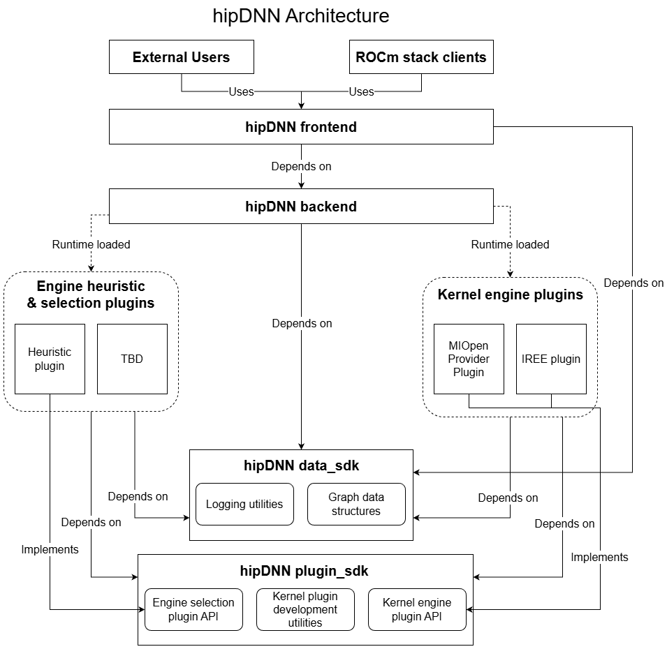

.. meta::
  :description: hipDNN has a plugin-based architecture in order to allow contributors and users to extend hipDNN without modifying the core library. 
  :keywords: hipDNN, ROCm, API, 

.. _architecture:

******************************
hipDNN high-level architecture
******************************

hipDNN has a plugin-based architecture in order to allow contributors and users to extend hipDNN without modifying the core library. 
hipDNN has support for engine plugins, which provide the kernels to solve graphs. 

.. note::

  See :ref:`backend-architecture` for a more granular breakdown of the system architecture and the backend API.

Architecture overview
=====================

Components
==========

- **Frontend**: A header-only C++ library that provides the industry standard API for interacting with hipDNN. The frontend wraps the backend C API to provide a more user-friendly C++ interface.
- **Backend**: A shared library which provides a C API for hipDNN. The backend is the core component of hipDNN which acts as a plugin loader and manager, connecting problems to plugins that can solve them.
- **SDKs**: Header-only libraries that provide shared utilities and interfaces. hipDNN provides three SDKs: Data SDK (graph schemas and data structures), Plugin SDK (plugin API and utilities), and Test SDK (testing utilities and CPU reference implementations).
- **MIOpen Provider Plugin**: A plugin that wraps MIOpen and provides access to the existing API through hipDNN. The :ref:`miopen` is its own separate project from hipDNN.
- **Other Plugins**: Plugins will be added over time to provide additional operational support, or performance improvements. Plugins should be external projects to hipDNN. See :ref:`plugin-support` for more information.

Frontend
--------

The frontend provides a user-friendly C++ interface to hipDNN, wrapping the lower-level C API provided by the backend.

Key characteristics:

- **Header-only C++ library**: There are no compiled libraries, which simplifies integration.
- **Dependencies**: The frontend is dependent on the :ref:`backend` and :ref:`data`.
- **Purpose**: It provides the API for users consuming hipDNN.
- **Expected usage**: The frontend should be consumed as a header-only dependency in user projects.

Frontend architecture
~~~~~~~~~~~~~~~~~~~~~

Graph class
^^^^^^^^^^^

The central abstraction in the frontend is the ``Graph`` class, which:

- Manages the construction of operation graphs.
- Handles the creation and configuration of nodes.
- Orchestrates the execution workflow.

Nodes
^^^^^

Nodes represent individual operations within a graph:

- Each node type (for example, ``BatchnormNode``, ``PointwiseNode``) inherits from ``INode``.
- Nodes encapsulate their specific attributes and tensor connections.
- Support serialization to Flatbuffer format for backend consumption.

Attributes
^^^^^^^^^^

Attributes configure the behavior of nodes:

- Each node type has corresponding attribute classes (for example, ``Batchnorm_attributes``).
- Attributes include operation-specific parameters like epsilon, momentum, etc.
- Support builder pattern for easy configuration.

Simplified workflow example
^^^^^^^^^^^^^^^^^^^^^^^^^^^

.. code:: cpp

  // Create a graph
  Graph graph;
  graph.set_compute_data_type(DataType_t::FLOAT);

  // Create tensors
  auto x = Graph::tensor(/* tensor attributes */);
  auto scale = Graph::tensor(/* tensor attributes */);
  auto bias = Graph::tensor(/* tensor attributes */);

  // Add operations
  auto [y, mean, inv_var, _, _] = graph.batchnorm(x, scale, bias, bn_attributes);

  // Build and execute
  graph.build_operation_graph(handle);
  graph.create_execution_plans();
  graph.build_plans();
  graph.execute(handle, variant_pack, workspace);

For complete working examples, see the official `samples on GitHub <https://github.com/ROCm/rocm-libraries/tree/develop/projects/hipdnn/samples>`_.

SDKs
----

hipDNN provides three header-only SDK libraries that serve as the foundation for communication between different components.

.. _data:

Data SDK (``data_sdk``)
~~~~~~~~~~~~~~~~~~~~~~~

The Data SDK contains ``FlatBuffers`` schemas and data structures for graph representation. 
The serialized structures allow data to be marshalled and passed between the frontend, backend, and plugins in a type-safe and highly version-compatible fashion.

- **Dependencies**: ``FlatBuffers`` and ``spdlog``.
- **Purpose**: Provides data structures and serialization for graphs, tensors, and configurations.
- **Expected usage**: Consumed by the frontend, backend, and plugins for graph data handling.
- **Core functionality**:

  - ``FlatBuffer`` schema definitions for graphs, nodes, and attributes.
  - Data structures for deserializing serialized graphs.
  - Logging utilities and type helpers (``half``, ``bfloat16``, etc.).

.. _plugin-sdk:

Plugin SDK (``plugin_sdk``)
~~~~~~~~~~~~~~~~~~~~~~~~~~~

The Plugin SDK contains the plugin API and utilities for creating engine plugins.

- **Dependencies**: :ref:`data`.
- **Purpose**: Provides the interface and utilities for plugin development.
- **Expected usage**: Consumed by plugin projects.
- **Core functionality**:

  - Plugin API definitions (for example, ``hipdnnEnginePluginCreate`` and ``hipdnnEnginePluginExecuteOpGraph``).
  - Base classes for engine implementation.
  - Utilities for plugin development.

Test SDK (``test_sdk``)
~~~~~~~~~~~~~~~~~~~~~~~

The Test SDK provides utilities for testing plugins.

- **Dependencies**: :ref:`data` and :ref:`plugin-sdk`.
- **Purpose**: Provides testing infrastructure for plugin validation.
- **Expected usage**: Consumed by plugin test suites.
- **Core functionality**:

  - CPU reference implementations for validation (convolution, batchnorm, etc.).
  - Test utilities (tolerances, seeds, logging).
  - Mock objects for unit testing.

Plugin architecture
-------------------

Plugin loading
~~~~~~~~~~~~~~~

- The backend discovers plugins at runtime via the default plugin path, or by using ``hipdnnSetEnginePluginPaths_ext`` to provide additional paths from which to load the plugins.
- Each plugin exports standard entry points defined in the Plugin SDK.

Engine management
~~~~~~~~~~~~~~~~~

- Each plugin can provide multiple engines.
- Engines must have globally unique IDs that remain constant for each run.
- Plugins determine which engines are applicable for a given graph.

Key plugin functions
~~~~~~~~~~~~~~~~~~~~

.. code:: c

  // Get all available engine IDs
  hipdnnEnginePluginGetAllEngineIds(engine_ids, max_engines, num_engines);

  // Check which engines can solve a graph
  hipdnnEnginePluginGetApplicableEngineIds(handle, graph, engine_ids, max, num);

  // Create execution context for a specific engine
  hipdnnEnginePluginCreateExecutionContext(handle, config, graph, context);

  // Execute the graph
  hipdnnEnginePluginExecuteOpGraph(handle, context, workspace, buffers, num_buffers);

Engine plugins
--------------

Engine plugins provide the actual computational implementations for hipDNN graphs.

Key characteristics:

- **Separate installable projects**: Independent development and deployment.
- **Dependencies**: :ref:`data` and :ref:`plugin-sdk` (and plugin-specific dependencies as needed).
- **Purpose**: Provides engines which are capable of solving graphs.
- **Expected usage**: Loaded at runtime by the backend.

Engine plugin types
--------------------

Static kernel engines
~~~~~~~~~~~~~~~~~~~~~

- Provides pre-compiled kernels for specific operations.
- Only handles specific configurations.
- For example, the MIOpen Provider plugin.
- **Advantages**:

  - Highly optimized for supported cases.
  - Predictable performance.
  - Lower compilation overhead.

Dynamic kernel engines
~~~~~~~~~~~~~~~~~~~~~~

- Generate kernels at runtime based on graph structure.
- Broad support: Handles general graph patterns.
- For example, future JIT-compilation plugins
- **Advantages**:

  - Flexible operation fusion.
  - Support for novel graph patterns.
  - Adaptable to hardware capabilities.

See :ref:`develop-plugins` for information on developing and using plugins.

.. _backend:

Backend
-------

The backend is the core engine of hipDNN responsible for managing plugins and orchestrating graph execution.

Key characteristics
~~~~~~~~~~~~~~~~~~~

- **Installable library**: C API with ABI for language interoperability, which is dynamically loadable.
- **Dependencies**: :ref:`data`.
- **Purpose**: Provides a stable C API for interacting with the hipDNN kernel providers.
- **Expected usage**: Library linked to the frontend API and expert user projects that provides access to the backend API.

Workflow
~~~~~~~~

1. **Create a Graph**: Build an operation graph using the frontend.
2. **Create heuristic descriptor**: Initialize with the graph and desired heuristic mode.
3. **Get engine configs**: Query available engine configurations from the heuristic.
4. **Create execution plan**: Combine selected engine config with the graph.
5. **Run execution plan**: Execute with variant pack containing tensor data.

.. code:: c

  // Simplified Backend workflow
  hipdnnBackendDescriptor_t graph_desc, heuristic_desc, config_desc, plan_desc, variant_desc;

  // 1. Create graph (from serialized data)
  hipdnnBackendCreateAndDeserializeGraph_ext(&graph_desc, serialized_graph, size);

  // 2. Create and configure heuristic
  hipdnnBackendCreateDescriptor(HIPDNN_BACKEND_ENGINEHEUR_DESCRIPTOR, &heuristic_desc);
  hipdnnBackendSetAttribute(heuristic_desc, HIPDNN_ATTR_ENGINEHEUR_OPERATION_GRAPH, ...);
  hipdnnBackendFinalize(heuristic_desc);

  // 3. Get engine configurations
  hipdnnBackendGetAttribute(heuristic_desc, HIPDNN_ATTR_ENGINEHEUR_RESULTS, ...);

  // 4. Create execution plan
  hipdnnBackendCreateDescriptor(HIPDNN_BACKEND_EXECUTION_PLAN_DESCRIPTOR, &plan_desc);
  hipdnnBackendSetAttribute(plan_desc, HIPDNN_ATTR_EXECUTION_PLAN_ENGINE_CONFIG, ...);
  hipdnnBackendFinalize(plan_desc);

  // 5. Execute
  hipdnnBackendExecute(handle, plan_desc, variant_desc);

Error handling strategy
-----------------------

hipDNN uses a layered error handling approach designed to be robust across C/C++ boundaries:

-  **Plugins**: Plugin entry points return ``hipdnnPluginStatus_t`` codes. Internal exceptions are caught at the plugin boundary and converted to status codes. Error strings are stored in thread-local storage via ``PluginLastErrorManager``.
-  **Backend (C API)**: All public API functions return ``hipdnnStatus_t`` codes. The backend catches any internal C++ exceptions, converts them to the appropriate status code, and stores the exception message. Users can retrieve descriptive error messages using ``hipdnnGetLastErrorString``.
-  **Frontend (C++ API)**: The C++ frontend checks ``hipdnnStatus_t`` codes from the backend. On failure, it retrieves the detailed error message via ``hipdnnGetLastErrorString`` and returns an ``Error`` object containing the error code and description. The frontend utilizes *value-based error handling* rather than throwing exceptions.

