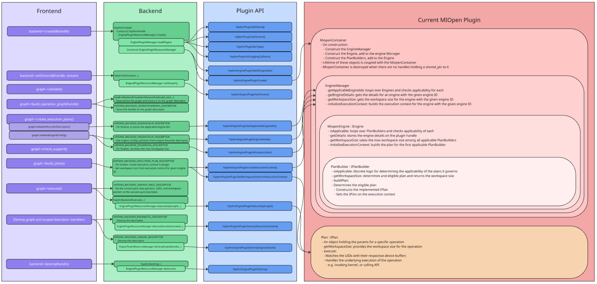

.. meta::
  :description: hipDNN high-level architecture
  :keywords: hipDNN, ROCm, API, 

.. _backend-architecture:

***************************
hipDNN backend architecture
***************************

.. important::

  This page is for advanced users who want a more granular breakdown of the system architecture and the backend API. See :ref:`architecture` for a high-level overview of the system architecture. 

The hipDNN framework consists of a frontend (C++ Graph API), a backend (core runtime), and a plugin system. The backend prepares and dispatches execution to dynamically loaded plugins via a C-API interface.

This diagram demonstrates how frontend calls pass through the backend and ultimately get handled by an engine plugin. 
The call-stack demonstrated isn't exhaustive, it's mostly to illustrate the entry / exit points for each layer. The implementation of the MIOpen plugin is overlayed to demonstrate how a plugin might implement the plugin interface.

Execution Flow
==============

The plugin C-API separates the plugin implementation from the hipDNN backend. 
SDKs are provided to assist plugin developers, but the implementation details are otherwise at the discretion of the developer.

This architecture effectively separates the plugin interface from the engine implementation details. However, this infrastructure is largely internal to the MIOpen plugin. The goal of the Plugin SDK is to standardize and provide these as reusable components for plugin development, so developers can focus on the implementations of the underlying kernels and libraries.

Backend descriptor types
========================

The backend uses descriptors as opaque handles to manage different aspects of graph execution:

Operation Graph Descriptor (``HIPDNN_BACKEND_OPERATIONGRAPH_DESCRIPTOR``)
-------------------------------------------------------------------------

- Represents the computational graph to be executed.
- Contains nodes, tensors, and their connections.

Engine Heuristic Descriptor (``HIPDNN_BACKEND_ENGINEHEUR_DESCRIPTOR``)
----------------------------------------------------------------------

- Manages the selection of appropriate engines for a graph.
- Queries plugins for applicable engines.
- Extensible plugin design to control engine selection.

Engine Config Descriptor (``HIPDNN_BACKEND_ENGINECFG_DESCRIPTOR``)
------------------------------------------------------------------

- Represents a specific engine configuration.
- Contains engine ID and configuration parameters.
- Retrieved from heuristic results.

Engine Descriptor (``HIPDNN_BACKEND_ENGINE_DESCRIPTOR``)
--------------------------------------------------------

- Represents a backend engine.
- Contains engine ID, and a set of behavioral notes + configurable settings.
- Retrieved from engine config Descriptor.

Execution Plan Descriptor (``HIPDNN_BACKEND_EXECUTION_PLAN_DESCRIPTOR``)
------------------------------------------------------------------------

- Combines an engine configuration with a graph.
- Manages workspace requirements.
- Prepares for actual execution.

Variant Pack Descriptor (``HIPDNN_BACKEND_VARIANT_PACK_DESCRIPTOR``)
--------------------------------------------------------------------

- Contains runtime data for execution.
- Maps tensor UIDs to device memory pointers.
- Includes workspace device memory pointer.

