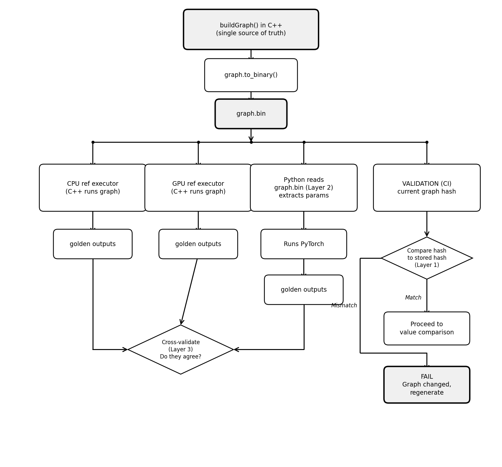

# RFC 0010: Golden Reference Validation

> Owner: Integration Test Team
> Last updated: 2026-05-04

## Table of Contents
1. [Executive Summary](#executive-summary)
2. [Pipeline Overview](#pipeline-overview)
3. [Step 1: construct -- Build the Graph](#step-1-construct----build-the-graph)
4. [Step 2: execute-reference -- Run the Reference Executor](#step-2-execute-reference----run-the-reference-executor)
5. [Step 3: serialize -- Save Inputs and Outputs to Disk](#step-3-serialize----save-inputs-and-outputs-to-disk)
6. [Step 4: deserialize -- Load Inputs Back](#step-4-deserialize----load-inputs-back)
7. [Step 5: execute-engine -- Run the Engine Under Test](#step-5-execute-engine----run-the-engine-under-test)
8. [Step 6: deserialize -- Load Saved Outputs](#step-6-deserialize----load-saved-outputs)
9. [Step 7: validate -- Compare Engine Output to Saved Output](#step-7-validate----compare-engine-output-to-saved-output)
10. [Verification Modes](#verification-modes)
11. [CLI and Configuration](#cli-and-configuration)
12. [Harness Integration](#harness-integration)
13. [Data Management with DVC](#data-management-with-dvc)
14. [CI Integration](#ci-integration)
15. [Adding New Golden Reference Tests](#adding-new-golden-reference-tests)
16. [Implementation Phases](#implementation-phases)
17. [Risk Register](#risk-register)
18. [Quality Principles](#quality-principles)
19. [Future Work](#future-work)

---

## Executive Summary

The integration test suite currently supports two verification modes. This RFC adds a third:

1. **CPU reference** (existing) -- compute reference on CPU at runtime
2. **GPU reference** (existing) -- compute reference on GPU at runtime
3. **Golden reference** (new) -- compare against pre-computed, version-controlled reference data from disk

### Key Benefits
- **Deterministic baselines and regression detection**: Reference data is frozen from an agreed-upon known-good source. Test outcomes depend only on the engine under test. Unlike computed mode -- where both the reference executor and the engine can drift together and the test still passes -- golden mode compares against a locked baseline, so any engine change is caught
- **Unblocks testing before C++ reference kernels exist**: Generate golden data from any trusted source (see [Reference Sources](#reference-sources)) and start validating immediately -- the C++ reference kernel can follow later without delaying test coverage
- **Faster execution**: Eliminates runtime reference computation for large tensors
- **Data-driven test addition**: New test cases can be added by generating new golden data files without recompiling the test binary

### How It Works

At its core, the golden reference feature follows these steps across two pipelines -- generation (run once) and validation (run every CI):

| Step | Tag | What happens | Generation | Validation |
|------|-----|-------------|:---:|:---:|
| 1 | `construct` | Build the graph (same as today) | Y | Y |
| 2 | `execute-reference` | Run a trusted reference (CPU ref, GPU ref, or external) to produce truth | Y | -- |
| 3 | `serialize` | Save inputs + outputs to disk | Y | -- |
| 4 | `deserialize` | Load saved inputs from disk | -- | Y |
| 5 | `execute-engine` | Run MIOpen GPU (the thing being tested) | -- | Y |
| 6 | `deserialize` | Load saved reference outputs from disk | -- | Y |
| 7 | `validate` | Compare engine output to saved output | -- | Y |

No reference executor runs in CI. The truth was computed once and frozen to disk. The graph is always rebuilt from `buildGraph()` in the test fixture -- the stored `graph.bin` is used only for fingerprint comparison, not for reloading the graph. The diagrams in [Pipeline Overview](#pipeline-overview) show both pipelines visually.

### Why This Is Needed

The integration test suite currently validates engine outputs by computing references at runtime via [`CpuReferenceGraphExecutor`](../../test_sdk/include/hipdnn_test_sdk/utilities/cpu_graph_executor/CpuReferenceGraphExecutor.hpp) or [`GpuReferenceGraphExecutor`](../../../../dnn-providers/integration-tests/src/harness/gpu_graph_executor/GpuReferenceGraphExecutor.hpp). This creates several gaps:

1. **Circular dependency risk**: If the reference executor has a bug, both sides produce the same wrong answer and the test passes
2. **Coverage gap**: Operations not yet implemented in the reference executor cannot be tested (e.g., instead of writing a C++ SDPA reference kernel, golden data lets us use an external framework's output as truth via `--external-reference`)
3. **Non-determinism**: GPU reference results can vary across runs, making failure investigation harder
4. **Slowness**: CPU reference execution for large tensors is the bottleneck in full-tier tests

A prior effort established a golden reference pattern in the MIOpen plugin's test suite ([`GoldenReferenceGpu.hpp`](../../../miopen-provider/tests/common/GoldenReferenceGpu.hpp)) using serialized graph+tensor JSON files loaded from `hipdnn_reference_data/`. This RFC builds on that pattern, extends it for broader use, and integrates it into the shared integration test harness so it works across all plugins (MIOpen, Fusilli, and future ones) without plugin-specific code.

### Who This Serves

- **Test author**: Can add golden data for a new op without writing a reference kernel. Clear error messages when something goes wrong.
- **CI pipeline**: Deterministic pass/fail with no flaky skips. No runtime reference computation slowing down feedback.
- **Developer**: Can trust test results, understand failures at a glance, and run locally without needing remote storage credentials.

---

## Pipeline Overview

Two pipelines share the same set of steps:

### Generation Pipeline (runs once, produces golden data)


### Validation Pipeline (runs every CI)


The graph fingerprint check is the **first gate**. Before loading any tensors or running any engine, the harness serializes the current graph and compares its hash to the stored `graph.bin`. If the hash differs, the golden data may no longer match the graph the engine will execute, so the test fails immediately and asks the developer to regenerate. This check is conservative -- it may reject golden data that is still technically valid (e.g., when only internal UIDs changed but tensor names and shapes are the same). That is by design: a false failure is cheap (just regenerate), while a false pass is dangerous.

This assumes `graph.to_binary()` produces identical bytes for the same logical graph. If the serialization is non-deterministic (e.g., map iteration order varies), the fingerprint will fire spuriously. If that becomes an issue, the check can be replaced with a semantic comparison.

The graph construction (step 1) is shared by both pipelines -- the same `buildGraph()` code produces the same graph. This means golden data and the test under execution always agree on tensor names, shapes, and semantics.

---

## Step 1: construct -- Build the Graph

**What**: Construct the computation graph using the test fixture's `buildGraph()` method.

**Who calls it**: Both the generation pipeline and the validation pipeline.

**What exists today**: This step already works. Every test fixture (e.g., `IntegrationGpuConvForward.cpp`) implements `buildGraph()` which creates a `graph::Graph`, adds tensors with explicit **names** (e.g., `"x"`, `"w"`, `"y"`), creates operations, validates, and builds the operation graph.

**What changes**: Nothing. The graph construction code is untouched.

**Design constraint**: Tensor names set in `buildGraph()` are the **identity contract** for golden data. They are how golden files map to runtime tensors. A tensor named `"x"` in the golden file must correspond to a tensor named `"x"` in the graph.

### Tensor Identity Contract

**Invariant**: Golden data maps tensors by **name** (e.g., `"X"`, `"W"`, `"Y"`), never by UID.

UIDs are assigned during `buildGraph()` and can change across refactors. Names are set explicitly by test authors and are part of the test's semantic contract. Names must be unique within a graph -- if two tensors share a name, the manifest silently drops one and the name-to-UID map silently overwrites the other, causing wrong data to load with no error. The generator enforces this at write time. The golden data loader resolves names to UIDs at load time:

```cpp
// Resolve golden tensor names to runtime UIDs
void resolveGoldenTensors(
    const graph::Graph& graph,
    const GoldenManifest& manifest,
    GraphTensorBundle& bundle)
{
    std::unordered_map<std::string, int64_t> nameToUid;
    graph.visit([&](const graph::INode& node) {
        for(const auto& attr : node.getNodeInputTensorAttributes())
            nameToUid[attr->get_name()] = attr->get_uid();
        for(const auto& attr : node.getNodeOutputTensorAttributes())
            nameToUid[attr->get_name()] = attr->get_uid();
    });

    for(const auto& [name, tensorInfo] : manifest.inputs)
    {
        auto it = nameToUid.find(name);
        if(it == nameToUid.end())
        {
            FAIL() << "Golden data references tensor '" << name
                   << "' not found in runtime graph. "
                   << "Graph construction may have changed since golden data was generated.";
        }
        bundle.tensors.insert({it->second, loadTensorFromBin(tensorInfo)});
    }
}
```

If a golden file references a tensor name that does not exist in the runtime graph, the test **fails immediately** with a diagnostic message. This is a fail-fast guard against silent data staleness.

**Acceptance criteria**:
- [ ] `resolveGoldenTensors()` maps by `attr->get_name()`, never by UID
- [ ] Golden tensor name absent from runtime graph: **hard FAIL** with message naming the missing tensor
- [ ] Runtime output tensor absent from golden data: **hard FAIL** listing expected golden names
- [ ] Unit test: Rename a tensor UID, verify golden validation still works (name unchanged)
- [ ] Unit test: Rename a tensor name, verify golden validation fails with clear diagnostic
- [ ] Unit test: Add a new output tensor not in golden data, verify hard FAIL
- [ ] Generator refuses to write golden data if any tensor name is empty or duplicated within the graph

---

## Step 2: execute-reference -- Run the Reference Executor

**What**: Execute the CPU reference to produce trusted output values.

**Who calls it**: Only the generation pipeline. This step does NOT run during CI validation -- that's the whole point of golden data.

**What exists today**: `CpuReferenceGraphExecutor` serializes the graph to flatbuffer, then walks nodes in topological order using `PlanBuilderRegistry` to look up a CPU implementation for each operation. It supports: ConvFwd/Bwd/Wrw, BatchnormInf/Train/Bwd, Pointwise (all modes), Matmul, Layernorm, RMSNorm, SDPA, Reduction, BlockScaleDequantize.

**What changes**: Nothing to the executor itself. The generation pipeline calls it exactly as the existing `verifyGraph()` does:

```cpp
executeCpuGraph(graph, cpuBundle);

// Which is:
auto [serializedGraph, serErr] = graph.to_binary();
CpuReferenceGraphExecutor().execute(
    serializedGraph.data(), serializedGraph.size(),
    cpuBundle.toHostVariantPack());
```

**Two distinct executors -- do not confuse**:

| | execute-reference (Step 2) | execute-engine (Step 5) |
|---|---|---|
| **What** | A trusted reference source | MIOpen GPU engine |
| **When** | Once, during golden data generation | Every CI run, during validation |
| **Purpose** | Produce trusted truth | Produce output to validate |
| **Source** | CPU ref, GPU ref, or external (e.g., PyTorch) | `graph.execute(handle, ...)` |

### Reference Sources

The golden data format is **reference-source-agnostic**. The manifest records which source produced the truth (via `reference_executor` field), but the validation pipeline doesn't care -- it just loads tensors and compares. This means any trusted source can produce golden data:

| Category | Examples | Flag | When to use |
|----------|----------|------|------------|
| In-house CPU ref | `CpuReferenceGraphExecutor` | `--reference-executor cpu` (default) | Most ops -- already implemented, trusted |
| In-house GPU ref | `GpuReferenceGraphExecutor` | `--reference-executor gpu` | When CPU ref is too slow or unavailable |
| Python frameworks | PyTorch, TensorFlow, JAX | `--external-reference <dir>` | New ops with no C++ ref kernel yet; unblocks testing immediately |
| Third-party engines | Other vendor libraries, other hipDNN plugins | `--external-reference <dir>` | Cross-engine validation, competitive benchmarking |
| Other C++ implementations | Standalone C++ reference code, research prototypes | `--external-reference <dir>` | When a team has a verified implementation outside the test SDK |

The first two (CPU/GPU ref) are built-in -- the generator calls them directly. Everything else goes through `--external-reference`, which reads pre-computed tensor files from a directory. The golden data format doesn't distinguish between them; only the manifest metadata records the origin.

**Future-proofing**: As new engines are added to hipDNN (e.g., Fusilli, or a new plugin), their outputs can also serve as reference data for cross-engine comparison. The golden data format doesn't need to change -- just generate from one engine, validate against another.

### External Reference Pipeline

For operations where no C++ reference executor exists, **PyTorch (or any framework) can produce the truth instead**. This avoids writing and maintaining a C++ reference kernel for every operation -- PyTorch already has a correct, well-tested implementation.

```bash
# 1. Generate reference outputs with PyTorch
python scripts/generate_reference.py \
  --op sdpa_fwd \
  --cases "B1_H8_S128_D64,B2_H16_S256_D64" \
  --output-dir ./pytorch_outputs/

# 2. Feed them into the golden data generator
./hipdnn_integration_tests \
  --generate-golden \
  --external-reference ./pytorch_outputs/ \
  --golden-data-dir ./golden_data \
  --gtest_filter="*SdpaFwd*Smoke*"
```

#### What the Python script must produce

The `--external-reference` directory must contain one raw binary file per output tensor, named to match the tensor name in the graph (e.g., `Y.bin`). The generator reads these files instead of running a C++ reference executor, then packages them into the standard golden data format (manifest + binary blobs + SHA-256).

#### Where the scripts live

External reference scripts live in `scripts/reference_generators/` within the integration test project:

```
integration-tests/
  scripts/
    reference_generators/
      generate_sdpa_reference.py    # SDPA fwd/bwd
      generate_layernorm_reference.py
      common.py                     # Shared utilities (tensor I/O, shape parsing)
      requirements.txt              # torch, numpy
```

#### Graph-Level Correctness: Closing the Semantic Gap

The core risk with external references is: **how do we know the Python script ran the same computation as the C++ graph?** If the Python script hardcodes `padding=1` but the C++ graph says `padding=0`, the golden data is wrong and nothing catches it.

The following diagram shows how the graph definition flows through the system and where each correctness check happens:



Three layers of defense, each catching a different kind of mismatch:

**Layer 1: Graph fingerprint** -- catches graph drift after generation

The generator stores `graph.bin` (serialized flatbuffer) in the golden data directory. At validation time, the harness serializes the current graph and compares its SHA-256 to the stored hash. If someone changes `buildGraph()` without regenerating golden data, this catches it before any value comparison.

```cpp
// At golden validation time (step 4, before loading tensors)
auto [currentGraphBin, err] = graph.to_binary();
auto currentHash = computeSha256(currentGraphBin);
if(currentHash != manifest.graph.sha256)
{
    FAIL() << "Graph definition has changed since golden data was generated."
           << "\n  Golden graph hash: " << manifest.graph.sha256
           << "\n  Current graph hash: " << currentHash
           << "\n  Regenerate golden data with --generate-golden";
}
```

This is Phase 1 -- it protects all reference sources (CPU ref, GPU ref, and external).

**Layer 2: Python reads the serialized graph** -- eliminates dual-spec

Instead of the Python script independently defining operation parameters, it reads the serialized graph exported from `buildGraph()`:

```bash
# 1. Export the graph definition from C++
./hipdnn_integration_tests \
  --export-graph \
  --golden-data-dir ./graph_exports/ \
  --gtest_filter="*SdpaFwd*Smoke*"

# 2. Python reads the exported graph, extracts params, runs PyTorch
python scripts/generate_reference.py \
  --graph-file ./graph_exports/SdpaFwd_Smoke_B1_H8/graph.bin \
  --output-dir ./pytorch_outputs/

# 3. Feed outputs into golden data generator
./hipdnn_integration_tests \
  --generate-golden \
  --external-reference ./pytorch_outputs/ \
  --golden-data-dir ./golden_data \
  --gtest_filter="*SdpaFwd*Smoke*"
```

The Python script extracts operation type, tensor shapes, data types, and operation-specific parameters (padding, stride, dilation, etc.) from the flatbuffer. `buildGraph()` in C++ is the **single source of truth**. The Python script never independently defines parameters -- it reads them.

This requires a Python flatbuffer reader for the graph schema, which is additional work but eliminates an entire class of bugs (parameter mismatch between C++ and Python).

**Layer 3: Cross-validation health check** -- catches implementation bugs

When a C++ reference executor IS available for an operation, a CI health check generates golden data from both sources and confirms they agree:

```bash
# Generate from C++ CPU reference
./hipdnn_integration_tests --generate-golden --reference-executor cpu \
  --golden-data-dir ./golden_cpu/ --gtest_filter="*SdpaFwd*Smoke*"

# Generate from Python external reference
./hipdnn_integration_tests --generate-golden --external-reference ./pytorch_outputs/ \
  --golden-data-dir ./golden_ext/ --gtest_filter="*SdpaFwd*Smoke*"

# Compare the two sets of golden outputs
python scripts/compare_golden_sets.py ./golden_cpu/ ./golden_ext/
```

If both produce the same outputs (within tolerance), the external reference is validated. If they disagree, investigation is needed before trusting either.

#### Summary

| Layer | Phase | What it catches | How |
|-------|-------|----------------|-----|
| Graph fingerprint | Phase 1 | C++ graph changed after golden data was generated | Hash comparison at validation time |
| Python reads serialized graph | Phase 2 | Python and C++ disagree on operation parameters | Single source of truth (flatbuffer) |
| Cross-validation health check | Phase 2 | Python implementation bug (correct params, wrong math) | Generate from both sources, compare outputs |

**Acceptance criteria**:
- [ ] `--reference-executor cpu` calls `CpuReferenceGraphExecutor` (default)
- [ ] `--reference-executor gpu` calls `GpuReferenceGraphExecutor`
- [ ] `--external-reference <dir>` reads raw binary files by tensor name, skips executor
- [ ] External reference with missing output tensor file (e.g., `Y.bin` absent): **hard FAIL** naming the missing file
- [ ] `reference_executor` field written to manifest for all three sources (`cpu`, `gpu`, `external`)
- [ ] Generator validates reference outputs contain no NaN/Inf before writing

---

## Step 3: serialize -- Save Inputs and Outputs to Disk

**What**: After the reference executor produces outputs, write all tensor data (inputs AND outputs) plus metadata to disk.

**Who calls it**: Only the generation pipeline.

**This is where format decisions live.** The question "JSON or binary?" is answered here.

### Golden Data Format

Golden data uses a **manifest + binary blobs** format. Each test case produces a directory:

```
NCHW_1x16x16x16_1x16x3x3/
  manifest.json          # Metadata, tensor map, checksums
  graph.bin              # Serialized flatbuffer graph
  tensor_X.bin           # Raw binary tensor data (input)
  tensor_W.bin           # Raw binary tensor data (input)
  tensor_Y.bin           # Raw binary tensor data (reference output)
```

#### Manifest Format

```json
{
  "format_version": 1,
  "metadata": {
    "generator_version": "1.0.0",
    "created_at": "2026-05-04T18:00:00Z",
    "gpu_architecture": "gfx942",
    "rocm_version": "6.4.0",
    "reference_executor": "cpu",
    "reference_executor_hash": "a3f8c2e1",
    "operation": "conv_fwd",
    "seed": 42
  },
  "graph": {
    "file": "graph.bin",
    "sha256": "e3b0c44298fc1c14..."
  },
  "inputs": {
    "X": {
      "file": "tensor_X.bin",
      "dims": [1, 16, 16, 16],
      "strides": [4096, 256, 16, 1],
      "data_type": "FLOAT",
      "sha256": "a1b2c3d4e5f6..."
    },
    "W": {
      "file": "tensor_W.bin",
      "dims": [16, 16, 3, 3],
      "strides": [144, 9, 3, 1],
      "data_type": "FLOAT",
      "sha256": "f6e5d4c3b2a1..."
    }
  },
  "outputs": {
    "Y": {
      "file": "tensor_Y.bin",
      "dims": [1, 16, 16, 16],
      "strides": [4096, 256, 16, 1],
      "data_type": "FLOAT",
      "sha256": "1a2b3c4d5e6f..."
    }
  }
}
```

#### Why Not JSON + Base64?

Jeremy's original pattern uses JSON with embedded tensor data. For small tensors this works, but a single `8x512x64x64` fp32 tensor is 64 MB raw. Base64 adds 33% overhead and JSON parsing becomes the bottleneck. The binary blob format:

- Stores tensors at raw size (no encoding overhead)
- Enables memory-mapped reads for large tensors
- Keeps the manifest human-readable for inspection and debugging
- Adds ~3 lines of I/O code compared to all-JSON

#### Extensibility to Binary

Start with JSON manifest for velocity. The reader/writer are behind abstract interfaces (`GoldenDataReader` / `GoldenDataWriter`), making a future binary manifest format a drop-in replacement:

```cpp
// Scaffold: abstract reader interface
class IGoldenDataReader
{
public:
    virtual ~IGoldenDataReader() = default;
    virtual GoldenManifest loadManifest(const std::filesystem::path& dir) = 0;
    virtual std::unique_ptr<ITensor> loadTensor(const GoldenTensorInfo& info,
                                                 const std::filesystem::path& dir) = 0;
};

// Phase 1: JSON implementation
class JsonGoldenDataReader : public IGoldenDataReader { ... };
// Future: binary implementation (if needed for velocity at scale)
```

#### Integrity Verification (SHA-256)

Every golden file is integrity-checked before use. This catches partial DVC pulls, disk corruption, and storage-side bit flips:

```cpp
void verifyGoldenIntegrity(const GoldenManifest& manifest,
                           const std::filesystem::path& directory)
{
    auto verifyFile = [&](const std::string& file, const std::string& expectedHash) {
        auto path = directory / file;
        if(!std::filesystem::exists(path))
        {
            FAIL() << "Golden data file missing: " << path;
        }
        auto actualHash = computeSha256(path);
        if(actualHash != expectedHash)
        {
            FAIL() << "Golden data integrity check failed for " << path
                   << "\n  Expected SHA-256: " << expectedHash
                   << "\n  Actual SHA-256:   " << actualHash
                   << "\n  File may be corrupted. Run 'dvc pull' to re-fetch.";
        }
    };

    verifyFile(manifest.graph.file, manifest.graph.sha256);
    for(const auto& [name, info] : manifest.inputs)
        verifyFile(info.file, info.sha256);
    for(const auto& [name, info] : manifest.outputs)
        verifyFile(info.file, info.sha256);
}
```

`computeSha256()` takes either a byte buffer (for the graph fingerprint) or a file path (for integrity checks) and returns a lowercase hex SHA-256 string. Implementation uses OpenSSL's EVP interface, which is already a ROCm build dependency.

#### Versioning

The manifest stores `generator_version` and `reference_executor_hash`. No comparison logic is built on these fields -- they exist for diagnostics and forensics. When the reference executor changes, regenerate golden data. "Truth should be truth."

#### Stride Safety

Strides are stored in the manifest for documentation and belt-and-suspenders validation, but the primary safety mechanism is **dim validation at load time**: if golden dims match the graph's dims, and the graph produces strides from dims deterministically (via `buildGraph()`), stride mismatch is structurally impossible. If dims don't match, the load fails hard before any comparison.

**Acceptance criteria** (for serialize):
- [ ] Tensor data stored as raw binary `.bin` files (no encoding overhead)
- [ ] Manifest is JSON (human-readable, < 1 KB per test case)
- [ ] Generator computes SHA-256 at write time and writes it to manifest
- [ ] `writeTensorBin()` writes raw bytes with no transformation
- [ ] Memory usage for loading a 64 MB tensor: < 128 MB (raw + GPU copy)
- [ ] Reader/writer behind abstract interfaces for future format extensibility
- [ ] Dims stored in manifest; dim mismatch at load time is hard FAIL

**Acceptance criteria** (for integrity):
- [ ] Every `.bin` file has a `sha256` field in the manifest
- [ ] `verifyGoldenIntegrity()` runs before any tensor comparison
- [ ] Missing file: **hard FAIL** with file path and `dvc pull` suggestion
- [ ] Hash mismatch: **hard FAIL** with expected vs actual hash
- [ ] Unit test: Corrupt a tensor file (truncate by 1 byte), verify clear failure message
- [ ] Unit test: Delete a tensor file, verify clear failure message
- [ ] Unit test: Valid golden data, verify integrity check passes silently

---

## Step 4: deserialize -- Load Inputs Back

**What**: Read saved input tensors from golden data files and populate the GPU bundle with them.

**Who calls it**: The validation pipeline. During golden mode, inputs come from disk instead of being randomly generated.

**What this step replaces**: In computed mode, `initializeBundle()` fills tensors with random data using a seed. In golden mode, `resolveGoldenTensors()` fills tensors from binary files.

**How tensor matching works**: The golden manifest stores tensors by name (e.g., `"X"`, `"W"`). The graph has tensors with UIDs. Step 4 builds a name-to-UID map by visiting graph nodes, then loads each golden tensor into the bundle slot corresponding to its UID. (See [Tensor Identity Contract](#tensor-identity-contract) in Step 1.)

**Before loading tensors, verify the graph hasn't changed** (graph fingerprint check):

The first thing Step 4 does is serialize the current graph and compare its hash to the stored `graph.bin` hash in the manifest. If they differ, the graph definition has changed since golden data was generated -- the golden data may no longer correspond to the current graph. This is a hard FAIL with a message to regenerate.

**What can go wrong** (from pen test):
- Graph definition changed since generation → hard FAIL on graph fingerprint mismatch
- Golden file references a tensor name not in the graph → hard FAIL (Step 1 contract)
- Binary file is shorter than expected (dims * element_size) → hard FAIL on short read
- Dims in manifest don't match dims from `buildGraph()` → hard FAIL with shape diagnostic
- Data type mismatch → hard FAIL before comparison
- All-zeros or all-NaN in golden data → detected by NaN/Inf checks in generator (Step 3)

**Acceptance criteria**:
- [ ] Graph fingerprint check runs before any tensor loading
- [ ] Graph fingerprint mismatch: hard FAIL with both hashes and regeneration suggestion
- [ ] `loadTensorFromBin()` reads raw bytes and casts to appropriate type per manifest `data_type`
- [ ] Short read: hard FAIL with expected vs actual byte count
- [ ] Dim mismatch between manifest and runtime graph: hard FAIL naming both shapes
- [ ] All golden input tensors loaded before execution begins (no partial loads)

---

## Step 5: execute-engine -- Run the Engine Under Test

**What**: Execute the MIOpen GPU engine on the inputs loaded from golden data.

**Who calls it**: The validation pipeline.

**What exists today**: `executeGpuGraph()` in `IntegrationGraphVerificationHarness.hpp`:

```cpp
void executeGpuGraph(hipdnnHandle_t handle,
                     graph::Graph& graph,
                     GraphTensorBundle& bundle)
{
    int64_t workspaceSize;
    auto result = graph.get_workspace_size(workspaceSize);
    ASSERT_EQ(result.code, ErrorCode::OK);
    Workspace workspace(static_cast<size_t>(workspaceSize));

    auto variantPack = bundle.toDeviceVariantPack();
    result = graph.execute(handle, variantPack, workspace.get());
    ASSERT_EQ(result.code, ErrorCode::OK);
}
```

**What changes**: Nothing to the execution code itself. The golden path calls it exactly as the computed path does. The only difference is where the inputs came from: random fill (computed) vs disk (golden).

**Design bug found during pen test**: Engine support check (engine ID lookup, `create_execution_plans()`, `check_support()`, `build_plans()`) currently lives inside `verifyGraphComputed()`. The golden path needs these same checks. Fix: extract engine support check into a shared method called by both the dispatcher and `verifyGraphGolden()`:

```cpp
// Shared engine setup -- called before BOTH computed and golden paths
void prepareEngine(graph::Graph& graph)
{
    // Engine support check (existing code from verifyGraph lines 96-137)
    // create_execution_plans + check_support + build_plans (lines 141-146)
}
```

### Architecture Guard

Golden data generated by a GPU reference executor is only valid on the architecture that generated it. Golden data generated by the CPU reference executor is architecture-independent.

```cpp
void checkArchitectureCompatibility(const GoldenMetadata& metadata)
{
    if(metadata.reference_executor == "cpu")
    {
        // CPU-generated golden data is architecture-independent
        return;
    }

    // GPU-generated golden data: architecture must match
    std::string currentArch = getCurrentGpuArchitecture();
    if(currentArch != metadata.gpu_architecture)
    {
        GTEST_SKIP() << "Golden data was generated on " << metadata.gpu_architecture
                     << " but current GPU is " << currentArch
                     << ". GPU-generated golden data is architecture-specific.";
    }
}
```

**Acceptance criteria**:
- [ ] GPU-generated golden data on architecture mismatch: **GTEST_SKIP** naming both architectures
- [ ] CPU-generated golden data: no architecture check, runs everywhere
- [ ] Engine support check shared between computed and golden paths
- [ ] `prepareEngine()` runs before any GPU execution in both paths

---

## Step 6: deserialize -- Load Saved Outputs

**What**: Read saved reference output tensors from golden data files for comparison.

**Who calls it**: The validation pipeline, after Step 5 completes.

**This is distinct from Step 4**: Step 4 loads inputs (to feed the engine). Step 6 loads outputs (to compare against the engine's results). They use the same `loadTensorFromBin()` function but at different points in the pipeline.

**What can go wrong**:
- Same failure modes as Step 4 (missing files, short reads, dim mismatches)
- Golden output shape doesn't match engine output shape → hard FAIL (detected by dim validation)

---

## Step 7: validate -- Compare Engine Output to Saved Output

**What**: Compare the engine's output (from Step 5) against the golden reference output (from Step 6) using the harness's tolerance framework.

**Who calls it**: The validation pipeline.

### Tolerance: Single Source of Truth

Tolerances are **always computed by the harness** via `getTolerance()` / `registerValidator()`. The golden manifest does NOT store tolerance values. This eliminates dual-source-of-truth bugs where the harness formula changes but golden data retains the old tolerance.

The validation step uses the same `_tensorIdToValidatorMap` as the computed path. `registerValidator()` is called during `runGraphTest()` before `verifyGraph()`, so the validators are available for both computed and golden paths.

**Diagnostic output on failure**:

```cpp
if(!valid)
{
    auto stats = computeMismatchStats(*goldenTensor, *gpuTensor);
    FAIL() << "Golden reference mismatch for tensor '" << name << "'"
           << "\n  Max absolute error: " << stats.maxAbsError
           << "\n  Max relative error: " << stats.maxRelError
           << "\n  Mismatched elements: " << stats.mismatchCount
           << " / " << stats.totalElements
           << "\n  Golden data from: " << manifest.metadata.created_at
           << "\n  Reference executor: " << manifest.metadata.reference_executor
           << "\n  Generator version: " << manifest.metadata.generator_version;
}
```

**Acceptance criteria**:
- [ ] Golden manifest contains no tolerance fields
- [ ] `verifyGraphGolden()` uses `_tensorIdToValidatorMap` (same as computed path)
- [ ] `registerValidator()` is called before golden validation, same as computed path
- [ ] Changing `toleranceForNodeTyped()` takes effect immediately for both modes
- [ ] Failure message includes: tensor name, max errors, mismatch count, golden metadata

---

## Verification Modes

The harness gains a `VerificationMode` that controls which pipeline runs:

```cpp
// src/harness/TestConfig.hpp

enum class VerificationMode
{
    COMPUTED,  // CPU/GPU reference executor (existing behavior, default)
    GOLDEN,   // Pre-computed golden data from disk
    BOTH,     // Run both; computed is authoritative for pass/fail
};
```

| Mode | Steps executed | Reference Source |
|------|---------------|-----------------|
| `computed` | 1, random fill, 5 (CPU ref), 5 (GPU engine), 7 | CPU/GPU reference executor at runtime |
| `golden` | 1, 4, 5, 6, 7 | Pre-computed data from disk |
| `both` | Both pipelines | Both; computed is authoritative |

### `both` Mode Failure Semantics

When `both` mode is active, the computed result is always authoritative. Golden comparison is advisory:

| Computed | Golden | Test Result | Action |
|----------|--------|-------------|--------|
| PASS | PASS | **PASS** | None |
| PASS | FAIL | **PASS** | Emit warning: golden data may be stale |
| FAIL | PASS | **FAIL** | Engine regression; golden data confirms old behavior worked |
| FAIL | FAIL | **FAIL** | Engine regression confirmed by both methods |

This ensures `both` mode never blocks merges due to stale golden data, while still providing signal when golden and computed disagree.

**Acceptance criteria**:
- [ ] Truth table implemented exactly as specified above
- [ ] Warning for computed-pass/golden-fail includes: golden data path, creation date, reference executor hash, and suggestion to regenerate
- [ ] `both` mode with missing golden data directory: **warning + continue** (does not fail, does not skip)
- [ ] Unit test: Each of the 4 truth table cells verified
- [ ] Unit test: `both` mode with nonexistent golden directory produces warning-only
- [ ] Integration test: Real graph in `both` mode with valid golden data produces PASS

---

## CLI and Configuration

New CLI flags added to `main.cpp`:

| Flag | Values | Default | Description |
|------|--------|---------|-------------|
| `--vm, --verification-mode` | `computed`, `golden`, `both` | `computed` | Selects verification strategy |
| `--gd, --golden-data-dir` | path | `<exe_dir>/../lib/hipdnn_golden_data` | Root directory for golden data |
| `--generate-golden` | flag | off | Generate golden data instead of running tests |
| `--golden-seed` | integer | 42 | Seed for golden data input generation |
| `--external-reference` | path | none | Directory with external reference outputs |

Environment variable fallbacks:
- `HIPDNN_TEST_VERIFICATION_MODE`
- `HIPDNN_TEST_GOLDEN_DATA_DIR`

TOML config integration (extends existing format):
```toml
[verification]
mode = "computed"                              # "computed" | "golden" | "both"
golden_data_dir = "/path/to/golden_data"       # overridden by CLI flag

[engines.MIOPEN_PLUGIN]
tolerance = "dynamic"
# expected_failures applies to all verification modes
expected_failures = [
    "IntegrationGpuConvFwd3dFp32/Smoke.Correctness/NCDHW_1x1x4x4x4_1x1x3x3x3",
]
```

`expected_failures` applies uniformly across verification modes. A test marked as expected-to-fail is expected to fail regardless of whether the reference comes from a computed executor or golden data.

### Staleness Detection

The `reference_executor_hash` field in the manifest (short git hash of the reference executor source) enables detection of stale golden data. When the current reference executor hash differs from the golden data's hash, the harness logs a warning. This is advisory -- it does not change pass/fail -- but provides a clear signal that regeneration may be needed.

**Acceptance criteria**:
- [ ] All 5 CLI flags parsed and stored in `TestConfig` singleton
- [ ] Environment variable fallbacks work when CLI flag is absent
- [ ] Generator writes `reference_executor_hash` to manifest
- [ ] `verifyGraphGolden()` logs a warning if hashes differ
- [ ] Warning does NOT change test pass/fail

---

## Harness Integration

The existing `verifyGraph()` is refactored into a dispatcher that routes to the appropriate pipeline. The public API is unchanged -- existing tests work without modification:

```cpp
template <typename DataType, typename TestCaseType>
class IntegrationGraphVerificationHarness : public ::testing::TestWithParam<TestCaseType>
{
protected:
    void verifyGraph(graph::Graph& graph, unsigned int seed)
    {
        // Generate mode: create golden data and return
        if(TestConfig::get().isGenerateGoldenMode())
        {
            generateGoldenData(graph, seed);
            return;
        }

        auto mode = TestConfig::get().getVerificationMode();

        if(mode == VerificationMode::COMPUTED || mode == VerificationMode::BOTH)
        {
            verifyGraphComputed(graph, seed);
        }

        if(mode == VerificationMode::GOLDEN || mode == VerificationMode::BOTH)
        {
            auto goldenPath = resolveGoldenPath();
            if(!std::filesystem::exists(goldenPath / "manifest.json"))
            {
                if(mode == VerificationMode::GOLDEN)
                {
                    FAIL() << "Golden data not found: " << goldenPath
                           << "\nRun 'dvc pull' or generate with --generate-golden";
                }
                // BOTH mode: missing golden data is a warning, not a failure
                HIPDNN_PLUGIN_LOG_WARN(
                    "Golden data not found, skipping golden check: " << goldenPath);
                return;
            }
            verifyGraphGolden(graph, goldenPath);
        }
    }

private:
    // Existing computed verification flow, extracted verbatim from current verifyGraph()
    void verifyGraphComputed(graph::Graph& graph, unsigned int seed)
    {
        // ... existing code from IntegrationGraphVerificationHarness.hpp ...
    }

    void verifyGraphGolden(graph::Graph& graph, const std::filesystem::path& goldenDir)
    {
        // Step 4: deserialize inputs
        // Step 5: execute-engine
        // Step 6: deserialize outputs
        // Step 7: validate
    }

    void generateGoldenData(graph::Graph& graph, unsigned int seed)
    {
        // Step 1: construct (already done by caller)
        // Step 2: execute-reference
        // Step 3: serialize
    }
};
```

### Generator Flow (Steps 1-3)

```cpp
void generateGoldenData(graph::Graph& graph, unsigned int seed)
{
    auto goldenDir = resolveGoldenPath();
    std::filesystem::create_directories(goldenDir);

    GraphTensorBundle refBundle;
    std::vector<int64_t> outputTensorIds;
    generateBundles(graph, refBundle, refBundle, outputTensorIds);
    initializeBundle(graph, refBundle, seed);

    executeCpuGraph(graph, refBundle);  // Step 2: execute-reference

    GoldenDataWriter writer(goldenDir);
    writer.writeManifest(graph, refBundle, outputTensorIds, buildMetadata());
    writer.writeTensorBlobs(refBundle);  // Step 3: serialize

    std::cout << "Golden data written to: " << goldenDir << std::endl;
}
```

**Acceptance criteria**:
- [ ] `verifyGraph()` signature unchanged (zero changes to existing tests)
- [ ] `verifyGraphComputed()` is exact rename of existing `verifyGraph()` body
- [ ] `--generate-golden` calls `generateGoldenData()` which uses same `buildGraph()`, `generateBundles()`, `initializeBundle()`
- [ ] Engine support check shared between computed and golden paths (not duplicated, not missing from golden)
- [ ] Output directory structure matches manifest layout
- [ ] Clang-tidy clean

---

## Data Management with DVC

### Repository Layout

```
integration-tests/
  .dvc/
    config                      # Remote storage configuration
  golden_data.dvc               # DVC tracking file (committed to git)
  golden_data/
    manifest.json               # Top-level manifest listing all golden test cases
    conv/
      fwd/
        fp32/
          smoke/
            NCHW_1x16x16x16_1x16x3x3/
              manifest.json
              graph.bin
              tensor_X.bin
              tensor_W.bin
              tensor_Y.bin
            NHWC_2x32x32x32_2x32x3x3/
              manifest.json
              ...
          full/
            ...
        fp16/
          ...
      bwd/
        ...
    batchnorm/
      ...
```

The directory names (`smoke/`, `full/`, etc.) follow the test naming convention already used in the codebase. Golden data doesn't require any particular naming -- it simply mirrors whatever the tests are called.

The **top-level `manifest.json`** maps GTest names to golden data directories. This enables:
- Detection of orphaned golden data (files on disk not in manifest)
- Detection of missing golden data (entries in manifest not on disk)
- CI health checks without loading every individual manifest

**Acceptance criteria**:
- [ ] Top-level `manifest.json` maps test names to directories
- [ ] `resolveGoldenPath()` looks up the current test name in the top-level manifest
- [ ] Test name absent from manifest in golden mode: **hard FAIL** with suggestion to generate
- [ ] Test name absent from manifest in both mode: **warning + skip golden check**
- [ ] Generator updates top-level manifest when generating new golden data

### DVC Workflow

```bash
# One-time setup
cd integration-tests
dvc init
dvc remote add -d storage <remote-url>

# Generate golden data (Steps 1-3)
./build/hipdnn_integration_tests \
  --generate-golden \
  --golden-data-dir ./golden_data \
  --gtest_filter="*Smoke*"

# Track and push
dvc add golden_data/
git add golden_data.dvc .gitignore
git commit -m "Add conv fwd fp32 smoke golden data"
dvc push

# On another machine or in CI (Steps 4-7)
dvc pull
./hipdnn_integration_tests \
  --verification-mode golden \
  --golden-data-dir ./golden_data
```

### CI Credential Strategy

| Environment | Auth Method | Details |
|-------------|-------------|---------|
| GitHub Actions CI | OIDC federation | No long-lived secrets. GHA assumes an IAM role via OIDC. |
| Developer workstation | `dvc remote modify --local` | Developer configures personal credentials locally; never committed to git. |
| External contributors | Pre-built artifact | Golden data bundled into TheRock test artifacts. No DVC access needed. |

The choice of remote backend (S3, Azure Blob, GCS) is an infrastructure decision outside the scope of this RFC. The DVC abstraction layer makes the backend swappable without code changes.

**Acceptance criteria**:
- [ ] CI pipeline: `dvc pull` step skipped entirely for `--verification-mode computed`
- [ ] CI pipeline: `dvc pull` failure is **non-fatal warning** if `--verification-mode computed`
- [ ] CI pipeline: `dvc pull` failure is **hard failure** if `--verification-mode golden`
- [ ] Runbook: Step-by-step for setting up DVC credentials for each of the three environments

---

## CI Integration

### Recommended CI Strategy

| CI Stage | Verification Mode | Golden Data Required | Rationale |
|----------|-------------------|---------------------|-----------|
| Pre-submit (smoke) | `computed` | No | Fast feedback, no DVC dependency |
| Post-submit (full) | `both` | Yes | Cross-validates golden against computed |
| Nightly | `golden` | Yes | Regression gate against locked baselines |
| Weekly | `both` (all tiers) | Yes | Full cross-validation, staleness detection |

### CI Pipeline Integration

```yaml
# Excerpt from integration test CI job
- name: Pull golden reference data
  if: inputs.verification_mode != 'computed'
  run: |
    pip install dvc[s3]
    cd dnn-providers/integration-tests
    dvc pull

- name: Run integration tests
  run: |
    ./hipdnn_integration_tests \
      --verification-mode ${{ inputs.verification_mode }} \
      --golden-data-dir ./golden_data \
      --gtest_filter=${{ inputs.gtest_filter }}
```

Pre-submit jobs omit the DVC pull step entirely, keeping them fast and independent of remote storage availability.

---

## Adding New Golden Reference Tests

### Step 1: Write the test (existing workflow)

Follow the test fixture convention. No golden-specific code is required in the test itself:

```cpp
template <typename DataType>
class MyOperation : public IntegrationGraphVerificationHarness<DataType, TestCaseType>
{
public:
    static std::pair<graph::Graph, GraphOutputs> buildGraph(
        hipdnnHandle_t handle, const TestCaseType& tc);

protected:
    void runGraphTest() override
    {
        auto [graphObj, outputs] = buildGraph(getSharedHandle(), this->GetParam());
        this->registerValidator(outputs.y, this->getTolerance(graphObj, outputs.y));
        this->verifyGraph(graphObj, seed);  // automatically routes to golden if configured
    }
};
```

### Step 2: Generate golden data (Steps 1-3 of the pipeline)

```bash
./hipdnn_integration_tests \
  --generate-golden \
  --golden-data-dir ./golden_data \
  --reference-executor cpu \
  --gtest_filter="*MyOperation*Smoke*"
```

### Step 3: Inspect the generated data

```bash
cat golden_data/myop/fwd/fp32/smoke/NCHW_1x16x16/manifest.json | python -m json.tool
```

Verify tensor shapes and value ranges match expectations.

### Step 4: Version with DVC

```bash
dvc add golden_data/
git add golden_data.dvc
git commit -m "Add golden data for MyOperation smoke tests"
dvc push
```

### Step 5: Validate with `both` mode (Steps 4-7 of the pipeline)

```bash
./hipdnn_integration_tests \
  --verification-mode both \
  --golden-data-dir ./golden_data \
  --gtest_filter="*MyOperation*Smoke*"
```

Both computed and golden validation must pass. This confirms the golden data is consistent with the current reference executor.

---

## Implementation Phases

### Phase 1: Foundation

**What ships**: The core 7-step pipeline end-to-end.

**Scope**:
1. `VerificationMode` enum and CLI flags in `TestConfig`
2. `GoldenManifest` struct with JSON parsing
3. `resolveGoldenTensors()` with name-based matching
4. `verifyGraphGolden()` in harness (steps 4-7)
5. `generateGoldenData()` in harness (steps 1-3)
6. Architecture guard
7. `both` mode truth table logic
8. Binary blob I/O (read/write) behind abstract interface
9. SHA-256 integrity verification
10. Unit tests for all acceptance criteria above

**Definition of done**:
- Round-trip test passes (generate + validate) for conv fwd fp32 smoke
- All acceptance criteria in Steps 1-7, Verification Modes, Harness Integration checked off
- Code review approved
- Clang-tidy clean
- Unit tests pass on CPU-only build
- Integration test passes on GPU machine

---

### Phase 2: Integration & Scale

**What ships**: DVC pipeline, CI integration, manifest-based path resolution, staleness detection.

**Scope**:
1. Top-level manifest and `resolveGoldenPath()` implementation
2. `reference_executor_hash` in metadata + staleness warnings
3. `--external-reference` flag for ops without reference executors
4. DVC setup and CI pipeline snippet
5. DVC credential runbook
6. Golden data generated for at least 10 test cases across conv fwd/bwd/wrw, batchnorm, fp32/fp16

**Definition of done**:
- All acceptance criteria in Data Management with DVC, CLI and Configuration checked off
- DVC round-trip documented and tested
- CI pipeline snippet reviewed by DevOps
- Corrupted golden data always produces a clear diagnostic

---

### Phase 3: Polish (ongoing)

**What ships**: Developer experience improvements as need arises.

**Scope**: Items from [Future Work](#future-work), picked up when the specific pain point emerges.

---

## Risk Register

| Risk | Impact | Likelihood | Mitigation |
|------|--------|------------|------------|
| DVC remote becomes unavailable | Golden-mode CI fails | Low | Compute-mode CI is independent of DVC; CI fallback to compute-only |
| Tensor naming conventions diverge across op families | Name-based matching breaks | Medium | Lint rule: all test tensors must have non-empty, unique names within a graph |
| Golden data regeneration cadence unclear | Stale data accumulates | Medium | `reference_executor_hash` provides signal; weekly `both`-mode CI catches drift |
| Large golden data sets slow down CI | CI feedback loop degrades | Low | DVC caching, selective pull by test filter, compression (future) |
| Team unfamiliar with DVC | Onboarding friction | Medium | Runbook in Phase 2, pair programming during first 3 onboardings |
| Engine support check missing from golden path | Silent failures or crashes | High | Design bug identified in pen test. Fix: extract `prepareEngine()` shared method |
| Shape/stride mismatch between golden data and runtime | Wrong comparison, subtle bugs | Medium | Dim validation at load time; hard FAIL on any mismatch |
| NaN/Inf in golden data goes undetected | All comparisons pass vacuously | Low | Generator validates outputs contain no NaN/Inf before writing |
| Partial DVC pull leaves truncated files | Integrity check catches it | Low | SHA-256 verification before any comparison |

---

## Quality Principles

1. **Fail loud, never fail silent**: Every failure mode produces an actionable error message. No silent passes on corrupted/stale data.
2. **Computed reference is always authoritative**: Golden is a second opinion, never the sole source of truth for pass/fail in `both` mode.
3. **Test authors should not think about golden data**: The harness handles everything. Writing a golden-validated test is identical to writing a computed-validated test.
4. **CI should work with zero golden data**: Compute-mode is always available. Golden mode is an overlay, not a dependency.
5. **Every golden file is integrity-checked**: SHA-256 before comparison, always. No exceptions.
6. **Three verbs, seven steps**: If a design decision doesn't serve serialize, deserialize, or validate, question whether it belongs.

---

## Future Work

1. **Golden data inspection CLI**: A `--inspect-golden` mode that reads a golden directory and prints metadata, tensor shapes, and value statistics (min/max/mean/std) for debugging.

2. **Automated staleness detection**: A weekly CI job that compares reference executor hashes across all golden data and opens a tracking issue when mismatches are detected.

3. **Incremental generation**: Per-test-case generation that detects existing files and only generates missing ones, reducing regeneration overhead.

4. **Golden data garbage collection**: A CI job that diffs the top-level manifest against the test executable's test list to detect and clean up orphaned golden data from removed test cases.

5. **Mixed-precision and fused graph support**: The current directory layout does not cleanly handle mixed-precision operations or fused graphs (conv+bias+relu). The layout may need extension when these tests arrive.

6. **Compression**: Optional zstd compression of binary blobs for full-tier golden data with large tensors. The manifest would gain a `"compression": "zstd"` field.

7. **GPU non-determinism**: Some GPU operations (e.g., atomics in backward passes) are non-deterministic across runs. Golden validation for these operations may need a wider tolerance band or a deterministic execution mode flag.

8. **Binary manifest format**: If JSON parsing of manifests becomes a bottleneck at scale, swap the `IGoldenDataReader` implementation to a binary format (flatbuffer or protobuf) behind the same interface.
