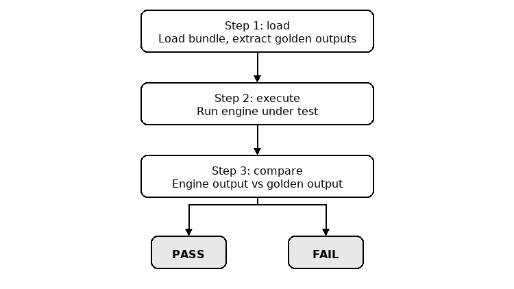

# RFC 0010: Golden Reference Validation

> Owner: Integration Test Team
> Last updated: 2026-05-07

## Table of Contents
1. [Summary](#summary)
2. [Design Overview](#design-overview)
3. [Detailed Design](#detailed-design)
   - [Existing Infrastructure](#existing-infrastructure)
   - [Self-Contained Bundles](#self-contained-bundles)
   - [Golden Data Format](#golden-data-format)
   - [Generic Test Runner](#generic-test-runner)
   - [Generation Pipeline](#generation-pipeline)
   - [Reference Sources](#reference-sources)
   - [Verification Modes](#verification-modes)
   - [Tolerance Framework](#tolerance-framework)
   - [Data Integrity](#data-integrity)
   - [Harness Integration](#harness-integration)
4. [Folder Convention](#folder-convention)
5. [CLI and Configuration](#cli-and-configuration)
6. [Integration](#integration)
   - [CI Integration](#ci-integration)
   - [Adding New Golden Reference Tests](#adding-new-golden-reference-tests)
7. [Data Management](#data-management)
8. [Risk Register](#risk-register)
9. [Known Limitations](#known-limitations)
10. [Future Work](#future-work)

---

## Summary

The integration test suite validates engine outputs by computing references at runtime. This creates several gaps:

1. **Circular dependency risk**: If the reference executor has a bug, both sides produce the same wrong answer and the test passes
2. **Coverage gap**: Operations not yet implemented in the reference executor cannot be tested (e.g., SDPA has no C++ reference kernel)
3. **Non-determinism**: GPU reference results can vary across runs, making failure investigation harder
4. **Slowness**: CPU reference execution for large tensors is the bottleneck in full-tier tests

A prior effort established a golden reference pattern -- golden data bundles (graph JSON + tensor `.bin` files) loaded from disk and validated against engine outputs. The initial infrastructure is in place for batchnorm. This RFC extends that pattern to all operation types, formalizes the folder convention, adds data integrity checks, and integrates with CI.

---

## Design Overview

Golden reference validation uses two pipelines -- [**generation**](#generation-pipeline) and [**validation**](#generic-test-runner) -- that share a common data format: the **golden data bundle** (`{Name}.json` + `{Name}.tensor{uid}.bin`). A bundle is a self-contained test case: the graph JSON defines the computation, the `.bin` files carry the tensor data (inputs and expected outputs). Generation produces bundles; validation loads a bundle, deserializes the graph JSON into a FlatBuffers graph object, executes it through the engine under test (CPU reference or MIOpen GPU plugin), and compares the result to the expected output.

**[Generation](#generation-pipeline) (run once, any tool):**
1. Define graph and create input tensors
2. Run a reference source (PyTorch, CPU ref, etc.) to produce outputs
3. Write the bundle

**[Validation](#generic-test-runner) (C++, every CI run):**
1. Load bundle from disk, extract golden outputs
2. Execute engine under test
3. Compare engine output to golden output — PASS or FAIL

---

## Detailed Design

### Existing Infrastructure

The golden reference infrastructure is already built and working for batchnorm. What this RFC adds: golden data for operations beyond batchnorm; a formalized folder convention; data integrity checks; a CI strategy with explicit verification modes and golden data fetching; and GPU runner test instantiations. The table below summarizes each existing component:

| Component | File(s) | Role |
|-----------|---------|------|
| Core loader | [`LoadGraphAndTensors.hpp`](../../test_sdk/include/hipdnn_test_sdk/utilities/LoadGraphAndTensors.hpp) | Reads bundles from disk, separates inputs from expected outputs, validates results |
| CPU runner | [`GoldenReferenceCpu.hpp`](../../test_sdk/tests/utilities/GoldenReferenceCpu.hpp) | Discovers and runs golden tests using the CPU reference executor |
| GPU runner | [`GoldenReferenceGpu.hpp`](../../../../dnn-providers/miopen-provider/tests/common/GoldenReferenceGpu.hpp) | Same pattern, executes via MIOpen GPU plugin (defined, no tests yet) |
| Python framework | [`reference_data_scripts/utilities/`](../../reference_data_scripts/utilities/) | Generates bundles: defines graphs, runs PyTorch, writes output files |
| Golden data | [`hipdnn_reference_data/`](../../hipdnn_reference_data/BatchnormFwdInference/) | 6 batchnorm bundles across 4 layout/datatype combinations |

### Self-Contained Bundles

All of these components operate on a single shared artifact -- the golden data bundle. A bundle (`{Name}.json` + `{Name}.tensor{uid}.bin`) is self-contained. The graph JSON carries the full computation definition. The `.bin` files carry the raw tensor data (inputs and outputs). Together they are a complete test case. The bundle does not reference any C++ code, any `buildGraph()` function, or any test fixture. If the computation changes, generate a new bundle.

This is test-as-data: the graph definition lives on disk, not in C++.

### Golden Data Format

Golden data uses the existing format already established by `LoadGraphAndTensors.hpp` and `Graph.save()`. The folder path identifies the operation, layout, and data type. The filename identifies the test variant (e.g., tensor size). Each test case is a set of files with a shared base name:

```
{Operation}/{Layout}/{DataType}/{TestName}.json              # Graph definition (operation, tensor metadata, parameters)
{Operation}/{Layout}/{DataType}/{TestName}.tensor{uid}.bin   # Raw tensor data, one file per UID
```

For example, `BatchnormFwdInference/nchw/fp32/Small` is a batchnorm inference test with small tensors in NCHW layout at fp32 precision:

```
BatchnormFwdInference/nchw/fp32/
  Small.json               # Graph: batchnorm inference, 6 tensors, fp32
  Small.tensor0.bin         # x (input)
  Small.tensor1.bin         # mean (input)
  Small.tensor2.bin         # inv_variance (input)
  Small.tensor3.bin         # scale (input)
  Small.tensor4.bin         # bias (input)
  Small.tensor5.bin         # y (output — golden reference)
```

---

### Generic Test Runner



The CPU and GPU runners (`TestGoldenReferenceCpu`, `TestGoldenReferenceGpu`) follow the same three-step pattern:

1. **Load** — read the bundle from disk, separate golden outputs from inputs
2. **Execute** — run the engine under test (CPU reference or MIOpen GPU plugin)
3. **Compare** — check engine output against golden output — PASS or FAIL

Test cases are auto-discovered: `getGoldenReferenceParams()` scans a subdirectory for `.json` files and returns each as a gtest parameter. Adding a bundle to an existing folder is picked up on the next run.

#### What Needs to Change for Full Genericity

- Remove hardcoded `EXPECT_EQ(tensorMap.size(), 6)` — only works for batchnorm's 6 tensors, blocks other operations
- Add tolerance lookup by operation type + data type, so a single test class handles all operations without per-operation subclasses

---

### Generation Pipeline


Golden data is generated by Python scripts in [`reference_data_scripts/`](../../reference_data_scripts/), using PyTorch as the reference executor. Each generator follows the same three-step pattern:

1. **Define** — create graph and input tensors
2. **Compute** — run a reference source (PyTorch, CPU ref, etc.)
3. **Write** — save the bundle (`.json` + `.tensor{uid}.bin`)

To add a new operation, create a node class and generator script following the existing [`generate_batchnorm_reference.py`](../../reference_data_scripts/generate_batchnorm_reference.py) pattern. See [Adding New Golden Reference Tests](#adding-new-golden-reference-tests) for the full workflow.

#### Current Coverage

Only batchnorm has generators and data today (6 bundles across 4 layout/datatype combinations). Generators are needed for: convolution (fwd/bwd/wrw), matmul, SDPA (fwd/bwd), pointwise, layernorm, RMS norm, reduction, batchnorm train/bwd, and block scale dequantize/quantize.

---

### Reference Sources

The golden data format is **reference-source-agnostic**. Any tool that produces a valid bundle (graph JSON matching the [`graph.fbs`](../../flatbuffers_sdk/schemas/graph.fbs) schema + corresponding `.bin` files) is a valid reference source. The validation pipeline does not know or care what produced the data.

| Category | Examples |
|----------|----------|
| Python frameworks | PyTorch, TensorFlow, JAX |
| In-house references | `CpuReferenceGraphExecutor`, `GpuReferenceGraphExecutor` |
| AMD internal tools | AITER, AOTriton |
| Third-party engines | cuDNN (via shim), oneDNN |

PyTorch is the recommended starting point because it is independent of the C++ codebase (breaks the circular dependency in Problem #1). For operations where another source is more trusted (e.g., AITER's SDPA kernels), that source should be preferred. The format is the contract, not the tool.

---

### Verification Modes

Three modes control which test suites run. `computed` and `golden` are separate gtest suites with different test fixtures, parameterization, and data sources.

| Mode | What runs | Reference source |
|------|-----------|-----------------|
| `computed` | Test-as-code tests (`IntegrationGraphVerificationHarness`) — graph built by `buildGraph()` in C++ | CPU/GPU reference executor at runtime |
| `golden` | Test-as-data tests (`TestGoldenReferenceCpu` / `TestGoldenReferenceGpu`) — graph loaded from disk | Pre-computed data from bundle |
| `both` | Both suites, independently — both must pass | Both |

**Floating-point edge cases**: NaN in golden data is a generation error — the [generation-time validation](#generation-time-check-output-validation-python) rejects it before writing. `-0.0` vs `+0.0` uses value comparison, not bitwise.

**Architecture note**: all current golden data comes from Python or the CPU reference executor (architecture-independent). If GPU-generated data is added, an architecture guard will be needed. See [Future Work](#future-work).

---

### Tolerance Framework

#### Single Source of Truth

Tolerances are **always defined in code**, never stored in the data bundle. The data bundle contains only the graph definition and tensor values. This eliminates dual-source-of-truth bugs where the code formula changes but golden data retains the old tolerance.

The current approach passes tolerances as arguments to `goldenReferenceTestSuite(atol, rtol)`, with values determined per test class:

```cpp
// Current pattern (from TestCpuFpReferenceBatchnorm.cpp):
class TestCpuBatchnormFwdInferenceGoldenReferenceNchwFp32 : public TestGoldenReferenceCpu
{
protected:
    void runTest() { goldenReferenceTestSuite(/*atol=*/1e-5, /*rtol=*/1e-5); }
};
```

**Proposed improvement**: tolerance lookup by operation type + data type, so a single generic test class can handle all operations:

```cpp
// Future: single test class for all operations
// Operation type extracted from the loaded FlatBuffers graph via node.attributes_type()
// (returns the NodeAttributes enum: PointwiseAttributes, ConvolutionFwdAttributes, etc.)
auto opType = graph->nodes()->Get(0)->attributes_type();
auto [atol, rtol] = getToleranceForOperation(opType, graph->io_data_type());
goldenReferenceTestSuite(atol, rtol);
```

The exact format of the tolerance configuration (lookup table, config file, or constexpr map) is an implementation detail. The operation type is available from the loaded graph via the FlatBuffers-generated `NodeAttributes` enum (see [`graph_generated.h`](../../flatbuffers_sdk/include/hipdnn_flatbuffers_sdk/data_objects/graph_generated.h)). The principle is: tolerances come from code keyed by operation type and data type, not from the data bundle.

**Acceptance criteria**:
- [ ] Golden data bundles contain no tolerance fields
- [ ] Changing tolerance values in code takes effect immediately for both computed and golden modes
- [ ] Failure message includes: tensor UID, max absolute error, max relative error, mismatch count

---

### Data Integrity

Key-value consistency is mostly guaranteed by construction: `Graph.save()` writes the JSON and `.bin` files from the same in-memory graph in a single call, and `loadGraphAndTensors()` reads UIDs from the JSON and loads the corresponding `.bin` files. The UIDs match because they come from the same source. Corruption can only happen after generation (partial downloads, disk errors, manual edits).

Two checks catch the real failure modes:

#### Load-Time Check: File Size Validation (C++)

Before loading tensor data, verify that the file size matches what the graph JSON declares:

```cpp
auto expectedBytes = product(attributes->dims()) * sizeOfDataType(attributes->data_type());
auto actualBytes = std::filesystem::file_size(tensorPath);
if(actualBytes != expectedBytes)
{
    FAIL() << "Tensor file size mismatch for UID " << attributes->uid()
           << "\n  Expected: " << expectedBytes << " bytes"
           << " (dims=" << formatDims(attributes->dims())
           << ", dtype=" << attributes->data_type() << ")"
           << "\n  Actual:   " << actualBytes << " bytes"
           << "\n  File:     " << tensorPath;
}
```

This catches truncated files (the most common corruption from partial downloads or crashed writes), oversized files (wrong tensor written to the wrong path), and complete mismatches (binary file from a different bundle). It's cheap — a single `stat()` call per tensor, no data reading.

`loadGraphAndTensors()` does not perform this check today. A truncated file silently produces garbage in the tail of the tensor. This must be added.

A missing `.bin` file for a UID in the JSON already causes `fillTensorFromFile()` to throw, but the error message should be improved to name the UID and suggest the bundle may be incomplete.

After loading, the loader should also verify that the number of `.bin` files on disk with the bundle's base name matches the number of tensor UIDs in the graph JSON. Extra `.bin` files (e.g., a stale `Small.tensor6.bin` left from a previous generation with a different tensor count) indicate a corrupted or partially-regenerated bundle and should produce a warning.

#### Generation-Time Check: Output Validation (Python)

`Graph.save()` must validate all output tensors before writing. This is not an opt-in per-script check — it is built into `Graph.save()` itself so that no generator can bypass it:

```python
class Graph:
    def save(self, base_filename):
        self._validate_outputs()       # Runs BEFORE any file I/O
        self._write_json(base_filename)
        self._write_tensors(base_filename)

    def _validate_outputs(self):
        for uid, tensor_attr in self.output_tensors.items():
            t = tensor_attr.tensor
            if torch.isnan(t).any():
                raise ValueError(f"Tensor UID {uid} contains NaN — check input ranges or reference op")
            if torch.isinf(t).any():
                raise ValueError(f"Tensor UID {uid} contains Inf — check input ranges or reference op")
            if t.numel() > 1 and t.std() == 0:
                raise ValueError(f"Tensor UID {uid} has zero variance (all-same values)")
```

A tensor of all NaN, all Inf, or all-same-value makes the test meaningless — everything passes within tolerance. Because the check is inside `Graph.save()`, it is impossible to write a bundle with degenerate outputs.

#### Load-Time Check: NaN/Inf Rejection (C++)

As a safety net (catches bundles generated before this check existed, or by external tools), `loadGraphAndTensors()` must also reject NaN/Inf in output tensors after loading:

```cpp
for(auto uid : outputTensorUids)
{
    auto* data = static_cast<const float*>(tensorMap.at(uid)->hostPtr());
    auto size = tensorMap.at(uid)->numElements();
    for(size_t i = 0; i < size; ++i)
    {
        if(std::isnan(data[i]) || std::isinf(data[i]))
        {
            FAIL() << "Golden output tensor UID " << uid
                   << " contains NaN/Inf at index " << i
                   << " — regenerate the bundle";
        }
    }
}
```

This is more expensive than the file-size check (it reads the data), but only runs on output tensors (not inputs) and catches the exact failure mode: NaN in golden data means the reference was wrong.

**Acceptance criteria**:
- [ ] `loadGraphAndTensors()` validates file size before reading tensor data
- [ ] File size mismatch: hard FAIL with expected vs actual bytes, dims, data type, and file path
- [ ] Missing `.bin` file: hard FAIL naming the UID and file path
- [ ] `Graph.save()` calls `_validate_outputs()` internally — no generator can bypass it
- [ ] `loadGraphAndTensors()` rejects NaN/Inf in output tensors after loading (safety net for legacy/external bundles)
- [ ] Both checks produce actionable error messages naming the tensor UID

---

### Harness Integration

Two test patterns coexist in the codebase today. The long-term direction is convergence toward Pattern 2 (test-as-data) as the primary pattern, with Pattern 1 (test-as-code) maintained for backward compatibility:

#### Pattern 1: Test-as-Code (`IntegrationGraphVerificationHarness`)

Used for **computed** verification. The graph is built in C++ by `buildGraph()`. Inputs are randomly generated. The CPU/GPU reference executor runs at test time. This is the existing pattern, unchanged by this RFC.

```cpp
template <typename DataType, typename TestCaseType>
class IntegrationGraphVerificationHarness : public ::testing::TestWithParam<TestCaseType>
{
    void verifyGraph(graph::Graph& graph, unsigned int seed) { ... }
};
```

Every existing test (conv, matmul, SDPA, etc.) uses this pattern. This RFC does not modify it.

#### Pattern 2: Test-as-Data (`TestGoldenReferenceCpu` / `TestGoldenReferenceGpu`)

Used for **golden** verification. The graph is loaded from JSON on disk. No `buildGraph()`. No runtime reference computation. This is the pattern established by the existing golden reference infrastructure and extended by this RFC.

```cpp
class TestGoldenReferenceCpu : public ::testing::TestWithParam<std::filesystem::path>
{
    void SetUp() override
    {
        _graphAndTensors = loadGraphAndTensors(GetParam());
        _referenceOutputTensors = _graphAndTensors.extractAndClearOutputTensorData();
    }
    void goldenReferenceTestSuite(float atol, float rtol) { ... }
};
```

New golden tests should use Pattern 2. Existing computed tests continue using Pattern 1. Over time, as golden data coverage grows, Pattern 2 becomes the primary validation path and Pattern 1 serves as a cross-validation supplement.

#### Engine Setup for GPU Runner

The GPU runner (`TestGoldenReferenceGpu`) handles engine setup internally:

```cpp
void SetUp() override
{
    hipdnnEnginePluginCreateImpl(&_handle);
    _engineConfigBuffer = createValidEngineConfig(1).Release();
    _graphAndTensors = loadGraphAndTensors(path);
    _referenceOutputTensors = _graphAndTensors.extractAndClearOutputTensorData();
}
```

The execution creates a plugin execution context, executes the graph, marks device-modified output tensors, and validates:

```cpp
void goldenReferenceTestSuite(float atol, float rtol)
{
    hipdnnEnginePluginCreateExecutionContextImpl(_handle, &engineConfig, &opGraph, &ctx);
    hipdnnEnginePluginExecuteOpGraphImpl(_handle, ctx, nullptr, deviceBuffers.data(), ...);
    for(auto uid : _graphAndTensors.outputTensorUids)
        _graphAndTensors.tensorMap.at(uid)->markDeviceModified();
    EXPECT_TRUE(_graphAndTensors.validateTensors(_referenceOutputTensors, atol, rtol));
}
```

**Acceptance criteria**:
- [ ] Pattern 1 (computed) tests are unchanged -- zero modifications to existing test fixtures
- [ ] Pattern 2 (golden) tests work for any operation type (after removing `EXPECT_EQ(tensorMap.size(), 6)`)
- [ ] Both patterns can coexist in the same test binary
- [ ] `getGoldenReferenceParams()` discovers test cases by scanning for `.json` files

---

## Folder Convention

Golden data is organized under `hipdnn_reference_data/` with a three-level hierarchy. The folder path is a human convention for organization and gtest discovery -- the loader does not validate that the folder path matches the graph content. The generator is responsible for placing bundles in the correct folder.

```
hipdnn_reference_data/
  {Operation}/            # e.g., BatchnormFwdInference, ConvFwd, MatmulFwd
    {Layout}/             # e.g., nchw, nhwc, ncdhw
      {DataType}/         # e.g., fp32, fp16, bfp16
        {TestName}.json + {TestName}.tensor{uid}.bin
```

### Naming Conventions

| Level | Convention | Examples |
|-------|-----------|----------|
| Operation | PascalCase, direction suffix | `BatchnormFwdInference`, `ConvFwd`, `ConvBwd`, `MatmulFwd`, `SdpaFwd`, `PointwiseRelu` |
| Layout | Lowercase | `nchw`, `nhwc`, `ncdhw`, `ndhwc` |
| DataType | Lowercase abbreviation | `fp32`, `fp16`, `bfp16` |
| TestName | PascalCase, describes tensor size/source | `Small`, `Large`, `MIOpen`, `Smoke` |

### Example: Current Data

```
hipdnn_reference_data/
  BatchnormFwdInference/
    ncdhw/
      fp32/
        Small.json + Small.tensor{0..5}.bin
    nchw/
      bfp16/
        Small.json + Small.tensor{0..5}.bin
      fp16/
        Small.json + Small.tensor{0..5}.bin
      fp32/
        Small.json + Small.tensor{0..5}.bin
        Large.json + Large.tensor{0..5}.bin
        MIOpen.json + MIOpen.tensor{0..5}.bin
```

### How Test Discovery Works

`getGoldenReferenceParams("BatchnormFwdInference/nchw/fp32")` scans the directory for `.json` files and returns each file path as a gtest parameter. Each `.json` file becomes a separate test case.

To add a new test case to an existing operation/layout/datatype, drop a new `.json` + `.bin` bundle into the directory. The next test run picks it up automatically.

### gtest Filtering

Because test names include the file path, standard gtest filtering works:

```bash
# Run all batchnorm golden tests
./test_binary --gtest_filter="*BatchnormFwd*"

# Run only fp32 nchw batchnorm golden tests
./test_binary --gtest_filter="*nchw*fp32*"
```

### Adding a New Operation

1. Create the folder hierarchy: `hipdnn_reference_data/{Operation}/{Layout}/{DataType}/`
2. Generate data bundles using a Python script (see [Generation Pipeline](#generation-pipeline))
3. Add C++ test instantiation (see [Adding New Golden Reference Tests](#adding-new-golden-reference-tests))

---

## CLI and Configuration

### CLI Flags

| Flag | Values | Default | Description |
|------|--------|---------|-------------|
| `--vm, --verification-mode` | `computed`, `golden`, `both` | `computed` | Controls which test suites run |
| `--gd, --golden-data-dir` | path | `<exe_dir>/../lib/hipdnn_reference_data` | Root directory for golden data |

### Environment Variable Fallbacks

- `HIPDNN_TEST_VERIFICATION_MODE` -- overridden by `--verification-mode` CLI flag
- `HIPDNN_TEST_GOLDEN_DATA_DIR` -- overridden by `--golden-data-dir` CLI flag

Generation is performed by Python scripts (see [Generation Pipeline](#generation-pipeline)), not by the C++ test binary. The test binary is purely a consumer of golden data.

#### Implementation

Each golden test fixture checks the verification mode in `SetUp()` and skips itself if disabled:

```cpp
void SetUp() override
{
    if(TestConfig::instance().verificationMode() == VerificationMode::Computed)
    {
        GTEST_SKIP() << "Golden tests disabled (--verification-mode=computed)";
    }
    // ... load graph and tensors ...
}
```

Computed test fixtures use the same pattern in reverse, skipping when mode is `golden`. In `both` mode, neither fixture skips -- both suites run.

**Acceptance criteria**:
- [ ] Both CLI flags parsed and stored in `TestConfig` singleton
- [ ] Environment variable fallbacks work when CLI flag is absent
- [ ] `--verification-mode golden` with missing golden data directory: hard FAIL with path and suggestion
- [ ] `--verification-mode computed` ignores golden data entirely (no fetch, no directory check)

---

## Integration

### CI Integration

#### Recommended CI Strategy

| CI Stage | Verification Mode | Golden Data Required | Rationale |
|----------|-------------------|---------------------|-----------|
| Pre-submit (smoke) | `computed` | No | Fast feedback, no external storage dependency |
| Post-submit (full) | `both` | Yes | Cross-validates golden against computed |
| Nightly | `golden` | Yes | Regression gate against locked baselines |

#### CI Pipeline Integration

```yaml
# Excerpt from integration test CI job
- name: Pull golden reference data
  if: inputs.verification_mode != 'computed'
  run: |
    # Tool-specific fetch command (e.g., dvc pull, aws s3 sync, etc.)
    cd projects/hipdnn
    ./scripts/fetch_golden_data.sh

- name: Run integration tests
  run: |
    ./hipdnn_integration_tests \
      --verification-mode ${{ inputs.verification_mode }} \
      --golden-data-dir ${{ github.workspace }}/projects/hipdnn/hipdnn_reference_data \
      --gtest_filter=${{ inputs.gtest_filter }}
```

Pre-submit jobs omit the golden data fetch step entirely, keeping them fast and independent of remote storage availability.

### Adding New Golden Reference Tests

Adding a test case to an **existing** operation/layout/datatype requires zero C++ changes: generate the data bundle and drop it into the folder. The runner discovers it on the next run.

Adding a **new** operation requires a one-time C++ `INSTANTIATE_TEST_SUITE_P` (Step 4 below).

#### Step 1: Generate the data bundle

Use an existing generation script, or write a new one following the pattern in `generate_batchnorm_reference.py` (see [Writing a New Generator](#writing-a-new-generator)). Any tool that produces a valid bundle (matching the schema in [Golden Data Format](#golden-data-format)) works -- PyTorch, AITER, AOTriton, or any other stable reference source.

#### Step 2: Run the generator

```bash
cd reference_data_scripts/
python generate_conv_reference.py \
  --base-filename ../hipdnn_reference_data/ConvFwd/nchw/fp32/Small \
  --io-type float --x-size 1 16 16 16 --w-size 16 16 3 3 \
  --padding 1 1 --stride 1 1 --dilation 1 1
```

#### Step 3: Commit the bundle to `hipdnn_reference_data/`

```bash
git add hipdnn_reference_data/ConvFwd/nchw/fp32/Small.*
git commit -m "Add conv fwd golden reference data (nchw fp32 Small)"
```

For large tensor data, use git-lfs, DVC, or another storage solution (see [Data Management](#data-management)).

#### Step 4: Add C++ test instantiation (new operations only)

If this is the first golden test for a new operation, add a test instantiation. If the operation already has golden tests (e.g., adding a new size to `BatchnormFwdInference/nchw/fp32/`), skip this step -- the runner discovers the new bundle automatically.

```cpp
// In a test .cpp file (CPU runner):
using TestConvFwdGoldenFp32 = hipdnn_test_sdk::utilities::TestGoldenReferenceCpu;

TEST_P(TestConvFwdGoldenFp32, Correctness)
{
    goldenReferenceTestSuite(/*atol=*/1e-5, /*rtol=*/1e-5);
}

INSTANTIATE_TEST_SUITE_P(,
    TestConvFwdGoldenFp32,
    hipdnn_test_sdk::utilities::getGoldenReferenceParams("ConvFwd/nchw/fp32"));
```

For GPU golden tests, use `TestGoldenReferenceGpu` instead:

```cpp
// GPU runner:
using TestConvFwdGoldenGpuFp32 = test_helpers::TestGoldenReferenceGpu;

TEST_P(TestConvFwdGoldenGpuFp32, Correctness)
{
    goldenReferenceTestSuite(/*atol=*/1e-5, /*rtol=*/1e-5);
}

INSTANTIATE_TEST_SUITE_P(,
    TestConvFwdGoldenGpuFp32,
    test_helpers::getGoldenReferenceParams("ConvFwd/nchw/fp32"));
```

#### Step 5: Verify

```bash
# Run the new golden tests
./test_binary --gtest_filter="*ConvFwdGolden*"
```

---

## Data Management

### Repository Layout

Golden data lives in `hipdnn_reference_data/` at the project root, following the [Folder Convention](#folder-convention):

```
projects/hipdnn/
  hipdnn_reference_data/
    BatchnormFwdInference/
      nchw/
        fp32/
          Small.json + .tensor{0..5}.bin
          Large.json + .tensor{0..5}.bin
          MIOpen.json + .tensor{0..5}.bin
        fp16/
          Small.json + .tensor{0..5}.bin
        bfp16/
          Small.json + .tensor{0..5}.bin
      ncdhw/
        fp32/
          Small.json + .tensor{0..5}.bin
    ConvFwd/
      nchw/
        fp32/
          ...
    ...
```

At install time, golden data is placed at `<exe_dir>/../lib/hipdnn_reference_data/`, which is where `getGoldenReferenceParams()` looks by default.

### Storage Options

Golden data can grow large (a single test case with `8x512x64x64` fp32 tensors is ~64 MB). For large datasets, external storage is needed. The golden data format is tool-agnostic -- any of the following work:

| Option | Pros | Cons |
|--------|------|------|
| git (small data) | Simplest, no extra tools | Only practical for small tensors |
| git-lfs | Built into git, no new tool | GitHub storage/bandwidth costs at scale |
| DVC | Data versioned alongside code, backend-agnostic (S3/Azure/GCS) | Third-party tool, learning curve |
| S3/Azure + script | No new dependency, simple | No automatic version linkage to code |

This RFC does not prescribe a specific storage tool. The existing batchnorm data (small tensors) is committed directly to git.

**Acceptance criteria**:
- [ ] CI pipeline: golden data fetch step skipped entirely for `--verification-mode computed`
- [ ] CI pipeline: golden data fetch failure is **hard failure** if `--verification-mode golden`

---

## Risk Register

| Risk | Impact | Likelihood | Mitigation |
|------|--------|------------|------------|
| FlatBuffers schema change | Old JSON bundles unreadable by `loadGraphAndTensors()` | Medium | Regenerate from Python scripts (Python framework is schema-independent) |
| Reference script bug freezes wrong data | Silent incorrect baseline | Medium | Cross-validate against C++ CPU ref; review generated data before committing; [generation-time validation](#generation-time-check-output-validation-python) rejects degenerate outputs |
| PyTorch version drift | Different versions produce slightly different outputs | Low | Pin PyTorch version in `requirements.txt`; regenerate when upgrading |
| Large golden data sets slow CI | CI feedback loop degrades | Low | Storage caching, selective fetch by test filter, compression (future) |
| Remote storage unavailable | Golden-mode CI fails | Low | Computed-mode CI is independent of storage; CI fallback to computed-only |

---

## Known Limitations

Comparison testing can confirm that two implementations agree, not that either is correct. If the reference executor and the engine under test share the same bug, the test passes. Future work on mathematical invariant checks and hand-verified micro cases addresses this gap without changing the golden data format.

---

## Future Work

1. **Per-operation tolerance configuration**: Structured `(operation_type, data_type) → (atol, rtol)` lookup so the generic runner doesn't need per-operation test classes.
2. **Automatic test discovery**: Recursive scanning of `hipdnn_reference_data/` to auto-generate test instantiations, eliminating manual `INSTANTIATE_TEST_SUITE_P`.
3. **C++ graph export**: Utility to export a graph from an existing test-as-code `buildGraph()` to the bundle format, enabling conversion of computed tests to golden tests.
4. **Bundle inspection and validation tool**: CLI that reads bundles, reports tensor metadata and statistics, and validates integrity across a directory tree.
5. **External data validation**: Because bundles are self-contained and tool-agnostic, external parties (customers, partner teams) could submit their own input+output tensor data for a given graph and validate it against golden references — or vice versa — without any C++ code. A Python-only comparison tool could load two bundles with the same graph and diff their output tensors.
6. **Mathematical invariant checks and hand-verified micro cases**: Per-operation invariants (e.g., softmax rows sum to 1) and hand-computed expected outputs that catch bugs comparison testing cannot. Separate RFC.
