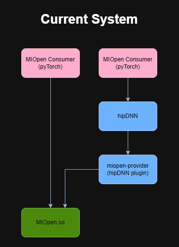
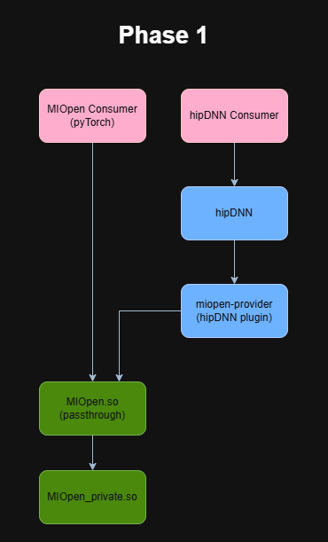
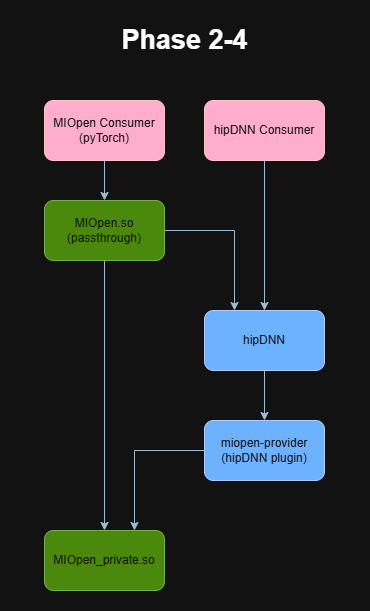

# MIOpen → hipDNN Forwarding Wrapper

- Contributors: Nolan Hanna, Mitch Ousdahl

## Table of Contents
1. [Executive Summary](#1-executive-summary)
2. [Problem Statement](#2-problem-statement)
3. [Current System Overview](#3-current-system-overview)
4. [Proposed Design](#4-proposed-design)
5. [Key Design Decisions](#5-key-design-decisions)
6. [Risks](#6-risks)
7. [Execution Plan](#7-execution-plan)
8. [Testing Plan](#8-testing-plan)
9. [Future Considerations](#9-future-considerations)
10. [Glossary](#10-glossary)

## 1. Executive Summary

### Why

Frameworks like PyTorch, TensorFlow, ONNX Runtime, and JAX/XLA already have substantial integration with MIOpen — call sites, tuning DBs, build infrastructure, CI coverage. There is external pushback against going all-in on a hipDNN backend at this juncture: the migration work for those framework teams is non-trivial, the timing is bad for several of them, and hipDNN is still maturing. At the same time, we want MIOpen consumers to start benefiting from hipDNN's engine ecosystem (performance work, fusion graphs, new architectures) without waiting for that migration. A forwarding wrapper lets us route selected calls through hipDNN behind the existing MIOpen API, decoupling the rollout of hipDNN-backed execution from any framework-side rework.

### What

This RFC proposes a thin wrapper layer in front of MIOpen that preserves the existing MIOpen C API verbatim from the consumer's point of view, while internally choosing — on a per-entry-point basis — whether to forward the call to the original MIOpen implementation or to hipDNN. The work is gated behind a single CMake feature flag. When the flag is **off**, MIOpen builds, links, and runs **bit-for-bit as it does today** — no symbol changes, no extra dispatch, no new dependency. When the flag is **on**, MIOpen is split into two artifacts:

- **MIOpen Private** — the existing MIOpen implementation, with the public C entry points internally renamed to a `_impl` suffix (e.g. `miopenConvolutionForward_impl`). Functionally identical to today's library, just relocated behind a private symbol surface.
- **MIOpen Public** — a new lightweight shared library that re-exports the original public symbol names (e.g. `miopenConvolutionForward`) and dispatches each call either to MIOpen Private or to hipDNN.

Two implementation options are evaluated for how the wrapper reaches the private library (see §4.3): a **public/private split with direct linkage** (preferred, pending investigation) and a **`dlopen`/`dlsym`-based wrapper that the user `LD_PRELOAD`s** (fallback). Because the public API does not change, this work is invisible to existing MIOpen consumers; they continue to call `miopenConvolutionForward` and either link against `libMIOpen.so` as today (Option A) or pick up the wrapper at process start via `LD_PRELOAD` (Option B). The forwarding decision happens behind that boundary.

### Phased approach

The work is broken into four phases (full detail in §7):

1. **Pass-through wrapper.** Establish the two-library split and dispatch plumbing; every entry point still forwards to MIOpen Private. Validate that overhead is negligible.
2. **Selective hipDNN forwarding.** Pick a small, low-risk set of ops; route them to hipDNN under an opt-in env var.
3. **Env var and logging mapping.** Translate MIOpen's debug/tuning/logging surface to hipDNN's.
4. **Provider short-circuit and baselining.** Rewire hipDNN's MIOpen provider to call MIOpen Private directly (avoiding a wrapper-back-into-hipDNN loop) and publish end-to-end performance numbers.

## 2. Problem Statement

hipDNN is being positioned as the next-generation graph-execution surface for AMD's deep-learning stack, but MIOpen still has a large installed base and a stable C API that frameworks (PyTorch, TensorFlow, ONNX Runtime, JAX/XLA, etc.) depend on directly. We want a path for MIOpen consumers to benefit from hipDNN's engine ecosystem — performance work, new architectures, fusion graphs — without requiring those consumers to migrate their integration code or rebuild against a new header.

This wrapper is an explicitly **temporary** measure. The longer-term goal is for frameworks to consume hipDNN features directly so that we no longer need to add new functionality to MIOpen. Eventually MIOpen itself will be deprecated and the public API exposed by this wrapper will go away — though that endpoint is expected to be a long way off, is out of scope for this RFC, and is not blocked or driven by the work proposed here. In the meantime, the wrapper gives us a way to put framework calls in front of hipDNN without forcing framework teams to do migration work first.

Concretely, we want the ability to:

- Redirect specific MIOpen API calls to hipDNN at runtime, on a per-entry-point basis.
- Roll the redirection out incrementally — one operation, or one path within an operation, at a time — and roll it back just as easily.
- Prove that the forwarding layer itself adds negligible overhead before we migrate any production traffic onto it.
- Keep the "no wrapper" build path completely untouched, so that the wrapper feature cannot regress consumers who haven't opted in. The flag-off build must produce the exact same artifact MIOpen produces today.
- Eventually let hipDNN's existing MIOpen provider bypass the wrapper to avoid the round-trip cost when hipDNN is already in the call stack.

What we are **not** trying to do in this RFC:

- Change the MIOpen public API.
- Rewrite MIOpen on top of hipDNN.
- Deprecate or remove any MIOpen entry points.

## 3. Current System Overview

MIOpen exposes a flat C API through `include/miopen/miopen.h`. Each public entry point is implemented in a corresponding `*_api.cpp` file under `src/` (e.g. `convolution_api.cpp`, `batch_norm_api.cpp`, `layernorm_api.cpp`). The API layer translates handle/descriptor objects, builds a `ProblemDescription`, calls into the solver framework, and returns a `miopenStatus_t`.

Consumers link against `libMIOpen.so` and call these symbols directly. There is no shim layer between the public symbol and the implementation; `miopenConvolutionForward` in the consumer binary resolves to the function defined in `convolution_api.cpp`.

hipDNN already ships with a MIOpen *provider plugin* (`dnn-providers/miopen-provider/`) that calls **into** MIOpen the normal way. Today, the call direction is exclusively `caller → MIOpen` and `hipDNN → MIOpen` — never `MIOpen → hipDNN`.

Today's call graph:

## 4. Proposed Design

### 4.1 Build-time feature flag

A new CMake option, tentatively `MIOPEN_ENABLE_HIPDNN_WRAPPER` (name TBD; default: `OFF`), controls the entire mechanism.

- **OFF**: The build is byte-for-byte equivalent to the current build. `libMIOpen.so` exports the existing public symbols, and those symbols resolve to today's implementations. No new files are compiled in, no new libraries are produced, no dependency on hipDNN is introduced.
- **ON**: The build splits MIOpen into two artifacts and adds a runtime dependency on hipDNN. Details below.

The flag must guard *everything* — source files, install rules, `target_link_libraries` entries, generated headers — so that flipping it cannot leak forwarding code into the default build.

### 4.2 Symbol surface split (architecture)

When the flag is on, the public API symbols are split across two libraries — a thin **Public** wrapper and the existing implementation, which becomes **Private**. After Phase 1, the wrapper is a pure pass-through to Private; from Phase 2 onward the wrapper may also forward to hipDNN, and Phase 4 short-circuits the hipDNN provider directly into Private (see §4.5 and the diagram in §7 Phase 1 for the pass-through state, and the diagram in §7 Phase 4 for the post-Phase-4 steady state).

- **MIOpen Private**: contains the entire current MIOpen library, with each public-API entry point internally renamed from `miopenFoo` to `miopenFoo_impl`. The renaming is applied uniformly via a code-generation step or a header-level macro (`#define miopenFoo miopenFoo_impl` when building Private), so that the .cpp source files do not need to be edited individually. All other MIOpen symbols (internal helpers, solver classes, etc.) are unchanged.
- **MIOpen Public**: a new, small shared library. For each public entry point, it defines a wrapper that decides where to dispatch and forwards the arguments. The exported symbol set is identical to today's `libMIOpen.so`, so no consumer code change is required.

How the two libraries are physically packaged, named on disk, and bound together is the subject of §4.3.

### 4.3 Implementation options

Two implementation options are under evaluation. **Option A is preferred but needs investigation** to confirm feasibility (build-system mechanics, symbol visibility, packaging implications). Option B is the fallback if A turns out to be impractical.

#### 4.3.1 Option A — Public/private split with direct linkage  *(preferred)*

The existing MIOpen `.so` filename is **reused for the public wrapper**. The implementation library is renamed.

| Aspect | Value |
|---|---|
| Public wrapper artifact | `libMIOpen.so` (same filename consumers link against today) |
| Private implementation artifact | `libMIOpen_private.so` |
| Symbol rename in Private | each public entry point → `_impl` suffix |
| Wrapper → Private binding | direct link at build time (`-lMIOpen_private`) |
| Wrapper → hipDNN binding | direct link at build time (`-lhipdnn`) |
| Consumer impact | none — same `-lMIOpen` link line, same SONAME |
| User runtime opt-in | none — picked up automatically when wrapper-on builds are deployed |

Why preferred: the call path is a plain function call (one indirection at most), the wrapper is a normal library that can be packaged and shipped through the existing channels, and consumers don't need to know the wrapper exists. It also makes the Phase 4 short-circuit straightforward — hipDNN's MIOpen provider just changes its link line to `-lMIOpen_private`.

What needs investigation:
- Whether `libMIOpen.so` can be cleanly produced as a wrapper that re-exports the existing public symbol set (SONAME, version script, ABI tags) without disturbing existing consumers.
- Whether the symbol rename can be applied via a single header-level mechanism without per-file edits, including for any entry points generated or registered through unusual paths.
- Packaging implications for ROCm distributors: shipping a second `.so` and ensuring both end up in the right paths.

#### 4.3.2 Option B — `dlopen`/`dlsym` wrapper, `LD_PRELOAD`-based  *(fallback)*

Today's `libMIOpen.so` is **left completely unchanged**. The wrapper ships as a separate library that the user `LD_PRELOAD`s.

| Aspect | Value |
|---|---|
| Existing MIOpen artifact | `libMIOpen.so` — **unchanged** |
| New wrapper artifact | `libMIOpen_wrapper.so` (name TBD) — separate `.so`, not part of the default link line |
| Wrapper → MIOpen binding | `dlopen("libMIOpen.so")` + `dlsym("miopenFoo")` at process start |
| Wrapper → hipDNN binding | `dlopen("libhipdnn.so")` + `dlsym("hipdnnFoo")` at process start |
| Consumer impact | must set `LD_PRELOAD=libMIOpen_wrapper.so` at process launch to opt in |
| User runtime opt-in | explicit, per-process, via `LD_PRELOAD` |

Why this is the fallback: the user-facing opt-in is more invasive (`LD_PRELOAD` is fragile, awkward in container/CI environments, and easy to forget), and the call path adds a function-pointer indirection plus all the usual `dlopen` lifecycle concerns. It does, however, leave the existing MIOpen build entirely alone and decouples the wrapper from the hipDNN ABI at link time, so it is the safer option if Option A turns out to require build-system changes we cannot stomach.

### 4.4 Per-entry-point routing policy

Each wrapper function consults a routing decision: "should this call go to hipDNN or to MIOpen Private?" In Phase 1 the answer is always "Private". As later phases add hipDNN coverage, the policy becomes more nuanced.

Routing inputs that the policy may consider:

- The entry point itself (some are forwarded, some are not).
- Argument shape (e.g. forward only certain layouts/dtypes).
- An opt-in environment variable (e.g. `MIOPEN_USE_HIPDNN_FOR=convolution,batchnorm`) so that the routing set can be changed without rebuilding.
- A compile-time list for entry points that are known-good and always forwarded.

The routing decision is centralized in one place (a small `routing.cpp` or equivalent) so that adding/removing a forwarded op is a one-line change.

### 4.5 Phase 4: hipDNN MIOpen-provider short-circuit

Today, hipDNN's MIOpen provider plugin calls into `libMIOpen.so`. Once the wrapper exists, that call would land in MIOpen Public, which might in turn forward back into hipDNN — a loop that, even if guarded against actual recursion, adds an unnecessary hop.

In Phase 4 the MIOpen provider is changed to link directly against `libMIOpen_private.so` and call the `_impl` symbols. This bypasses the wrapper entirely when hipDNN is the original caller, so the wrapper only sits in the path when an *external* consumer (e.g. PyTorch) called MIOpen.

This change is contained to the provider and does not affect other consumers.

### 4.6 Header story

The public header `miopen.h` is unchanged. Internally, when building MIOpen Private, an additional generated header (or a small block of `#define`s in `config.h`) renames the declared functions to their `_impl` variants. Consumers never see this header and never see the `_impl` names.

## 5. Key Design Decisions

Each decision below ties back to one or more bullets in the problem statement (§2). If a decision can't be tied back, that's a signal either to drop the decision or to widen the problem statement.

### 5.1 Split into Public + Private libraries instead of a single library with two symbol sets

**Ties to:** "Roll the redirection out incrementally … and roll it back just as easily" and "Eventually let hipDNN's existing MIOpen provider bypass the wrapper."

A single shared object that exports both `miopenConvolutionForward` and `miopenConvolutionForward_impl` would also work, but a split keeps the dependency direction one-way, which is what the incremental-rollout and provider-bypass goals depend on.

| | Pros | Cons |
|---|---|---|
| **Split (chosen)** | Explicit one-way dependency: Public depends on Private; Private has no knowledge of the wrapper. hipDNN's provider can link Private directly (Phase 4). Wrapper symbol footprint stays small and inspectable. Wrapper can be stripped/optimized independently of MIOpen proper. | Two artifacts to package and ship. Slightly more build-system complexity. |
| **Single `.so` with both symbol sets** | One artifact. No SONAME juggling. | The `_impl` symbols leak into anything that links against MIOpen — the provider can't cleanly bypass the wrapper without seeing both surfaces. Harder to reason about which symbol set is "the API." |

### 5.2 Build-time flag instead of always shipping the wrapper

**Ties to:** "Keep the 'no wrapper' build path completely untouched, so that the wrapper feature cannot regress consumers who haven't opted in."

A runtime flag ("wrapper present but always dispatches to Private") would not satisfy that bullet — the wrapper would still be in the call path and in the binary, so the flag-off artifact would no longer be byte-equivalent to today's MIOpen.

| | Pros | Cons |
|---|---|---|
| **Build-time flag (chosen)** | Flag-off artifact is bit-identical to today's MIOpen. Clean A/B comparison for perf regression detection. Wrapper code can be developed in-tree without affecting the shipped binary. | Two build configurations to maintain in CI. |
| **Runtime flag** | Single artifact; one build to test. | Wrapper is always present in the binary and in the call path, so flag-off is no longer equivalent to today's MIOpen — the very thing the problem statement requires us to preserve. |

### 5.3 Prefer Option A (direct linkage) over Option B (`dlopen`/`dlsym` + `LD_PRELOAD`)

**Ties to:** "Prove that the forwarding layer itself adds negligible overhead" and "Eventually let hipDNN's existing MIOpen provider bypass the wrapper."

| | Pros | Cons |
|---|---|---|
| **Option A — direct linkage (preferred)** | No user-side opt-in (no `LD_PRELOAD`). Plain function-call dispatch — easiest to argue is overhead-free. Provider short-circuit in Phase 4 is a one-line link-line change. SONAME is preserved, so consumers see no change. | Requires build-system changes to produce `libMIOpen.so` as a wrapper while renaming the implementation. Investigation required before commitment. |
| **Option B — `dlopen`/`dlsym` + `LD_PRELOAD`** | Existing MIOpen build is untouched. Wrapper is decoupled from hipDNN ABI at link time; degrades gracefully if hipDNN is missing. | `LD_PRELOAD` opt-in is fragile in container/CI environments and easy to forget. Function-pointer indirection plus `dlopen` lifecycle concerns. Provider short-circuit in Phase 4 is awkward — the provider would need its own opt-out from the preload. |

The preference is Option A precisely because the negligible-overhead and provider-bypass goals are easier to reason about with a plain function call than with a preload-based shim. Option B remains the fallback if the Option A investigation finds blocking build-system or packaging issues.

### 5.4 Phase env vars and logging separately

**Ties to:** "Roll the redirection out incrementally — one operation, or one path within an operation, at a time."

MIOpen has a substantial set of debug / tuning / logging environment variables and a logging subsystem with its own conventions. hipDNN has a different set. Mapping these requires care — some MIOpen knobs have no hipDNN analog and vice versa, some affect the call path before any forwarding decision can be made, and some affect kernel selection inside MIOpen Private in ways the wrapper can't influence. Gating the forwarding work on resolving the mapping would block incremental rollout. Phase 2 explicitly defers it (by only forwarding ops insensitive to env vars), Phase 3 takes it on as the focus.

| | Pros | Cons |
|---|---|---|
| **Phase separately (chosen)** | Forwarding rollout starts immediately on insensitive ops. Env-var mapping gets the design attention it deserves rather than being rushed. | A subset of ops is off-limits for forwarding until Phase 3 lands. |
| **Block on env-var/logging mapping first** | Single, complete forwarding story at launch. | Pushes any user-visible benefit out by months for a problem that doesn't affect early targets. |

### 5.5 Short-circuit the MIOpen provider in Phase 4 rather than Phase 1

**Ties to:** "Eventually let hipDNN's existing MIOpen provider bypass the wrapper" and "Roll the redirection out incrementally."

| | Pros | Cons |
|---|---|---|
| **Phase 4 (chosen)** | Phase 1 changes stay minimal. The wrapper is validated end-to-end before hipDNN's build is touched. | Until Phase 4, hipDNN-originated calls go through the wrapper unnecessarily — but the wrapper is a no-op pass-through during that window, so the cost is the indirection only. |
| **Phase 1** | Provider short-circuit available from day one. | Couples the wrapper rollout to a hipDNN build change; expands the blast radius of any Phase 1 issue. |

## 6. Risks

| Risk | Likelihood | Impact | Mitigation |
|---|---|---|---|
| Per-call overhead from the wrapper is non-negligible for short-running ops (especially under Option B's `dlopen`/`dlsym` indirection) | Medium | High | Measure in Phase 1 with the existing benchmark suite. Option A (direct linkage) is preferred precisely because the call path is a plain function call. If Option B is forced and overhead is significant, revisit feasibility of Option A. |
| Renaming public symbols to `_impl` collides with existing internal symbols somewhere in MIOpen | Low | Medium | The renaming is mechanical and applied via the public header; collisions surface at link time. We grep the source for `_impl` suffixes on the public-API names before flipping the flag. |
| Behavioral divergence between MIOpen and hipDNN for a forwarded op (precision, edge cases, error codes) | Medium | High | Phase 2 forwards a small, well-tested set first. The existing MIOpen test suite is the acceptance gate — anything that regresses against MIOpen-only behavior is reverted. |
| Environment variables silently change meaning when the wrapper is on | High if unaddressed | Medium | Phase 2 explicitly does *not* forward any op whose behavior is sensitive to env vars we haven't mapped. Phase 3 builds the mapping. |
| hipDNN ABI churn breaks the wrapper | Medium | Medium | Under Option A, breakage surfaces at link time and is caught in CI. Under Option B, version-check at load time and degrade to "dispatch to Private" if hipDNN is missing or incompatible. Either way, hipDNN ABI changes need to be coordinated with the wrapper's release cadence. |
| Consumers that statically link MIOpen lose the wrapper indirection | Low | Low | Document that the wrapper requires the shared-library build. Static-link consumers continue to get today's behavior, which is acceptable. |
| Loop / recursion if the MIOpen provider in hipDNN re-enters the wrapper before Phase 4 | Low | High | Until Phase 2, the wrapper never forwards to hipDNN, so the loop cannot occur. From Phase 2 onward, the routing policy explicitly excludes calls originating from the MIOpen provider (detectable via a thread-local guard). Phase 4 makes this structural by hooking the provider directly to Private. |
| Symbol-rename macros leak into consumer builds via a transitively-included header | Low | High | The `_impl` rename is confined to a header that is only included when *building* MIOpen Private. Public-installed headers do not include it. Verified by a CI check that compiles a sample consumer against the installed headers. |

## 7. Execution Plan

The work is broken into four phases. Each phase ends with the existing MIOpen test suite green in both wrapper-off and wrapper-on configurations.

Estimates below are gross — measured in **person-sprints** (one person-sprint = one engineer for a two-week sprint). They assume Option A (direct linkage); Option B would shift roughly one sprint of effort from build-system work into runtime/`dlopen` plumbing in Phase 1, with the rest of the plan unchanged. Total: **~8–14 person-sprints**.

### Phase 1 — Lightweight pass-through wrapper

**Estimate: 2–3 person-sprints.**

Goal: establish the two-library split and the dispatch plumbing, with **all** entry points dispatching to MIOpen Private. From the consumer's perspective, behavior is identical to today.

Tasks:
1. Add the `MIOPEN_ENABLE_HIPDNN_WRAPPER` CMake option (default OFF) and verify the OFF build produces a byte-equivalent `libMIOpen.so`.
2. Investigate Option A feasibility (build-system mechanics, SONAME, packaging). If blocking issues are found, fall back to Option B and amend the RFC.
3. Introduce the symbol-rename header that, when building MIOpen Private, redefines each public entry point to its `_impl` variant.
4. Add the new MIOpen Private build target (the existing MIOpen library with the rename applied) and the new wrapper target that becomes `libMIOpen.so`. Under Option A, the wrapper directly links MIOpen Private and hipDNN. Under Option B, the wrapper resolves both via `dlopen`/`dlsym` at init.
5. Generate the wrapper source file. Each entry point has a stub that forwards the call to the corresponding `_impl` symbol (a plain function call under Option A; a cached function-pointer dispatch under Option B).
6. Microbenchmark wrapper overhead on a representative short-running op (e.g. small `miopenSetTensor`). Confirm overhead is in the noise.
7. Run both the MIOpen test suite **and** the MIOpen provider tests (in `dnn-providers/miopen-provider/`) in both wrapper-off and wrapper-on configurations; all must be green.

Exit criteria: wrapper-on build passes the same test set as wrapper-off, and the wrapper adds < 1% wall-clock overhead on a representative end-to-end workload (target metric to be confirmed in Phase 1 after seeing real numbers).

### Phase 2 — hipDNN forwarding for selected entry points

**Estimate: 3–5 person-sprints** (scales with the number of op families in the initial set; assume one to two).

Goal: actually forward a small, low-risk set of API calls to hipDNN. Defer environment-variable and logging concerns.

Tasks:
1. Pick the initial forwarding set. Candidates are entry points where hipDNN already has full coverage and the behavior is well-understood (likely starting with a single op family).
2. Implement the routing policy module — a single source file that the wrapper consults to decide Private vs. hipDNN per call.
3. Implement the hipDNN call paths: argument translation from MIOpen descriptors to hipDNN graph + variant pack, hipDNN execution, result translation back to `miopenStatus_t`.
4. Add an opt-in env var (`MIOPEN_USE_HIPDNN_FOR=...`) for runtime selection of which ops are forwarded.
5. Document the explicit non-coverage of env-var / logging mapping for this phase. Forwarded ops in this phase should be ones whose behavior is *not* sensitive to MIOpen env vars or logging-related state.
6. Run the existing test suite with forwarding on for the selected ops. Add targeted tests for any forwarded-op edge case not already covered.

Exit criteria: at least one full op family forwards to hipDNN under the env-var opt-in and passes the MIOpen test suite.

### Phase 3 — Environment variable and logging mapping

**Estimate: 2–4 person-sprints.**

Goal: build a translation layer for the cross-cutting concerns deferred in Phase 2.

Tasks:
1. Inventory MIOpen environment variables and classify each: (a) directly maps to a hipDNN env var, (b) maps to a hipDNN concept under a different name, (c) no hipDNN equivalent — document behavior when forwarding is on.
2. Inventory logging conventions on both sides; decide whether the wrapper translates MIOpen log calls to hipDNN log calls, leaves them alone, or emits both.
3. Implement the env-var translation at wrapper init time (and on relevant per-call boundaries for variables that change kernel selection).
4. Document the mapping in user-facing docs.
5. Re-run the test suite, including any tests that exercise env-var-sensitive behavior.

Exit criteria: env-var-sensitive ops can be safely forwarded; user-facing documentation explains the mapping.

### Phase 4 — MIOpen-provider short-circuit and performance baselining

**Estimate: 1–2 person-sprints.**

Goal: avoid the wrapper hop when hipDNN is the original caller, and produce a definitive performance comparison.

Tasks:
1. Modify hipDNN's MIOpen provider (`dnn-providers/miopen-provider/`) to link against MIOpen Private and call `_impl` symbols directly.
2. Verify (with a tracing test) that hipDNN → MIOpen-provider → MIOpen calls do not pass through the wrapper.
3. Run the broader benchmark suite (MIOpenDriver, framework-level workloads) in three configurations: wrapper-off (baseline), wrapper-on with no hipDNN forwarding, wrapper-on with hipDNN forwarding for the supported set. Report deltas.
4. Decide, based on the data, whether to flip the wrapper default to ON for any downstream consumer.

Exit criteria: performance numbers published; informed decision on wrapper default.

## 8. Testing Plan

The existing MIOpen test suites are the acceptance gate. They run in both wrapper configurations from Phase 1 onward.

- **Unit and gtest layer** (`test/gtest/`) — every test that passes today must pass with the wrapper on, no exceptions. Any divergence is a bug in the wrapper or in the routing policy, not an excuse to skip a test.
- **Legacy Boost.Test layer** (`test/`) — same rule.
- **MIOpenDriver** — the standalone driver is run against both configurations on representative shapes for each forwarded op.
- **CTest aggregate** (`make check`) — must be green in both configurations before merging each phase.

New tests added by this work:

- A "wrapper passthrough" smoke test that asserts, with the wrapper on but routing to Private, that a call to `miopenConvolutionForward` produces the same output as the wrapper-off build. (Phase 1.)
- A "wrapper routes to hipDNN" test that asserts, for each forwarded op, the wrapper's hipDNN path returns the same result as the wrapper's Private path within tolerance. (Phase 2 onward.)
- A microbenchmark target measuring wrapper overhead on a no-op-equivalent entry point. (Phase 1.)
- A consumer-build smoke test that compiles a small program against the installed MIOpen headers and links against `libMIOpen.so` to verify the public symbol set is unchanged. (Phase 1 — guards against header leakage from §6.)
- Tracing-level tests verifying that hipDNN-originated calls bypass the wrapper. (Phase 4.)

All tests are run in CI for both wrapper-off and wrapper-on builds. Wrapper-off remains the default until Phase 4 concludes otherwise.

### 8.1 Leveraging PyTorch tests and benchmarks

PyTorch is the largest in-tree consumer of MIOpen and exercises the C API along paths that MIOpen's own test suite does not — real model graphs, autograd-driven shape combinations, mixed-dtype workloads, and the MIOpen tuning DB integration. Because the wrapper preserves the public ABI, PyTorch's own coverage is a high-value, no-extra-implementation source of integration testing.

- **PyTorch unit tests** — run the convnet, batchnorm, and RNN test modules from PyTorch's test suite (e.g. `test_nn.py`, `test_cudnn.py` paths that map to MIOpen on ROCm) against both wrapper-off and wrapper-on builds. These catch behavioral regressions that MIOpen-only tests miss.
- **TorchBench / model zoo** — run a handful of representative workloads (ResNet, BERT, a small transformer training step) under both configurations. These provide a real-world signal on overhead and on any subtle numerical regressions introduced by forwarded ops.
- **PyTorch microbenchmarks** — `torch.utils.benchmark` op-level scripts on the ops being forwarded in Phase 2, to spot per-call overhead before it shows up in end-to-end numbers.

Standing up this PyTorch coverage in CI is part of Phase 1 (for the pass-through validation) and is reused throughout Phase 2–4. Coordination with the PyTorch-on-ROCm team is needed to identify the right test subsets and to ensure the wrapper-on build is exercised in their regression CI.

## 9. Future Considerations

- **Default flip.** Whether and when `MIOPEN_ENABLE_HIPDNN_WRAPPER` defaults to ON depends entirely on Phase 4 measurements. Even if we flip the default, the OFF path stays supported.
- **Removing the wrapper later.** If hipDNN ever subsumes MIOpen entirely, the wrapper could be retired in favor of consumers calling hipDNN directly. The phased approach keeps that door open.
- **Static-linking story.** Consumers who static-link MIOpen are out of scope here. If they become important, we would need a separate mechanism — likely link-time symbol substitution rather than runtime dispatch.
- **Windows / ROCm-on-Windows.** Under Option B, `dlopen`/`dlsym` is POSIX-only and the Windows equivalent is `LoadLibrary`/`GetProcAddress`; the wrapper would need a thin abstraction. Under Option A this concern largely goes away (direct linkage works the same on both platforms, modulo SONAME / DLL naming). Not blocking for the Linux rollout but worth flagging.

We deliberately do **not** plan a third routing-heuristics layer (per shape / dtype / arch) on top of the wrapper. hipDNN already has its own routing heuristics, and when hipDNN can't handle a problem it is expected to fall through to its MIOpen provider — which has MIOpen's existing heuristics. Adding a third decision layer at the wrapper level would mostly duplicate work already happening one level down. The wrapper's routing policy stays minimal: hand-curated allow/deny per entry point, driven by what hipDNN supports.

## 10. Glossary

- **MIOpen Public** — the new wrapper shared library. Exports the original public API symbol set. Under Option A, ships as `libMIOpen.so` (replacing the existing artifact in that role). Under Option B, ships as a separate `libMIOpen_wrapper.so` that the user `LD_PRELOAD`s.
- **MIOpen Private** — the existing MIOpen library, built with its public-API entry points renamed to a `_impl` suffix, so the wrapper can call them without symbol collision. Under Option A, ships as `libMIOpen_private.so`. Under Option B, the existing `libMIOpen.so` is left untouched and the wrapper resolves its symbols at runtime.
- **`_impl` suffix** — the rename applied to each public-API entry point inside MIOpen Private (e.g. `miopenConvolutionForward` → `miopenConvolutionForward_impl`).
- **Option A / Option B** — the two implementation options under evaluation in §4.3. Option A: public/private split with direct linkage (preferred). Option B: `dlopen`/`dlsym`-based wrapper that the user `LD_PRELOAD`s (fallback).
- **Wrapper-off / wrapper-on** — shorthand for the two states of the `MIOPEN_ENABLE_HIPDNN_WRAPPER` CMake option.
- **Routing policy** — the centralized decision of, per entry point and per call, whether to dispatch to MIOpen Private or to hipDNN.
- **MIOpen provider** — hipDNN's existing engine plugin that calls into MIOpen. In Phase 4, it is rewired to call MIOpen Private directly.
- **`dlopen` / `dlsym`** — POSIX dynamic-loader primitives used by Option B's wrapper to resolve `_impl` and hipDNN entry points at runtime, avoiding a build-time link dependency.
