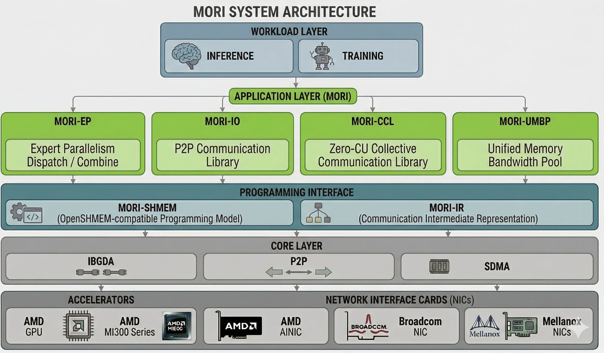

<h1 align="center">MORI</h1>

## News

- **[2026/05]** 🔥 MORI becomes the primary EP communication library for AMD platforms in Alibaba RTP-LLM ([MORI-EP PR](https://github.com/alibaba/rtp-llm/pull/977)).
- **[2026/05]** MORI's SDMA-based AllGather collective is integrated into DeepSpeed for ZeRO-3 optimization on AMD GPUs, delivering up to 10% end-to-end training speedup by offloading AllGather traffic to dedicated SDMA copy engines ([example](https://github.com/deepspeedai/DeepSpeed/blob/master/examples/sdma_allgather/README.md), [post](https://x.com/DeepSpeedAI/status/2056401598839140384)).
- **[2026/04]** 🔥 Tencent OpenUCL adopts the Mori ecosystem, using Mori's EP-style dispatch/combine pattern in AMD GPU deployments and leveraging MORI-SHMEM for GPU-initiated communication.
- **[2026/03]** 🔥 MORI-SHMEM powers ByteDance Triton-distributed EP dispatch/combine kernels as the backend, delivering seamless integration and high performance on AMD GPUs ([EP Kernels](https://github.com/ByteDance-Seed/Triton-distributed/pull/164), [MORI-SHMEM Integration](https://github.com/ByteDance-Seed/Triton-distributed/pull/145)).
- **[2026/02]** 🔥 MORI powers AMD's WideEP and PD disaggregation in SemiAnalysis InferenceX v2 benchmark ([PR](https://github.com/SemiAnalysisAI/InferenceX/pull/348), [InferenceX](https://inferencex.semianalysis.com/), [blog](https://newsletter.semianalysis.com/p/inferencex-v2-nvidia-blackwell-vs)).
- **[2026/01]** 🔥 MORI-EP and MORI-IO integrated into SGLang and vLLM for MoE Expert Parallelism and PD Disaggregation on AMD GPUs ([sglang & MORI-EP](https://github.com/sgl-project/sglang/pull/14797), [sglang & MORI-IO](https://github.com/sgl-project/sglang/pull/14626), [vllm & MORI-EP](https://github.com/vllm-project/vllm/pull/28664), [vllm & MORI-IO](https://github.com/vllm-project/vllm/pull/29304)).
- **[2025/12]** MORI adds support for AMD's AINIC (Pollara) with SOTA performance ([AINIC & MORI-EP](https://github.com/ROCm/mori/pull/119), [AINIC & MORI-IO](https://github.com/ROCm/mori/pull/113)).
- **[2025/09]** MORI-EP now seamlessly scales to 64 GPUs with SOTA performance ([multiple optimizations](https://github.com/ROCm/mori/pull/128), [multi-QP support](https://github.com/ROCm/mori/pull/108), [low-latency kernel](https://github.com/ROCm/mori/pull/105)).
- **[2025/09]** MORI adds Broadcom BNXT (Thor2) IBGDA support ([PR](https://github.com/ROCm/mori/pull/64)).

## Introduction



**MORI** (**Mo**dular **R**DMA **I**nterface) is a **bottom-up, modular, and composable framework** for building high-performance communication applications with a strong focus on **RDMA + GPU integration**. Inspired by the role of MLIR in compiler infrastructure, MORI provides reusable and extensible building blocks that make it **easier for developers to adopt advanced techniques** such as IBGDA (Infiniband GPUDirect Async) and GDS (GPUDirect Storage).

To help developers get started quickly, MORI also includes a suite of optimized libraries—**MORI-EP** (MoE dispatch & combine kernels), **MORI-IO** (p2p communication for KVCache transfer), and **MORI-CCL** (collective communication)—that deliver out-of-the-box performance, with support for AMD `Pensando DSC`, Broadcom `Thor2`, and NVIDIA Mellanox `ConnectX-7` NICs.

## Features summary
- Applications
    - MORI-EP: intra and inter-node dispatch/combine kernels with SOTA performance.
    - MORI-IO: point-to-point communication library with ultra-low overhead
    - MORI-CCL: lightweight and flexible collective communication library designed for highly customized use cases such as latency-sensitive or resource-constrained environment
    - MORI-UMBP: unified memory & bandwidth pool with tiered storage and distributed key-value access for scalable memory management
- Framework
    - High-performance building blocks for IBGDA / P2P and more​
    - Modular & composable components for developing communication applications, such as transport management, topology detection and etc.
    - Open-Shmem-style APIs
    - C++ and Python level APIs

## Documentation

| **Topic** | **Description** | **Guide** |
|---|---|---|
| MORI-EP | Dispatch/combine API, kernel types, configuration, usage examples | [EP Guide](docs/MORI-EP-GUIDE.md) |
| MORI-SHMEM | Symmetric memory APIs, initialization, memory management | [Shmem Guide](docs/MORI-SHMEM-GUIDE.md) |
| MORI-IR | Device bitcode integration for Triton and other GPU kernel frameworks | [IR Guide](docs/MORI-IR-GUIDE.md) |
| MORI-IO | P2P communication concepts, engine/backend/session design | [IO Guide](docs/MORI-IO-GUIDE.md) |
| MORI-VIZ | Warp-level kernel profiler with Perfetto integration | [Profiler](docs/PROFILER.md) |

## Benchmarks

### MORI-EP

Benchmark on DeepSeek V3 model configurations:

**Bandwidth** (4096 tokens, 7168 hidden, top-8 experts, FP8 dispatch + BF16 combine)

<table>
  <tr>
    <th>Hardware</th>
    <th>Kernels</th>
    <th>Dispatch XGMI</th>
    <th>Dispatch RDMA</th>
    <th>Combine XGMI</th>
    <th>Combine RDMA</th>
  </tr>
  <tr>
    <td rowspan="3">MI300X + CX7</td>
    <td>EP8</td>
    <td>307 GB/s</td><td>x</td><td>330 GB/s</td><td>x</td>
  </tr>
  <tr>
    <td>EP16-V1</td>
    <td>171 GB/s</td><td>52 GB/s</td><td>219 GB/s</td><td>67 GB/s</td>
  </tr>
  <tr>
    <td>EP32-V1</td>
    <td>103 GB/s*</td><td>57 GB/s*</td><td>91 GB/s*</td><td>50 GB/s*</td>
  </tr>
  <tr>
    <td rowspan="3">MI355X + AINIC</td>
    <td>EP8</td>
    <td>345 GB/s</td><td>x</td><td>420 GB/s</td><td>x</td>
  </tr>
  <tr>
    <td>EP16-V1</td>
    <td>179 GB/s</td><td>54 GB/s</td><td>234 GB/s</td><td>71 GB/s</td>
  </tr>
  <tr>
    <td>EP32-V1</td>
    <td>85 GB/s</td><td>46 GB/s</td><td>110 GB/s</td><td>61 GB/s</td>
  </tr>
</table>

**Latency** (128 tokens, 7168 hidden, top-8 experts, FP8 dispatch + BF16 combine)

<table>
  <tr>
    <th>Hardware</th>
    <th>Kernels</th>
    <th>Dispatch Latency</th>
    <th>Dispatch BW</th>
    <th>Combine Latency</th>
    <th>Combine BW</th>
  </tr>
  <tr>
    <td rowspan="3">MI300X + CX7</td>
    <td>EP8</td>
    <td>35 us</td><td>134 GB/s</td><td>47 us</td><td>204 GB/s</td>
  </tr>
  <tr>
    <td>EP16-V1-LL</td>
    <td>76 us</td><td>96 GB/s</td><td>122 us</td><td>121 GB/s</td>
  </tr>
  <tr>
    <td>EP32-V1-LL</td>
    <td>157 us*</td><td>48 GB/s*</td><td>280 us*</td><td>55 GB/s*</td>
  </tr>
  <tr>
    <td rowspan="3">MI355X + AINIC</td>
    <td>EP8</td>
    <td>31 us</td><td>142 GB/s</td><td>36 us</td><td>276 GB/s</td>
  </tr>
  <tr>
    <td>EP16-V1-LL</td>
    <td>84 us</td><td>87 GB/s</td><td>108 us</td><td>139 GB/s</td>
  </tr>
  <tr>
    <td>EP32-V1-LL</td>
    <td>152 us</td><td>45 GB/s</td><td>187 us</td><td>76 GB/s</td>
  </tr>
</table>

\* Stale data from previous kernel version; updated numbers pending re-benchmarking.

### MORI-IO

**NOTE:** This is the preview version of MORI-IO benchmark performance.

GPU Direct RDMA READ, pairwise, 128 consecutive transfers, 1 GPU, MI300X + Thor2:

```
+--------------------------------------------------------------------------------------------------------+
|                                            Initiator Rank 0                                            |
+-------------+-----------+----------------+---------------+---------------+--------------+--------------+
| MsgSize (B) | BatchSize | TotalSize (MB) | Max BW (GB/s) | Avg Bw (GB/s) | Min Lat (us) | Avg Lat (us) |
+-------------+-----------+----------------+---------------+---------------+--------------+--------------+
|      8      |    128    |      0.00      |      0.03     |      0.03     |    33.38     |    36.33     |
|      16     |    128    |      0.00      |      0.06     |      0.06     |    34.09     |    36.35     |
|      32     |    128    |      0.00      |      0.12     |      0.11     |    34.57     |    36.33     |
|      64     |    128    |      0.01      |      0.24     |      0.23     |    33.62     |    36.33     |
|     128     |    128    |      0.02      |      0.49     |      0.45     |    33.62     |    36.49     |
|     256     |    128    |      0.03      |      0.94     |      0.89     |    34.81     |    36.99     |
|     512     |    128    |      0.07      |      1.86     |      1.77     |    35.29     |    37.01     |
|     1024    |    128    |      0.13      |      3.84     |      3.53     |    34.09     |    37.09     |
|     2048    |    128    |      0.26      |      7.33     |      6.96     |    35.76     |    37.65     |
|     4096    |    128    |      0.52      |     12.94     |     12.46     |    40.53     |    42.09     |
|     8192    |    128    |      1.05      |     20.75     |     20.12     |    50.54     |    52.11     |
|    16384    |    128    |      2.10      |     29.03     |     28.33     |    72.24     |    74.02     |
|    32768    |    128    |      4.19      |     36.50     |     35.91     |    114.92    |    116.81    |
|    65536    |    128    |      8.39      |     41.74     |     41.39     |    200.99    |    202.70    |
|    131072   |    128    |     16.78      |     45.14     |     44.85     |    371.69    |    374.10    |
|    262144   |    128    |     33.55      |     46.93     |     46.76     |    715.02    |    717.56    |
|    524288   |    128    |     67.11      |     47.94     |     47.81     |   1399.99    |   1403.64    |
|   1048576   |    128    |     134.22     |     48.44     |     48.32     |   2770.90    |   2777.76    |
+-------------+-----------+----------------+---------------+---------------+--------------+--------------+
```

## Hardware Support Matrix

**GPU**

| | **MORI-EP** | **MORI-IO** | **MORI-SHMEM** |
|---|:---:|:---:|:---:|
| MI308X | ✅ | ✅ | ✅ |
| MI300X | ✅ | ✅ | ✅ |
| MI325X | ✅ | ✅ | ✅ |
| MI355X | ✅ | ✅ | ✅ |
| MI450X | 🚧 | 🚧 | 🚧 |

**NIC**

| | **MORI-EP** | **MORI-IO** | **MORI-SHMEM** |
|---|:---:|:---:|:---:|
| Pollara | ✅ | ✅ | ✅ |
| CX7 | ✅ | ✅ | ✅ |
| Thor2 | ✅ | ✅ | ✅ |
| Volcano | 🚧 | 🚧 | 🚧 |

✅ Supported &emsp; 🚧 Under Development

## Installation

### Prerequisites

- ROCm >= 6.4 (hipcc needed at runtime for JIT kernel compilation, not at install time)
- System packages: `libpci-dev` (see [Dockerfile.dev](docker/Dockerfile.dev))
- Optional: `libopenmpi-dev`, `openmpi-bin` — only needed when building C++ examples (`BUILD_EXAMPLES=ON`) or enabling MPI bootstrap (`MORI_WITH_MPI=ON`)

Or build docker image with:
```bash
cd mori && docker build -t rocm/mori:dev -f docker/Dockerfile.dev .
```

**IBGDA NIC support** (optional, for GPU-direct RDMA — auto-detected, no manual configuration needed):

| NIC | User library |
|-----|-------------|
| AMD Pollara (AINIC) | `libionic.so` |
| Mellanox ConnectX | `libmlx5.so` (typically pre-installed) |
| Broadcom Thor2 | `libbnxt_re.so` |

> **Note**: IBGDA requires vendor-specific DV (Direct Verbs) libraries. Mellanox `libmlx5` is
> typically pre-installed with the kernel OFED stack. For Thor2 and Pollara, install the
> corresponding userspace library from your NIC vendor.

### Install

MoRI can be installed in three ways: from PyPI (stable), nightly pre-built wheels (latest dev), or from source.

#### From PyPI (stable release)

```bash
pip install amd_mori
```

#### Nightly (pre-built, tested daily)

```bash
# From PyPI
pip install --pre amd-mori-nightly

# Or from GitHub Pages
pip install --no-index --force-reinstall --find-links https://rocm.github.io/mori/nightly/latest/ amd_mori
```

Browse all nightly builds: https://rocm.github.io/mori/nightly/

> **Note**: `amd-mori` and `amd-mori-nightly` both provide the `mori` Python module.
> Do not install both at the same time — uninstall one before installing the other.

#### From source

```bash
# NOTE: for venv build, add --no-build-isolation at the end
cd mori && pip install .
```

No hipcc needed at install time — host code compiles with a standard
C++ compiler. GPU kernels are JIT-compiled on first use and cached to
`~/.mori/jit/`. If a GPU is detected during install, kernel precompilation
starts automatically in the background.

To manually precompile all kernels (e.g. in a Docker image build):
```bash
MORI_PRECOMPILE=1 python -c "import mori"
```

### Verify installation

```bash
python -c "import mori; print(mori.__version__)"
```

## Testing

### Test MORI-EP (dispatch / combine)

```bash
cd /path/to/mori
export PYTHONPATH=/path/to/mori:$PYTHONPATH
python -c "import mori; print(mori.__file__)"

# Test correctness (8 GPUs)
pytest tests/python/ops/test_dispatch_combine_intranode.py -q
pytest tests/python/ops/test_dispatch_combine_async_ll.py -q
pytest tests/python/ops/test_dispatch_combine_internode_v1.py -q

# Benchmark performance
python tests/python/ops/bench_dispatch_combine.py
```

### Test MORI-IO

```bash
cd /path/to/mori
export PYTHONPATH=/path/to/mori:$PYTHONPATH

# Correctness tests
pytest tests/python/io/

# Benchmark performance (two nodes)
export GLOO_SOCKET_IFNAME=ens14np0
torchrun --nnodes=2 --node_rank=0 --nproc_per_node=1 --master_addr="10.194.129.65" --master_port=1234 \
  tests/python/io/benchmark.py --host="10.194.129.65" --enable-batch-transfer --enable-sess --buffer-size 32768 --transfer-batch-size 128
```

### Test MORI-IR (Triton + shmem integration, [guide](python/mori/ir/README.md))

```bash
# Basic shmem put (2 GPUs)
torchrun --nproc_per_node=2 examples/shmem/ir/test_triton_shmem.py

# Allreduce (8 GPUs)
torchrun --nproc_per_node=8 examples/shmem/ir/test_triton_allreduce.py
```

## Contribution Guide

Welcome to MORI! We appreciate your interest in contributing. Whether you're fixing bugs, adding features, improving documentation, or sharing feedback, your contributions help make MORI better for everyone.

### Code Quality

MORI uses pre-commit hooks to maintain code quality. After cloning the repository:

```bash
pip install pre-commit
cd /path/to/mori
pre-commit install

# Run on all files (first time)
pre-commit run --all-files
```

Pre-commit automatically checks code formatting, linting, license headers, and other quality checks on commit. To skip checks when necessary: `git commit --no-verify`
