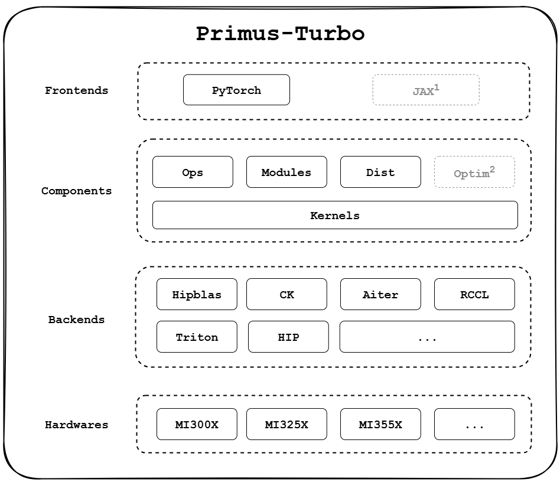

# Primus-Turbo
[What's Primus-Turbo?](#-whats-primus-turbo) | [What's New](#-whats-new) | [Primus Product Matrix](#-primus-product-matrix) | [Quick Start](#-quick-start) | [Example](#-example) | [Performance](#-performance) | [Roadmap](#-roadmap) | [License](#-license)

## 🔍 What's Primus-Turbo?
**Primus-Turbo** is a high-performance acceleration library dedicated to large-scale model training on AMD GPUs. Built and optimized for the AMD ROCm platform, it covers the full training stack — including core compute operators (GEMM, Attention, GroupedGEMM), communication primitives, optimizer modules, low-precision computation (FP8), and compute–communication overlap kernels.

With **High Performance**, **Full-Featured**, and **Developer-Friendly** as its guiding principles, Primus-Turbo is designed to fully unleash the potential of AMD GPUs for large-scale training workloads, offering a robust and complete acceleration foundation for next-generation AI systems.

<p align="center">
  
</p>
Note: JAX support is under active development. Optim support is planned but not yet available.

## 🚀 What's New
- **[2025/12/16]** 🔥[MoE Training Best Practices on AMD GPUs](https://rocm.blogs.amd.com/software-tools-optimization/primus-moe-package/README.html)
- **[2025/12/01]** 🔥[Efficient MoE Pre-training at Scale on 1K AMD GPUs with TorchTitan.](https://pytorch.org/blog/efficient-moe-pre-training-at-scale-with-torchtitan/)
- **[2025/09/19]** [Primus-Turbo introduction blog.](https://rocm.blogs.amd.com/software-tools-optimization/primus-large-models/README.html)
- **[2025/09/11]** Primus-Turbo initial release, version v0.1.0.

## 🧩 Primus Product Matrix

|     Module     | Role | Key Features |
|----------------|------|--------------|
| [**Primus-LM**](https://github.com/AMD-AGI/Primus)           | E2E training framework | - Supports multiple training backends (Megatron, TorchTitan, etc.)<br>- Provides high-performance, scalable distributed training<br>- Deeply integrates with Primus-Turbo and Primus-SaFE |
| [**Primus-Turbo**](https://github.com/AMD-AGI/Primus-Turbo)  | High-performance operators & modules | - Supports core training operators and modules (FlashAttention, GEMM, GroupedGemm, DeepEP etc.)<br>- Integrates multiple high-performance backends (e.g., CK, hipBLASLt, AITER) <br>- High performance and easy to integrate |
| [**Primus-SaFE**](https://github.com/AMD-AGI/Primus-SaFE)    | Stability & platform layer | - Cluster sanity check and benchmarking<br>- Kubernetes scheduling with topology awareness<br>- Fault tolerance<br>- Stability enhancements |


## 📦 Quick Start

### Requirements

#### Software
- ROCm >= 7.0
- Python >= 3.10
- PyTorch >= 2.6.0 (with ROCm support)
- [AITER](https://github.com/ROCm/aiter) (required for some operators, e.g. FlashAttention / FP8): `pip3 install "amd-aiter @ git+https://github.com/ROCm/aiter.git@v0.1.14.post1"`
- rocSHMEM (optional, required for **experimental DeepEP**). Please refer to our [DeepEP Installation Guide](primus_turbo/pytorch/deep_ep/README.md) for instructions.

#### Hardware
| Architecture | Supported GPUs      |
| -------------| --------------------|
| GFX942       | ✅MI300X, ✅MI325X |
| GFX950       | ✅MI350X, ✅MI355X |

> See [AMD GPU Architecture](https://rocm.docs.amd.com/projects/install-on-linux/en/latest/reference/system-requirements.html#supported-gpus) to find the architecture for your GPU.

### 1. Installation

#### Docker (Recommended)
Use the pre-built AMD ROCm image from [Docker Hub](https://hub.docker.com/r/rocm/primus/tags):
```bash
# PyTorch Ecosystem
docker pull rocm/primus:v26.2

# JAX Ecosystem
docker pull rocm/jax-training:maxtext-v26.2
```

You can also use the official ROCm PyTorch image from [Docker Hub](https://hub.docker.com/r/rocm/pytorch).

#### Install from Prebuilt Index

> **Prerequisite:** install inside an environment that already has **ROCm PyTorch** — e.g. the `rocm/primus` image above, or the official [`rocm/pytorch`](https://hub.docker.com/r/rocm/pytorch) image. Primus-Turbo builds against your existing torch and does **not** install torch for you; in a bare environment `pip` would otherwise pull a non-ROCm torch.

```bash
# PyTorch backend (latest)
pip3 install --no-build-isolation "primus-turbo[pytorch]" \
    --extra-index-url https://amd-agi.github.io/Primus-Turbo/simple/

# Pin a specific version
pip3 install --no-build-isolation "primus-turbo[pytorch]==0.1.0" \
    --extra-index-url https://amd-agi.github.io/Primus-Turbo/simple/
```

> The index currently serves **source distributions (sdist)**, so install compiles HIP kernels locally (needs the ROCm toolchain; supports gfx942 / gfx950). Prebuilt wheels are planned. Keep `--no-build-isolation` so the build uses your preinstalled torch.

#### Install from Source

```bash
git clone https://github.com/AMD-AGI/Primus-Turbo.git
cd Primus-Turbo

# Install build/runtime dependencies first
pip3 install -r requirements.txt

# Default backend: PyTorch
pip3 install --no-build-isolation ".[pytorch]"

# JAX backend
PRIMUS_TURBO_FRAMEWORK="JAX" pip3 install --no-build-isolation ".[jax]"
```

#### Install from GitHub URL (without cloning)

```bash
# Install from default branch
pip3 install --no-build-isolation "git+https://github.com/AMD-AGI/Primus-Turbo.git"

# Install from a specific branch
pip3 install --no-build-isolation "git+https://github.com/AMD-AGI/Primus-Turbo.git@main"
```

> Note:
> - `".[pytorch]"` / `".[jax]"` means install from current local repo with extras.
> - Extras select Python dependencies. Source compilation target is controlled by `PRIMUS_TURBO_FRAMEWORK`.

### 2. Development

For contributors, use editable mode (`-e`) so that code changes take effect immediately without reinstalling.

```bash
git clone https://github.com/AMD-AGI/Primus-Turbo.git
cd Primus-Turbo

pip3 install -r requirements.txt
pip3 install --no-build-isolation -e ".[pytorch]" -v

# (Optional) Set GPU_ARCHS environment variable to specify target AMD GPU architectures.
GPU_ARCHS="gfx942;gfx950" pip3 install --no-build-isolation -e ".[pytorch]" -v

# (Optional) Set PRIMUS_TURBO_FRAMEWORK to compile for a specific framework.
# Supported values: PYTORCH (default), JAX.
# For example, to compile for JAX:
PRIMUS_TURBO_FRAMEWORK="JAX" pip3 install --no-build-isolation -e ".[jax]" -v

# (Optional) ccache/sccache are auto-detected on PATH to speed up incremental rebuilds.
# Just install ccache or sccache and the build will use it automatically.
```

### 3. Testing

**Option 1: Single-process mode (slow but simple)**
```bash
pytest tests/pytorch/    # run all PyTorch tests
pytest tests/jax/        # run all JAX tests
```

**Option 2: Multi-process mode (faster)**
```bash
# PyTorch tests
## single-GPU tests (parallel)
pytest tests/pytorch/ -n 8
## deterministic tests (parallel)
pytest tests/pytorch/ -n 8 --deterministic-only
## multi-GPU tests
pytest tests/pytorch/ --dist-only

# JAX tests
## single-GPU tests (parallel)
pytest tests/jax/ -n 8
## multi-GPU tests
pytest tests/jax/ --dist-only
```

### 4. Packaging

`pip` installation behavior:
1. Use a compatible wheel (`.whl`) if available.
2. Fall back to source distribution (`sdist`, `.tar.gz`) when no wheel matches.

Artifact roles:
- **wheel**: prebuilt binary package, fast install, no local C++/HIP build.
- **sdist**: source package, slower install, requires local toolchain, fallback path.

#### Build artifacts
```bash
# Build wheel (binary distribution)
python3 -m build --wheel --no-isolation

# Build sdist (source distribution)
python3 -m build --sdist --no-isolation
```

#### Verify wheel install
```bash
pip3 install --no-build-isolation ./dist/primus_turbo-XXX.whl
```

#### Verify source fallback install
```bash
pip3 install --no-build-isolation ./dist/primus_turbo-XXX.tar.gz
```

> Tip:
> Run import checks outside the source tree (for example under `/tmp`) to avoid importing local source files by accident.

### 5. Minimal Example
```python
import torch
import primus_turbo.pytorch as turbo

dtype = torch.bfloat16
device = "cuda:0"

a = torch.randn((128, 256), dtype=dtype, device=device)
b = torch.randn((256, 512), dtype=dtype, device=device)
c = turbo.ops.gemm(a, b)

print(c)
print(c.shape)
```

## 💡 Example
See [Examples](./docs/examples.md) for usage examples.


## 📊 Performance
See [Benchmarks](./benchmark/README.md) for detailed performance results and comparisons.

## 📍 Roadmap
[Roadmap: Primus-Turbo Roadmap H1 2026](https://github.com/AMD-AGI/Primus-Turbo/issues/211)

## 📜 License

Primus-Turbo is licensed under the MIT License.

© 2025 Advanced Micro Devices, Inc. All rights reserved.
