# DeepSeek-V4昇腾训练支持：基于 CANN 平台的TorchTitan-NPU + AutoFuse 极简训练优化实践

**摘要**：本文介绍 DeepSeek\-V4\-Flash 模型基于 CANN 平台的训练优化实践。基于 TorchTitan\-NPU 框架，采用纯 FSDP + 大 EP 极简并行策略实现内存最优；创新性地使能训练入图技术，凭借 Ascend C AutoFuse 能力，获得端到端 32% 的编译收益；针对稀疏注意力结构定制高效融合算子，充分释放芯片算力。DeepSeek\-V4\-Flash 模型在 64 卡 A3 集群上 4K 序列 BF16 训练吞吐达 1100 tokens/p/s。这一快速支持能力验证了极简开箱方案在 NPU 大模型训练中的可行性与高效性，旨在帮助现有昇腾 A3 集群用户基于 DeepSeek 新模型架构快速开展续训练/SFT 及自研算法验证。

本文涉及的所有代码已开源：[https://gitcode.com/cann/torchtitan-npu](https://gitcode.com/cann/torchtitan-npu)，快速体验见[《基于TorchTitan-NPU的DeepSeek-V4-Flash训练部署指导》](../../llm_pretrain/deepseekv4/README.md)。
***

## Highlights

* 训练框架采用 TorchTitan + TorchTitan\-NPU 插件化方案，采用**超节点亲和的大 EP + 纯 FSDP** 的精简并行切分策略，以极低适配成本和通信开销达成**内存占用最优**，实现易用性与性能的较好均衡

* TorchTitan\-NPU 深度适配 torch.compile 机制，使能训练入图技术，依托 **Inductor + AutoFuse**（基于 Ascend C 的 Codegen 后端）实现端到端的 **Vector 算子自动融合**，为整网带来高达 **31.8%** 的开箱即用性能收益

* 针对稀疏注意力等复杂结构，开发 **SparseAttnSharedkv**、**LightningIndexer** 等多个高效的 NPU 融合算子，从负载均衡分核计算、内存与计算均衡等维度协同优化，充分释放芯片稀疏算力

* 基于上述优化点，CANN 已基于 TorchTitan 支持 DeepSeek\-V4\-Flash 的模型训练，采用 A3 集群 BF16 精度 64 卡 4K 序列 + MTP1 训练**吞吐达 1100 tokens/p/s**

## 引言

TorchTitan 为业界带来了 PyTorch Native 大模型训练方案的全新选择，其核心设计理念是模型算法与分布式并行、算子优化天然解耦。通过支持 torch.compile 训练入图优化，告别手写融合 kernel，大大提升了大规模分布式训练的易用性。在并行策略方面，TorchTitan 深度集成 FSDP2，实现参数、梯度和优化器状态的跨设备分片，显著降低单卡内存占用。

本实践的整体软件架构自顶向下由 TorchTitan、TorchTitan\-NPU 插件、TorchInductor 及 CANN 层的 AutoFuse 组件构成，各层分工明确、优势互补：

* **TorchTitan**：作为 PyTorch 原生分布式训练框架，避免对 Megatron 等重型框架的依赖，以精简代码库提供 FSDP 等并行能力的开箱即用支持。

* **TorchTitan\-NPU**：以插件形式提供可插拔安装，针对昇腾集群实现通信与算子的硬件加速适配，保持与上游 TorchTitan 的轻量集成。

* **TorchInductor**：直接继承社区 torch.compile 的图捕获与融合优化能力，无需重复造轮即可复用 PyTorch 编译生态的相关基础设施。

* **AutoFuse**：面向昇腾 NPU，定位为基于 Ascend C 的 Codegen & Schedule 后端，在 Inductor 基础上注入架构感知的融合、优化与展开策略，将计算图优化转化为 NPU 高效指令序列。

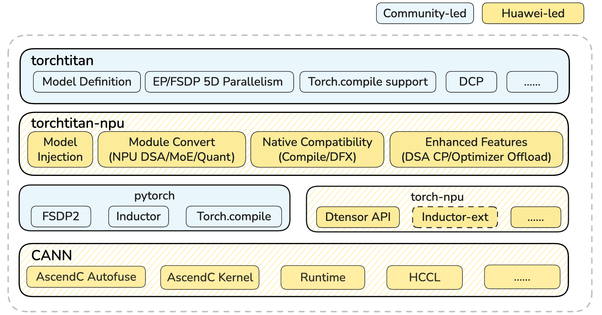

基于上述分层架构，我们在 **TorchTitan\-NPU 加速插件**的基础上完成了 DeepSeek\-V4\-Flash 模型续训练流程的适配与调优。整个方案围绕“极简并行、自动融合、定制算子”三条主线展开，下文将分别就基于 FSDP+EP 的极简分布式并行、torch.compile 与 AutoFuse 自动融合协同、以及高性能融合算子优化加速进行详细阐述。

## 极简分布式并行优化

### FSDP+EP极简切分优势

在 MoE 大模型训练中，EP 切分可有效分摊路由专家权重的存储压力，但注意力模块、共享专家、词嵌入及词表投影层等非专家参数仍需额外切分机制加以应对。另一方面，随着模型结构迎来又一个快速发展阶段，传统 TP/PP 方案在性能开销与易用性层面均面临诸多挑战，而 FSDP 在上述场景中展现出较为显著的优势。因此，本实践基于 A3 超节点 64 卡环境，在 DeepSeek\-V4\-Flash 模型训练中创新性地选择纯 FSDP + EP 极简切分方案，具体配置如下：

|**TP**|**PP**|**VPP**|**EP**|**FSDP**|**MBS**|**GBS**|**集群**|
|---|---|---|---|---|---|---|---|
|1|1|1|128|128|1|1024|64卡|

#### FSDP简介

FSDP（Fully Sharded Data Parallel）是 PyTorch 提供的数据并行技术，通过将模型参数、梯度和优化器状态跨设备分片存储，显著降低单卡内存占用。其原理是将 DDP 的 AllReduce 分解为前向的 AllGather 与后向的 ReduceScatter，在计算过程中按需收集参数、用完即释，以最小化常驻内存。此外，FSDP 的通信操作可与计算重叠执行，AllGather 提前预取下一层参数，ReduceScatter 则在后向计算进行时同步传输，有效将通信延迟掩盖在计算耗时内。

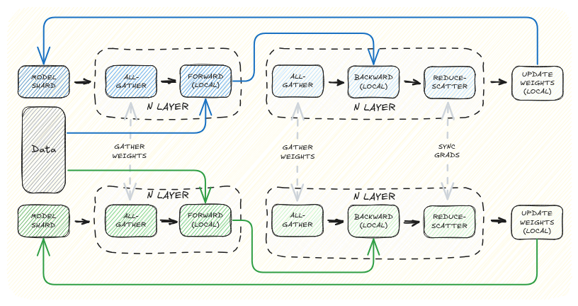

#### 内存收益

尽管 MoE 模型的路由专家权重在全局参数量中占据绝对主导，但经过 EP 维度切分后，非路由专家权重在单卡内存中的占比将显著上升，成为新的内存瓶颈。下表以 DeepSeek\-V4\-Flash 模型为例展示了 EP 切分前后瓶颈的转换，其中**主权重**和**模型梯度**均按照混合精度训练场景下常见的 4 字节大小计算。

<table border="1" cellspacing="0" cellpadding="8" style="border-collapse: collapse; text-align: center; font-family: Arial, sans-serif;">
  <thead>
    <tr style="background-color: #f2f2f2;">
      <th><strong>FSDP</strong></th>
      <th><strong>DP</strong></th>
      <th><strong>EP</strong></th>
      <th><strong>总参数量</strong></th>
      <th><strong>非专家参数量</strong></th>
      <th><strong>非专家权重+梯度</strong></th>
      <th><strong>专家参数量</strong></th>
      <th><strong>专家权重+梯度</strong></th>
      <th><strong>非专家内存占比</strong></th>
    </tr>
  </thead>
  <tbody>
    <tr>
      <td>1</td>
      <td>128</td>
      <td>1</td>
      <td>285B</td>
      <td>8B</td>
      <td style="background-color: #ffcccc;">59.5GB</td>
      <td>277B</td>
      <td>2060GB</td>
      <td>2.8%</td>
    </tr>
    <tr>
      <td>1</td>
      <td>128</td>
      <td>128</td>
      <td>285B</td>
      <td>8B</td>
      <td style="background-color: #ffcccc;">59.5GB</td>
      <td>~2B</td>
      <td>16GB</td>
      <td>80%</td>
    </tr>
    <tr>
      <td>128</td>
      <td>1</td>
      <td>128</td>
      <td>285B</td>
      <td>0.06B</td>
      <td style="background-color: #ccffcc;">0.465GB</td>
      <td>~2B</td>
      <td>16GB</td>
      <td>2.8%</td>
    </tr>
  </tbody>
</table>

考虑到 A3 单卡 64GB 的内存大小，在模型训练过程中不可避免地需要引入对非专家参数的切分。对比 TP/PP，FSDP 的通信可被计算完全掩盖（详见性能小节），因而可以使用相对激进的内存切分配置而不受性能考量的制约。实测开启 FSDP128 后，非专家权重被均分至全部 128 DIE，**几乎完全消除该部分内存占用**——TorchTitan 完成模型初始化后单卡权重内存仅约 8~9GB，可视作仅由 EP 切分后的路由专家权重构成。

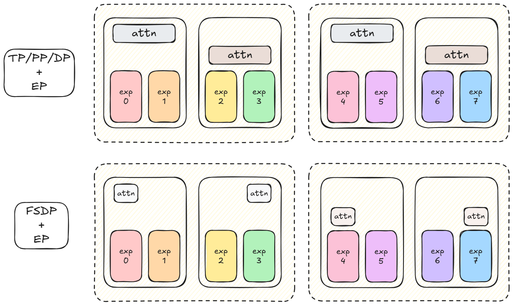

#### 性能开销

FSDP 通信数据不依赖当前层的中间计算结果，框架得以将集合通信操作下发至独立的通信流上，与模型前向/反向计算异步并发执行。**借助于 A3 超节点的高通信带宽，实测 FSDP 的通信开销可被计算过程完全掩盖。**这一特性打破了性能与内存之间的折衷——采用 FSDP128 将通信域扩大到 8 机范围时，依然不会因通信暴露而损害训练吞吐，为内存侧的极致压缩提供了可行性保障。

与之相对地，TP/PP 中的通信与计算关键路径紧密耦合，无法掩盖。即使借助 A3 芯片的 SIO 高带宽通信，并采用 TP2 这类极小通信域配置，张量并行依然会带来可观的通信开销；另一方面，PP 切分的流水线气泡率随通信域规模的扩大同步增加，导致的设备空闲亦不可忽略。这些现实约束反过来制约了数据并行向 TP/PP 的转换，实际部署中往往无法将数据并行完全切分为 TP/PP，从而残留一定程度的内存冗余。

#### 易用性优势

除内存与性能优势外，FSDP 在工程复杂度上也显著优于 TP/PP：

* **对 TP 切分而言**，DeepSeek 系列模型中 MLA/DSA/C4A/C128A 结构的引入使得注意力机制的 TP 切分越来越复杂。DeepSeek\-V4 的注意力机制在整体框架上继承了 DeepSeek\-V3.2 引入的 DSA 结构，其 Indexer 模块在计算前向结果和 Loss 值时均涉及模型 head 维度的累加操作，如下图所示。该操作的语义决定了无法直接沿 head 维度进行 TP 切分——强行切分则需同时引入新的 AllGather 聚合通信，以保证 ReduceSum 的正确性。

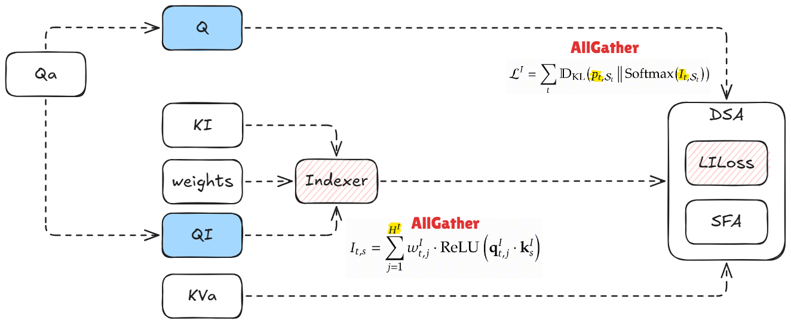

* **对 PP 切分而言**，模型中非均匀的模块（Embedding、LmHead、MTP 等）极易导致 PP Stage 间的耗时不均，MoE 模型中本身与数据分布相关的负载不均衡现象更进一步加重了 PP 性能调优过程中的困难。

相较之下，FSDP 对参数无差异分片并作异步 AllGather 的方式做到了模型算法和结构无感的权重切分——前反向计算时总可以获取完整的单层模型权重，各个 DP rank 间执行的计算无任何差异，且在适配上仅通过一行 `fully_shard` 函数调用即可，较好地克服了前述场景中 TP/PP 的缺陷。

### 双通信域overlap优化

基于 FSDP 相对于 TP/PP 的上述优势，我们选择了 FSDP128 + EP128 作为模型的切分策略，并在实际测试中优化了 TorchTitan 上游实现存在的一个通信域初始化问题：由于前述切分策略中，FSDP 域和 EP 域均与分布式并行组的全局默认通信域相同，使得 PyTorch **为 FSDP 和 EP 分配同一个 ProcessGroup**，导致两者的通信操作被迫串行执行，无法并发。

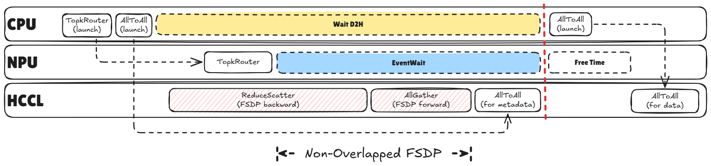

具体而言，如上图所示，EP 通信位于 MoE 模型执行的关键路径上，任何阻塞都会直接延迟模型的整体计算。当 FSDP 与 EP 共享 ProcessGroup 时，FSDP 的 AllGather/ReduceScatter 会与 EP 的 AllToAll 形成串行等待关系：FSDP 的通信操作会阻塞 EP 通信的执行，并最终进一步阻塞后续的计算算子。这意味着原本设计中被计算隐藏的 FSDP 通信暴露到了关键路径上，造成整体吞吐下降。

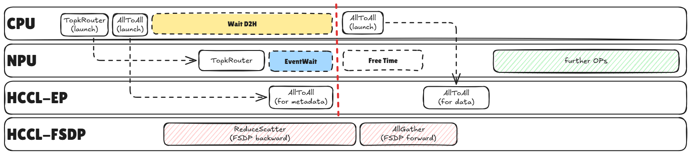

通过在初始化阶段对 EP 通信域进行独立标注，FSDP 与 EP 得以持有各自的 ProcessGroup。两者的通信操作因此可在不同的 HCCL 流上并发执行，从而恢复 FSDP 通信被模型主计算流程掩盖的设计初衷。修复后，EP 的关键路径通信不再受 FSDP 阻塞，实测结果显示，修复使模型在 MoE 层的通信等待时长由最长 10ms 降低至 ~3ms，并带来了 1.1% 的模型训练性能提升。后续我们会将这一问题反馈至 PyTorch/TorchTitan 上游社区，期望助力框架在后续版本中的优化。

### 内存卸载优化

在 FSDP2 原生方案中，尽管参数、梯度和优化器状态均被切分，但 AdamW 的两个 FP32 动量在前反向计算期间仍驻留设备内存，造成静置浪费。**作为 FSDP 的内存优化补充**，[SwapOptimizer](https://gitcode.com/Ascend/MindSpeed/blob/master/docs/features/swap-optimizer.md) 将 FSDP 已切分至单卡的优化器状态进一步卸载至主机内存，仅在权重更新阶段按需换入。我们在 TorchTitan 中参考 MindSpeed 思路实现了该特性，针对 DTensor 权重场景适配，并以参数为粒度设计切片流水，将“加载—更新—卸载”串行过程按照如下图所示的方式重叠执行，降低优化器更新阶段的内存峰值。

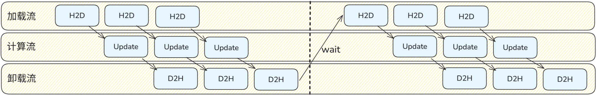

该机制将使用 AdamW 优化器场景下的常驻内存从 FSDP 的 16 字节/参数（权重 4 + 梯度 4 + 优化器 8）进一步压降至 8 字节/参数（仅权重 + 梯度），内存占用近乎减半。

## torch.compile + AutoFuse

随着 MoE 与多模态架构的普及，动态、细粒度的小算子组合已成为主流设计模式。以 DeepSeek 提出的 mHC 为例，其将 HC 过程分解为 HcRes、HcPre 与 HcPost 三部分，分别通过双随机矩阵与 Sigmoid 门控系数保障数学性质，但实现上依赖大量细碎的 PyTorch 操作。这类灵活结构在模型设计中日益普遍，若延续传统手写融合算子的方式，开发效率已难以匹配模型迭代速度，算子自动化融合能力由此成为刚需。

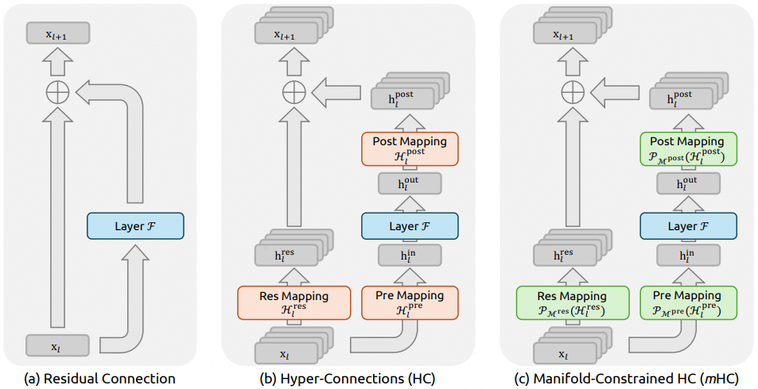

torch.compile 为此提供了基础能力：通过捕获 FX 计算图将模型逻辑转换为算子图表示，交由 Inductor 后端进行算子融合与代码生成。Inductor 通过垂直与水平融合策略，将多个细碎操作合并为单一高效内核，实现跨算子的全局优化。**TorchTitan 对 torch.compile 提供了原生深度支持**，可充分复用 PyTorch 现有的编译生态基础设施与优化成果。

然而，NPU 与 GPU 在内存架构与计算范式上存在本质差异，直接沿用 GPU 优化策略难以充分释放 NPU 潜力。为此，**CANN 框架的 AutoFuse 组件在继承 Inductor 整体流程的基础上，实现了目标为 Ascend C 的 Schedule & Codegen 后端。**通过架构感知的融合策略与指令调度，实现从计算图到高效 NPU 算子代码的自动化映射，显著提升融合算子在昇腾平台上的执行效率。

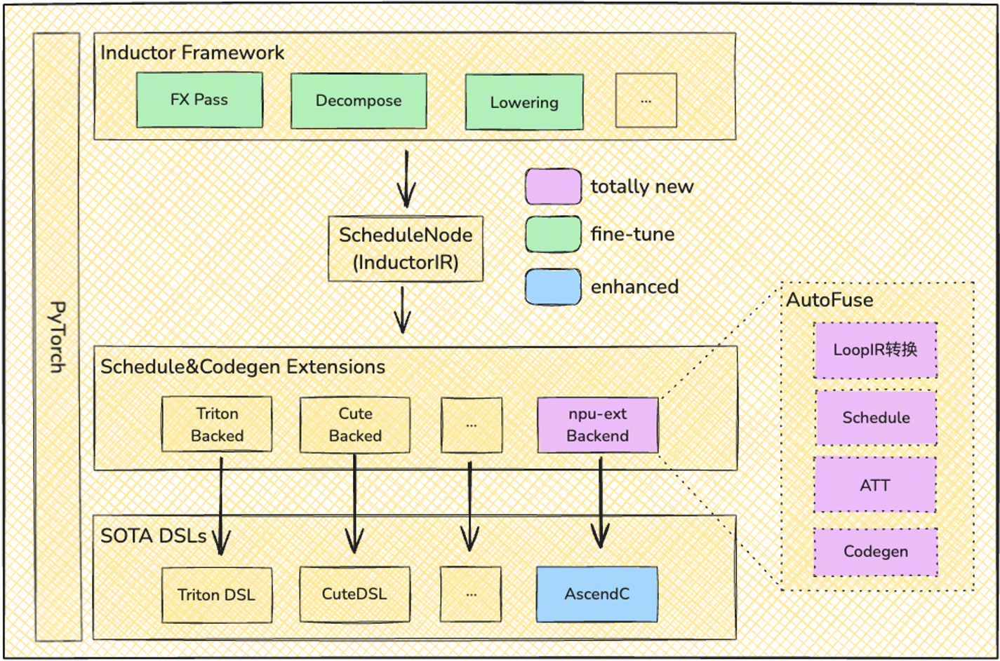

在本实践的训练场景中，由于不开启 TP 切分使得各算子的计算量本身较大，做算子融合后 Kernel Launch 开销占比极低，不存在静态图的收益空间。因而我们采用动态图 Eager 模式执行编译后的算子图，且 Eager 模式无需处理动态 Shape 约束，更为简洁灵活，已可获取融合的主要性能收益。

**AutoFuse 亮点**

* 使用简单：PyTorch 前端增加一行代码即可使能

* 性能提升：依赖 NPU 亲和的算子生成技术，本次模型融合收益约 31.8%

    * 亲和 NPU，模板规约的 Schedule 技术

    * 基于硬件建模，动态求解的算子 Tiling 技术

    * 基于 Ascend LoopIR 表达的，Ascend C 算子 kernel 代码生成技术

* 泛化与完备度：当前已支持 152 个 LoopIR 表达中的 46 个，未来将逐步补齐，与 LoopIR 完整对等

### AutoFuse收益分析

使能 AutoFuse 后 DeepSeek\-V4\-Flash 模型整网吞吐收益为 31.8%，具体性能提升数据拆解如下表所示，收益主要来自 AIV 的算子融合，以及 Host Bound 缓解带来的 Free Time 减少：

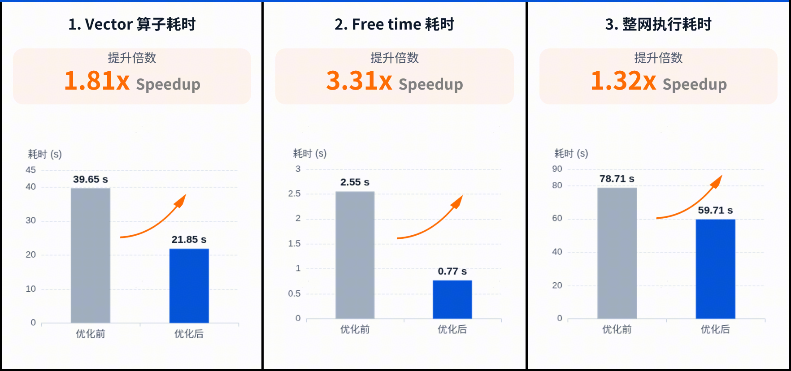

1. **AIV 的收益主要来自各类算子融合：**

|**融合后算子名称**|**数量****\(Count\)**|**融合后总耗时 \(s\)**|**融合前总耗时 \(s\)**|**净收益时间 \(s\)**|**优化核心**|
|---|---|---|---|---|---|
|autofused\_mul\_sum 系列|10,232|1.6|7.1|5.5|带宽优化：消除 Mul 结果写回内存再读回的操作，直接在片上完成规约。|
|基础逐元素融合 \(Mul/Add/Div\)|~20万个|7.8|12.8|5|访存收敛：将大量独立的乘、加、除操作合并，显著减少了对内存的总访问次数。|
|autofused\_add\_div\_expand\_mul\_pow|1,584|1|2.6|1.6|指令加速：将极高延迟的独立 Pow 算子指令化，通过计算掩盖访存延迟。|
|BroadcastTo 隐式化 \(聚合项\)|~3.3万个|0.3|2.5|2.2|隐式广播：通过 Stride 逻辑变换实现广播，彻底消除了 2s 多的物理内存拷贝耗时。|
|autofused\_npu\_dtype\_cast 系列|14,832|1.8|2.5|0.7|调度简化：吸收数万次类型转换操作，大幅降低了 CPU 下发任务给 NPU 的频率。|

**以下以其中一个片段为例说明：**

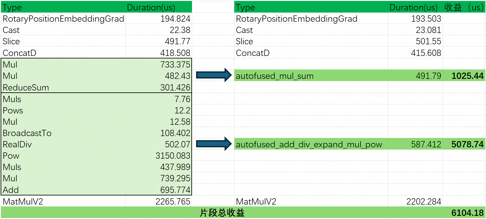

三大核心收益来源：

* 消除“访存墙” \(Memory Bound\)

    * 将 12 个独立算子的“读\-算\-写”循环，重构为 2 个高集成度融合内核

    * 中间张量驻留片上缓存 \(SRAM/L1\)，规避了频繁读写 HBM（全局内存） 的巨大带宽开销

* 掩盖高耗时指令 \(Operator Hiding\)

    * 通过编译器对 Pow/RealDiv 等高周期算子进行指令级重排

    * 计算压力被掩盖在矢量计算流水线中，实现非线性数学公式链的“近乎零成本”合并

* 精简内核启动开销 \(Launch Overhead\)

    * 大幅减少 Host\-to\-Device 握手次数。

    * 清理了重量级算子（如 MatMul）之间的“计算碎屑”，确保 NPU 核心持续处于高负载产出状态

2. **Host\-Bound（调度瓶颈）的显著削减**

核心优化路径：将原本离散间隔执行的小算子，优化为融合算子的连续执行，降低了硬件空泡，保障 NPU 计算流水线连续性，大幅提升硬件利用率

* 调度优化： 静态化分析 + Codegen Wrapper \-> 预编译执行流（取代动态 Dispatcher），降低 Host 延迟

* 算子级优化： 算子融合 \-> 减少 Launch 次数 \-> 缓解 Host 侧指令下发压力

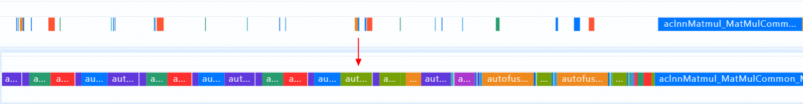

## 高性能融合算子优化

针对本次发布的新模型的 Attention 核心结构，设计并实现了 4 个在训练场景下使用的高性能 Ascend C 算子，提升核心计算模块的性能并优化内存。

### LightningIndexer

LightningIndexer\(LI\) 算子基于一系列操作得到每个 token 对应的 Top\-k 位置，输出 Top\-k 位置的索引，供 SparseAttnSharedkv 作为输入完成计算，具体计算公式如下：

$$
\operatorname{Top-}k \Bigl\{ [1]_{1 \times g} @ \bigl[ (W @ [1]_{1 \times S_k}) \odot \operatorname{ReLU}( Q_{\mathrm{index}} @ K_{\mathrm{index}}^\top ) \bigr] \Bigr\}
$$

LightningIndexer 的计算流程可分为 3 个阶段：

1. C0：Cube 操作，即 Q 和 K 的矩阵乘以及 ReLU 操作

2. V1：Vector 操作，ReLU 后续的多个向量计算（不包含 Topk）。

3. V2：Vector 操作，待前置完整分数计算完毕后，再通过二次分核完成每个 token 的 Topk 计算。

针对流水排布，本算子设计了一次 Preload C 过程，提升 C 和 V 计算间的流水并行度，流水排布图示例如下：

### SparseAttnSharedkv

SparseAttnSharedkv\(SAS\) 算子旨在完成以下公式描述的 Attention 计算，根据输入 cmp\_ratio 不同支持 3 种 Attention 计算，分别为 Sliding Window Attention\(SWA\)、Compressed Attention\(CFA\) 以及 Sparse Compressed Attention\(SCFA\)。其中 Attention 部分为 Multi\-Query Attention：

$$
S = Q @ \tilde{K}^\top
$$

$$
m = \max\bigl( \mathrm{sinks},\; \max(S) \bigr)
$$

$$
\mathrm{Attention} = \frac{ e^{S - m} @ \tilde{V} }{ \sum e^{S - m} + e^{\mathrm{sinks} - m} }
$$

其中，$\tilde{K}$ 和 $\tilde{V}$ 为基于 ori\_kv（原始的 KV）、cmp\_kv（压缩后的 KV）以及 cmp\_ratio（压缩率）等入参控制的实际参与计算的 K 和 V。SAS 算子实现主要分为 5 个阶段，分别为 V0/C1/V1/C2/V2，其中 V 为 vector 计算，C 为 Cube 计算，对应计算公式如下：

$$
V_0 : \operatorname{Gather}\bigl( \mathrm{cmpkv},\; \mathrm{topkIndices}[i] \bigr), \quad 0 \le i < \mathrm{selectBlockCount}
$$

$$
C_1 : \mathrm{qk} = Q @ K^\top
$$

$$
V_1 : P = \operatorname{onlineSoftmax}( \mathrm{qk},\; \mathrm{sinks} )
$$

$$
C_2 : O' = P @ V
$$

$$
V_2 : O = \operatorname{rescale}( O' )
$$

实现过程中，流水排布时通过 Preload 一轮 V0+C1 使得不同阶段间的依赖错开，实现除头尾以外的 CV 流水并行。

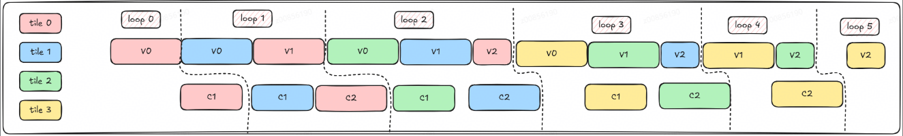

### SparseAttnSharedkvGrad

SparseAttnSharedkvGrad\(SASG\) 是 SAS 的反向算子，算子的计算流程如下：

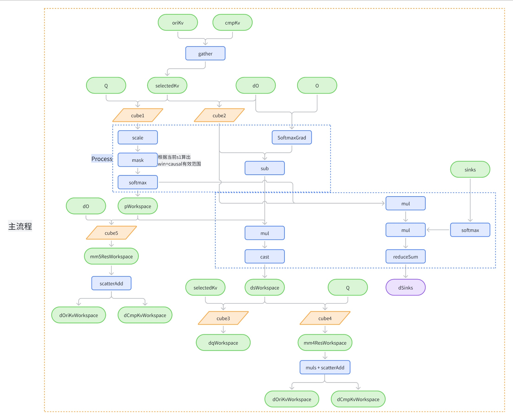

SASG 算子主流程可分为 5 个阶段，依次为 Gather、Cube12、Process、Cube345、Scatter，如图中所示。算子流水排布实现如下，通过 Preload 一次 Gather+Cube12 达成 CV 流水并行的效果。

### SparseLightningIndexerGradKLLoss

由于 LI 模块进行 Loss 计算时存在巨大内存开销（内存开销达到序列长度的平方级别，因为需要计算 Main Attention score）。SparseLightningIndexerGradKLLoss 算子将 Main Attention score 计算、LI 的反向，以及 Loss 计算过程融合，减少中间内存占用，优化内存和性能。算子计算公式如下：

LI 中取 Top\-k 的 value 的计算公式可以表示为：

$$
I_{t,:} = W_{t,:} @ \operatorname{ReLU}\bigl( q_{t,:} @ (K_{:t,:})^\top \bigr)
$$

LI 单独训练时，对应的 loss function 为：

$$
\mathcal{L}(I) = \sum_t D_{\mathrm{KL}} \bigl( p_{t,:} \;||\;\operatorname{Softmax}(I_{t,:}) \bigr)
$$

其中，p 是 target distribution，通过对 Main Attention score 在所有 head 维度上求和，然后把求和结果沿着上下文方向进行 L1 正则化得到。其中，D\_{\mathrm{KL}} 为 KL 散度，其表达式为：

$$
D_{\mathrm{KL}}(a \| b) = \sum_i a_i \log \frac{a_i}{b_i}
$$

通过求导可得Loss的梯度表达式：

$$
\mathrm{d}I_{t,:} = \operatorname{Softmax}(I_{t,:}) - p_{t,:}
$$

利用链式法则，可进一步计算 weight、query 和 key 矩阵的梯度：

$$
\mathrm{d}W_{t,:} = \mathrm{d}I_{t,:} @ \bigl( \operatorname{ReLU}( S_{t,:} ) \bigr)^\top
$$
$$
\mathrm{d}q_{t,:} = \mathrm{d}S_{t,:} @ K_{:t,:}
$$
$$
\mathrm{d}K_{:t,:} = ( \mathrm{d}S_{t,:} )^\top @ q_{:t,:}
$$

其中，S 为 QK 矩阵 softmax 的结果，计算过程可以拆分成 5 个阶段：

1. V0：依据 Top\-k 的索引从 Main Attention 的 K 和 LI 的 K 中提取有效数据

2. C1：完成 Main Attention 原始 Q 和 K 以及 LI 的 Q 和 K 矩阵运算

3. V1：完成 KLLoss、dW 计算

4. C2：完成 LI 反向的 dQ 计算

5. V2：通过 ScatterAdd 完成 LI 反向的 dK 计算

在实现过程中，针对 V0 进行两次 Preload，并通过 PingPong 掩盖 C1 和 C2 的计算，提升流水的并行度。

## 性能结果与未来展望

### 基于A3 SuperPods 64卡的性能结果

依托 CANN 平台与 TorchTitan\-NPU 插件，我们在 A3 64 卡集群上快速完成了 DeepSeek\-V4\-Flash 模型的基础训练性能调优。方案采用大 EP + 纯 FSDP 的极简并行切分策略，集成针对稀疏注意力模块开发的融合算子，并结合 Ascend C AutoFuse 自动融合机制，实现了模型吞吐从初始 397 tokens/p/s 到 1100 tokens/p/s 的显著提升。其中，定制融合算子和 AutoFuse 分别贡献了 90% 和 30% 的吞吐提升。

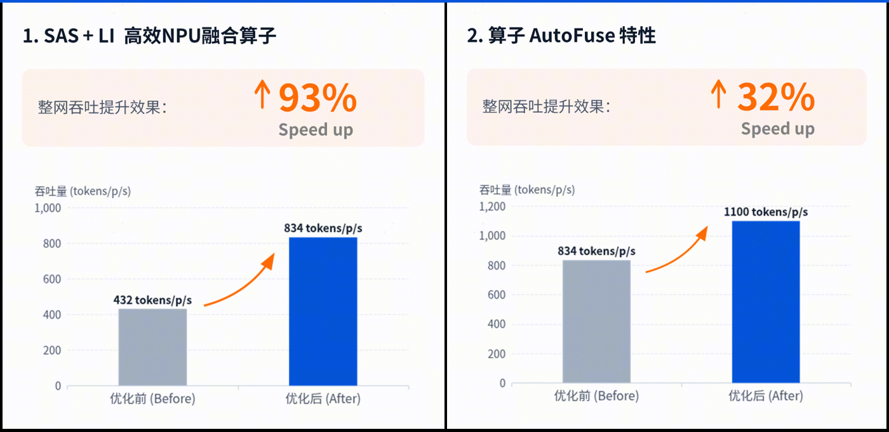

<table border="1" cellspacing="0" cellpadding="8" style="border-collapse: collapse; text-align: center; font-family: Arial, sans-serif;">
  <thead>
    <tr style="background-color: #f2f2f2;">
      <th>CUBE</th>
      <th>FA</th>
      <th>VEC</th>
      <th>EP</th>
      <th>FSDP</th>
      <th>FREE</th>
      <th>MFU</th>
    </tr>
  </thead>
  <tbody>
    <tr>
      <td>16.64s <strong>(27.89%)</strong></td>
      <td>11.8s <strong>(19.77%)</strong></td>
      <td>22.08s <strong>(37.01%)</strong></td>
      <td>5.70s <strong>(9.56%)</strong></td>
      <td>1.78s <strong>(2.98%)</strong></td>
      <td rowspan="2">1.67s <strong>(2.79%)</strong></td>
      <td rowspan="2"><strong>28.78%</strong></td>
    </tr>
    <tr>
      <td colspan="3">50.52s <strong>(84.68%)</strong></td>
      <td colspan="2">7.48s <strong>(12.53%)</strong></td>
    </tr>
  </tbody>
</table>

### 未来展望

从 A3 集群现阶段的 Profiling 数据来看，计算耗时占据绝对主导，达到总时间的 84.68%，其中 Vector 类算子更占到整网耗时的近 40%。因此，进一步的性能优化可重点围绕以下方向展开：

* 采用更精细的按需重计算策略，避免对无需保留激活值的 Vector 算子进行冗余重计算

* 进一步扩大 AutoFuse 自动融合的覆盖范围，以压缩计算时延

* 当前 TorchTitan\-NPU 版本尚未集成 MC2 或基于算子流水编排的 EP 域通信计算并行机制，将在后续阶段进行能力补齐

在功能拓展方面，后续计划同步跟进 DeepSeek\-V4 技术报告中的演进方向：

* 针对下一代 A5 平台，支持 FP8 与 A8W4 低精度量化训练特性，发挥 A5 代际的 **MxFP8/MxFP4 低精度**计算和通信能力

* 在 TorchTitan\-NPU 中集成 **Muon 优化器**功能支持，以追求更快的模型收敛效果，并配套提供 AutoFuse 与融合算子加速能力
