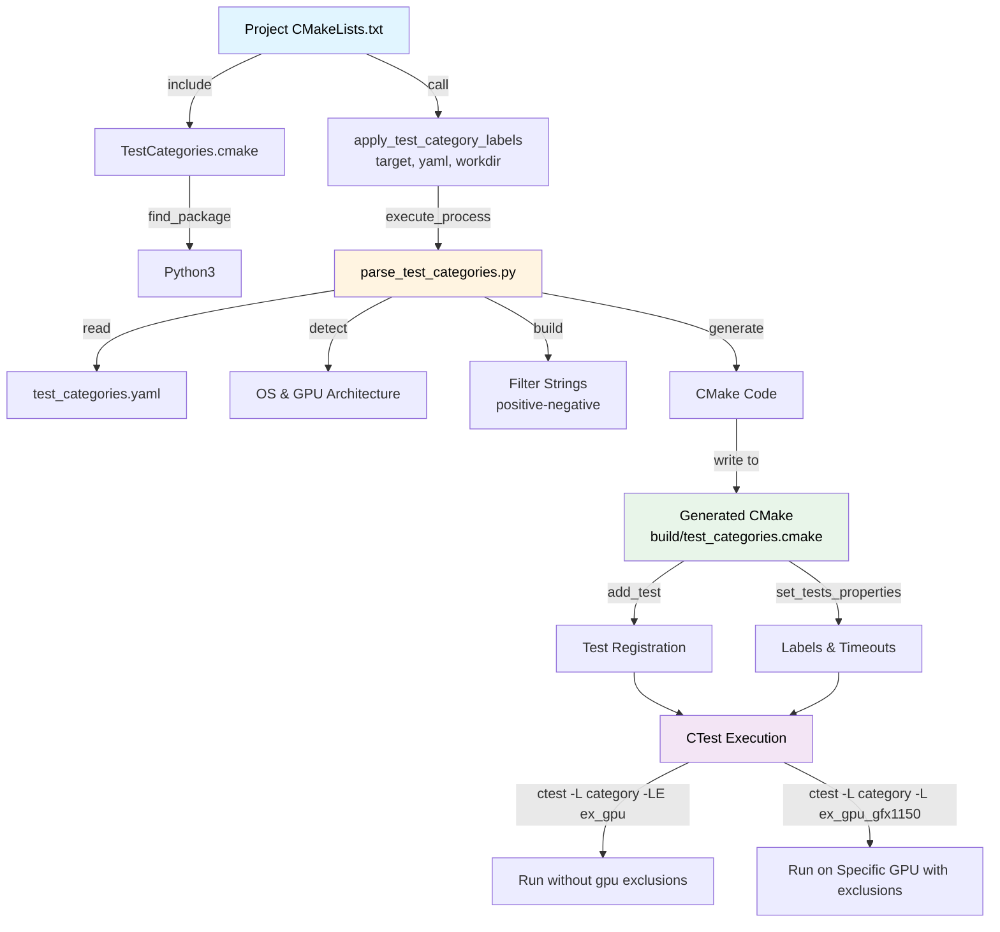

# ROCm Libraries CTest Integration Architecture

This directory contains the shared CTest integration files for organizing and executing tests across ROCm library projects using YAML-based test categorization.

## Directory Structure

```
shared/ctest/
├── README.md                      # This file - architecture documentation
├── TestCategories.cmake           # CMake module for test category integration
└── parse_test_categories.py       # Python parser for YAML to CMake conversion
```

**Files:**
- [TestCategories.cmake](./TestCategories.cmake) - CMake module with `apply_test_category_labels()` function
- [parse_test_categories.py](./parse_test_categories.py) - Python parser for YAML to CMake conversion

## Architecture Overview

The CTest integration provides a flexible, maintainable system for organizing tests into categories with support for platform-specific and GPU-specific test exclusions.

### **Core Components**

#### 1. **test_categories.yaml** (Project-specific)
Located in each project's test directory (e.g., `projects/miopen/test/gtest/test_categories.yaml`).

Defines test organization:
- Test categories with patterns and labels
- Test exclusions
- Timeout settings per category

#### 2. **parse_test_categories.py** (Shared)
Python script that:
- Parses YAML configuration files
- Detects runtime environment (OS, GPU architecture)
- Builds gtest filter strings with positive and negative patterns
- Generates CMake test registration code with proper exclusion syntax

#### 3. **TestCategories.cmake** (Shared)
CMake module providing:
- `apply_test_category_labels()` function for projects
- Python interpreter detection
- Error handling and fallback mechanisms

## Execution Flow



##  YAML Configuration Format

### **Basic Structure**

```yaml
test_categories:
  category_name:
    description: "Human-readable description"
    test_patterns: ["*pattern1*", "*pattern2*"]
    exclude: ["*pattern_to_exclude*"]
    exclude_windows: ["*linux_only_tests*"]
    exclude_linux: ["*windows_only_tests*"]
    labels: ["quick", "label2"]

exclude_gpu:
  # Common pattern definitions using YAML anchors for reusability
  common_patterns: &common_patterns
    - "*pattern1*"
    - "*pattern2*"
    - "*pattern3*"

  exclude_gpu_gfx11X:
    test_patterns: *common_patterns  # Reuse common patterns
    labels:
      - "quick"
      - "standard"
      - "comprehensive"
      - "full"
      - "ex_gpu_gfx11X"

  exclude_gpu_gfx1150:
    test_patterns:
      - "*specific_pattern*"
    labels:
      - "quick"
      - "ex_gpu_gfx1150"

execution_settings:
  default_timeout: 300
  timeout_multiplier: 1    # Multiplier for all timeouts (1, 1.5, 1.75, 2, etc.)
  # environment: { VAR1: "val1", VAR2: "val2" }   # optional; applied to all category tests
  category_timeouts:
    quick: 300
    standard: 1800
```

**Timeout Configuration:**
- `default_timeout`: Base timeout for categories not explicitly listed (in seconds)
- `timeout_multiplier`: Global multiplier applied to all timeouts (default: 1)
  - Use values like `1.5`, `1.75`, `2` to extend timeouts where needed
- `category_timeouts`: Timeouts for specific categories (before multiplier is applied)

**Environment (optional):** Under `execution_settings`, an `environment` map sets env vars for all category tests (e.g. `OPENBLAS_NUM_THREADS`, `OMP_NUM_THREADS`). Keys and values are strings; they are passed to CTest as `ENVIRONMENT "VAR1=val1;VAR2=val2"`.

**Extra arguments (optional, per-category):** A category may set `extra_args` to a list (or single string) of additional command-line arguments that the parser appends to the test command after `--gtest_filter=...`. Useful for projects whose test binary has runtime flags beyond gtest filtering (e.g. rocFFT's `--smoketest` and `--test_prob`). Each entry is shell-quoted with `shlex.quote`, so values with spaces or shell metacharacters are preserved as a single argument by CTest.

```yaml
test_categories:
  quick:
    test_patterns: ["*"]
    extra_args: ["--smoketest"]            # rocfft-test --gtest_filter=* --smoketest
    labels: ["quick"]
  standard:
    test_patterns: ["*"]
    exclude: ["*multi_gpu*"]
    extra_args: ["--test_prob", "0.02"]    # rocfft-test --gtest_filter=*-*multi_gpu* --test_prob 0.02
    labels: ["standard"]
```

`extra_args` flow through identically to category tests and to GPU-exclusion test variants, in both the build-tree CTest definitions and the install-tree `CTestTestfile.cmake`.

### **Enhanced Structure (Optional Fields)**

All fields below are **optional** and can be added incrementally. Teams can use them for richer test documentation and enable future capabilities like AI-assisted test selection:

```yaml
test_categories:
  category_name:
    # Required fields (same as base)
    description: "Human-readable description"
    test_patterns: ["*pattern1*", "*pattern2*"]
    labels: ["label1", "label2"]

    # Optional enhancement fields - add only if useful for your project
    notes: |
      Human-readable context about when to run these tests.
      Can include historical context, gotchas, or guidance for developers and AI tools.
    source_coverage:
      - "library/src/file.cpp"
      - "library/src/module.cpp:function_name"
    api_coverage:
      - "apiFunction1"
      - "apiFunction2"
    feature_tags:
      - "performance-critical"
      - "numerical-stability"
    dependencies:
      - "other_category"  # Metadata for related categories (not enforced by parser; for documentation/tooling)

    # Standard fields (from base)
    exclude: ["*always_exclude*"]
    exclude_windows: ["*linux_only*"]
    exclude_linux: ["*windows_only*"]

# Optional: Top-level context for AI/LLM tools
llm_context:
  code_to_test_mapping_guidelines: |
    Guidance for AI tools on how to map code changes to test categories.
    Projects can use this for AI-assisted test selection.

execution_settings:
  default_timeout: 300
  category_timeouts:
    category_name: 600
```

**Optional Field Descriptions:**

| Field | Purpose | Example Use |
|-------|---------|-------------|
| `notes` | Free-form text for context and documentation | "Run when epilogue changes. See bug #8765 for history" |
| `source_coverage` | Source files/functions tested by this category | `["library/src/gemm.cpp:matmul_kernel"]` |
| `api_coverage` | API functions tested by this category | `["hipblasLtMatmul", "hipblasLtMatmulAlgo"]` |
| `feature_tags` | Semantic tags for classification and filtering | `["performance-critical", "mixed-precision"]` |
| `dependencies` | Related test categories (documentation only) | `["auxiliary"]` - advisory metadata for downstream tooling |
| `llm_context` | Top-level guidance for AI-assisted workflows | Instructions for AI tools on test selection logic |

**Key Points:**
- All enhancement fields are **optional** - teams can ignore them entirely ✅
- Projects can adopt incrementally: start with just `notes`, add more later ✅
- **Parser does NOT process these fields** - they are for documentation and downstream tooling only ✅
- Parser gracefully ignores unknown fields - no code changes needed ✅
- Enables richer test documentation and future AI-assisted workflows ✅

### **GPU Exclusion with Hierarchical Matching**

GPU-specific exclusions use hierarchical pattern matching with wildcard 'X':

**Structure:**
- Each `exclude_gpu_gfx*` entry defines patterns to exclude for specific GPU architectures
- Patterns can be shared using YAML anchors (`&name`) and aliases (`*name`)
- Labels include both category labels and `ex_gpu_*` labels for filtering

**Hierarchical Matching:**
- Wildcard 'X' matches any remaining characters (e.g., `gfx11X` matches `gfx1100`, `gfx1150`, `gfx1151`)
- More specific GPUs inherit exclusions from general patterns:
  - `gfx1150` matches both `exclude_gpu_gfx11X` and `exclude_gpu_gfx1150`
  - `gfx1151` matches `exclude_gpu_gfx11X` (inherits from family pattern)

**Generated Tests:**
- For each GPU exclusion, separate tests are generated per applicable category
- Test name format: `{target}-{category}-{gpu_arch}-exclude`
- Uses gtest filter syntax: `{positive_patterns}-{category_excludes}:{gpu_exclusion_patterns}`

**Usage Examples:**
```bash
# On gfx1150 hardware (excludes gfx11X + gfx1150 patterns)
ctest -L quick -L ex_gpu_gfx1150

# On gfx950 hardware (excludes only gfx950 patterns)
ctest -L standard -L ex_gpu_gfx950

# On generic hardware (exclude all GPU-specific tests)
ctest -L quick -LE ex_gpu
```

### **Category-Level Exclusions**

Exclusions are applied using gtest's negative filter syntax (`positive_patterns-negative_patterns`):

**How it works:**
- All test patterns remain in the category definition
- Excluded patterns are added as negative filters after a single `-` separator
- Format: `pattern1:pattern2:pattern3-excluded1:excluded2:excluded3`
- Gtest runs tests matching positive patterns but excludes those matching negative patterns

**Exclusion order:**

1. **Base exclusions** (`exclude`) - Applied to that category
2. **OS-specific exclusions** (`exclude_windows`, `exclude_linux`) - Added based on detected OS at build time
3. **GPU exclusions** (`exclude_gpu`) - Appended for GPU-specific test variants

**Example filters:**
- **Category test**: `*Fusion*:*Conv*-*DeepBench*:*Slow*`
- **GPU exclusion test**: `*Fusion*:*Conv*-*DeepBench*:*Slow*:*gfx942*`

This approach maintains all patterns in the YAML configuration while letting gtest handle the filtering at runtime.

### **Implementation Details**

The `parse_test_categories.py` script builds filter strings using the following approach:

**1. Pattern String Storage**

For each category, the script stores:
```python
# Read timeout settings
base_timeout = timeouts.get(category_name, 300)
timeout = int(base_timeout * timeout_multiplier)  # Apply global multiplier

category_data[category_name] = {
    "positive_string": "pattern1:pattern2:pattern3",  # All test patterns
    "exclude_string": "neg1:neg2:neg3",               # Category + OS exclusions
    "labels": ["quick", "standard"],
    "timeout": timeout  # Final timeout after multiplier applied
}
```

**2. Category Test Generation**
```cmake
# Filter format: positive_string-exclude_string
add_test(
  NAME miopen_gtest-standard-suite
  COMMAND miopen_gtest --gtest_filter="*Fusion*:*Conv*-*DeepBench*:*Slow*"
)
```

**3. GPU Exclusion Test Generation**
```cmake
# Filter format: positive_string-exclude_string:gpu_exclude_string
add_test(
  NAME miopen_gtest-standard-gfx1150-exclude
  COMMAND miopen_gtest --gtest_filter="*Fusion*:*Conv*-*DeepBench*:*Slow*:*gfx942*"
)
```

## Integration Guide

##### **Step 1: Create test_categories.yaml**

Create `test_categories.yaml` in your project's test directory:

##### **Step 2: Include in CMakeLists.txt**

In your project's test CMakeLists.txt:

```cmake
# projects/myproject/clients/tests/CMakeLists.txt

# Set ROCM_LIBRARIES_ROOT to find shared modules
set(ROCM_LIBRARIES_ROOT ${CMAKE_CURRENT_SOURCE_DIR}/../../..)

# Include the shared CTest module
include(${ROCM_LIBRARIES_ROOT}/shared/ctest/TestCategories.cmake)

if(BUILD_TESTING)
    enable_testing()

    # Apply test categorization
    apply_test_category_labels(
        myproject-test                               # Test executable name
        "${CMAKE_CURRENT_SOURCE_DIR}/test_categories.yaml"  # YAML file path
        "${PROJECT_BINARY_DIR}/{WORK_DIR}"              # Working directory
    )
endif()
```

#### **Step 3: Build and Test**

```bash
# Configure with testing enabled
cmake -DBUILD_TESTING=ON ..
# Note: use -DMIOPEN_TEST_DISCRETE=OFF for miopen, the POC works on the monolithic miopen_gtest
make

# Run specific category on generic hardware
ctest -L quick -LE ex_gpu

# Run specific category on gfx1150 hardware
ctest -L quick -L ex_gpu_gfx1150

# Run specific category on gfx950 hardware
ctest -L standard -L ex_gpu_gfx950

# Run with verbose output
ctest -L quick -L ex_gpu_gfx1150 -V

# List available tests and their properties
ctest -N
```

### **Install-time CTestTestfile (TheRock / install tree)**

When tests are installed (e.g. into `/opt/rocm/bin/`), the **build-tree** test definitions are not installed. To run CTest from the **installed** location (e.g. on TheRock or any system that only has the install tree), projects can generate an **install-time CTestTestfile** that uses **relative paths** to the test executable.

**How it works:**

1. **Project enables it** by passing an optional **4th argument** to `apply_test_category_labels()`: a path to a file (e.g. `install_CTestTestfile.cmake`) that the parser will create or append to. The parser writes `add_test(...)` and `set_tests_properties(...)` lines into that file using a **relative** command (e.g. `"../rocblas-test"`), so the test binary is found relative to the directory where the file will live after install.

2. **Project installs that file** to a fixed location under the install prefix, typically a **project-specific subdirectory** of the bin dir (e.g. `bin/rocblas/` or `bin/MIOpen/`) and renames it to `CTestTestfile.cmake`. The test executable is installed in the parent `bin/` directory, so from `bin/rocblas/` the path `../rocblas-test` correctly points at the installed binary.

3. **TheRock (or any consumer)** runs CTest **from that installed directory** (e.g. `cd /opt/rocm/bin/rocblas && ctest -L quick`). CTest reads the local `CTestTestfile.cmake`, runs the tests with the same labels and timeouts as in the build tree, and no build tree is required.

**Example (rocBLAS):**

- Build: parser writes tests into `install_CTestTestfile.cmake`; CMake installs it as `CTestTestfile.cmake` to `bin/rocblas/`.
- CMake: `ROCBLAS_ENABLE_CTEST` (in `projects/rocblas/cmake/build-options.cmake`) defaults to **ON** when `${ROCM_LIBRARIES_ROOT}/shared/ctest/TestCategories.cmake` exists; if **ON**, a missing YAML or shared module is a **configure error** (set to **OFF** to skip categorization).
- Install layout: `bin/rocblas-test` (executable) and `bin/rocblas/CTestTestfile.cmake` (test definitions).
- Run from install: `cd /opt/rocm/bin/rocblas && ctest -L quick -N` (list) or `ctest -L quick` (run).

Projects that use this pattern (e.g. MIOpen, rocBLAS) document it in their Integration entries below; the same approach applies to any project that needs install-tree CTest runs.

## Integrations

- **miopen** - [test_categories.yaml](../../projects/miopen/test/gtest/test_categories.yaml) | [CMakeLists.txt](../../projects/miopen/test/gtest/CMakeLists.txt)
- **rocblas** - [test_categories.yaml](../../projects/rocblas/clients/gtest/test_categories.yaml) | [CMakeLists.txt](../../projects/rocblas/clients/gtest/CMakeLists.txt)
