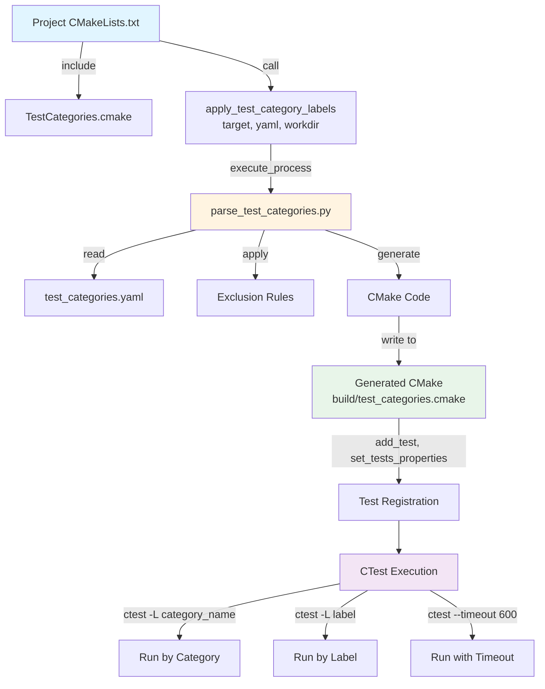

# ROCm Libraries CTest Integration Architecture

This directory contains the shared CTest integration infrastructure for organizing and executing tests across all ROCm library projects using YAML-based test categorization.

## Directory Structure

```
shared/ctest/
├── README.md                      # This file - architecture documentation
├── TestCategories.cmake           # CMake module for test category integration
└── parse_test_categories.py       # Python parser for YAML to CMake conversion

projects/
├── hipblas/clients/gtest/
│   ├── test_categories.yaml       # HipBLAS test categories configuration
│   └── CMakeLists.txt             # Integration example
└── rocfft/clients/tests/
    ├── test_categories.yaml       # RocFFT test categories configuration
    └── CMakeLists.txt             # Integration example
```

**Files:**
- [TestCategories.cmake](./TestCategories.cmake) - CMake module with `apply_test_category_labels()` function
- [parse_test_categories.py](./parse_test_categories.py) - Python parser for YAML to CMake conversion

**Example Integrations:**
- [hipblas/test_categories.yaml](../../projects/hipblas/clients/gtest/test_categories.yaml) - HipBLAS test configuration
- [hipblas/CMakeLists.txt](../../projects/hipblas/clients/gtest/CMakeLists.txt) - HipBLAS integration
- [rocfft/test_categories.yaml](../../projects/rocfft/clients/tests/test_categories.yaml) - RocFFT test configuration
- [rocfft/CMakeLists.txt](../../projects/rocfft/clients/tests/CMakeLists.txt) - RocFFT integration

## Architecture Overview

The CTest integration provides a flexible, maintainable system for organizing tests into categories with support for platform-specific and GPU-specific test exclusions.

### **Core Components**

#### 1. **test_categories.yaml** (Project-specific)
Located in each project's client directory (e.g., `projects/hipblas/clients/test_categories.yaml`).

Defines test organization:
- Test categories with patterns and labels
- Test exclusions
- Timeout settings per category

#### 2. **parse_test_categories.py** (Shared)
Python script that:
- Parses YAML configuration files
- Detects runtime environment (OS, GPU architecture)
- Applies exclusion rules
- Generates CMake test registration code

#### 3. **TestCategories.cmake** (Shared)
CMake module providing:
- `apply_test_category_labels()` function for projects
- Python interpreter detection
- Error handling and fallback mechanisms

## Execution Flow



## 📝 YAML Configuration Format

### **Basic Structure**

```yaml
test_categories:
  category_name:
    description: "Human-readable description"
    test_patterns: ["*pattern1*", "*pattern2*"]
    labels: ["label1", "label2"]
    exclude: ["*always_exclude*"]
    exclude_windows: ["*linux_only*"]
    exclude_linux: ["*windows_only*"]
    exclude_gfx942: ["*gfx942_issue*"] //TODO: gpu based exclusion


execution_settings:
  default_timeout: 300
  category_timeouts:
    category_name: 600
```

### **Exclusion Hierarchy**

The parser applies exclusions in this order:

1. **Base exclusions** (`exclude`) - Always applied
2. **OS-specific exclusions** (`exclude_windows`, `exclude_linux`) - Applied based on detected OS
3. **GPU-specific exclusions** - Applied based on detected GPU architecture: //TODO
   - **Exact match**: `exclude_gfx942` for gfx942 GPU
   - **Family match (-2 chars)**: `exclude_gfx94` matches gfx940, gfx941, gfx942, etc.
   - **Family match (-1 char)**: `exclude_gfx9` matches all gfx9x GPUs


## Integration Guide

##### **Step 1: Create test_categories.yaml**

Create `test_categories.yaml` in your project's client directory:

##### **Step 2: Include in CMakeLists.txt**

In your project's test CMakeLists.txt:

```cmake
# projects/myproject/clients/tests/CMakeLists.txt

# Set ROCM_LIBRARIES_ROOT to find shared modules
set(ROCM_LIBRARIES_ROOT ${CMAKE_CURRENT_SOURCE_DIR}/../../..)

# Include the shared CTest module
include(${ROCM_LIBRARIES_ROOT}/shared/ctest/TestCategories.cmake)

if(BUILD_TESTING)
    enable_testing()
    
    # Apply test categorization
    apply_test_category_labels(
        myproject-test                               # Test executable name
        "${CMAKE_CURRENT_SOURCE_DIR}/test_categories.yaml"  # YAML file path
        "${PROJECT_BINARY_DIR}/staging"              # Working directory
    )
endif()
```

#### **Step 3: Build and Test**

```bash
# Configure with testing enabled
<cmake -DBUILD_TESTING=ON ..>
<make>

# Run all tests
ctest

# Run specific category
ctest -L basic

# Run with verbose output
ctest -L advanced -V

# List available tests
ctest -N
```

## Current Integrations

Projects currently using this architecture:

- **hipblas** - [test_categories.yaml](../../projects/hipblas/clients/gtest/test_categories.yaml) | [CMakeLists.txt](../../projects/hipblas/clients/gtest/CMakeLists.txt)
- **rocfft** - [test_categories.yaml](../../projects/rocfft/clients/tests/test_categories.yaml) | [CMakeLists.txt](../../projects/rocfft/clients/tests/CMakeLists.txt)


